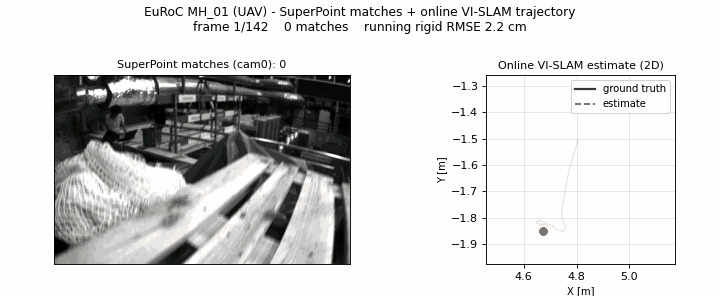
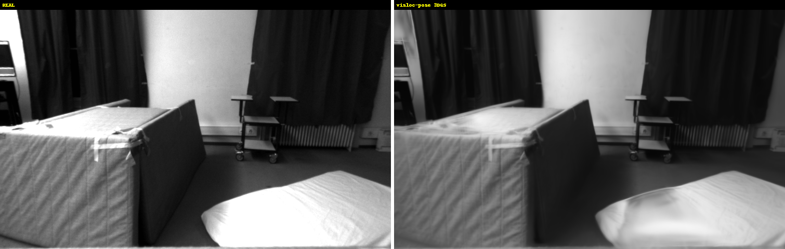

<h1 align="center">visloc-rs</h1>

<p align="center">
  <strong>GPS-denied visual &amp; visual-inertial SLAM for robots and UAVs &mdash; in pure Rust.</strong><br>
  Three pillars: <strong>visual SLAM</strong> (stereo VO · loop closure · PGO &amp; BA) ·
  <strong>map-reuse localization</strong> (PnP + RANSAC) ·
  <strong>structure-from-motion</strong> (COLMAP-grade reconstruction).<br>
  Validated on KITTI and the EuRoC MAV.
</p>

<p align="center">
  <a href="https://github.com/rsasaki0109/visloc-rs/actions/workflows/ci.yml"></a>
  
  
  
</p>

<p align="center">
  
  <br>
  <em><strong>EuRoC MH_03</strong> — a GPS-denied 6-DOF drone flight. Open stereo VO drifts (left);
  loop closure + bundle adjustment pulls it back to <strong>0.060 m ATE</strong>, within ~2.5× of
  ORB-SLAM3 and ~1.7× of DROID-SLAM — in pure Rust.</em>
</p>

<table>
  <tr>
    <td width="50%">
      
      <br>
      <strong>KITTI seq00 loop closure</strong><br>
      4541 frames, 35 verified loops: <strong>36.3 m → 2.6 m ATE (14×)</strong> — the drift dense global BA cannot remove.
    </td>
    <td width="50%">
      
      <br>
      <strong>KITTI stereo VO</strong><br>
      Metric rectified-stereo VO with confidence-weighted PnP, bundle adjustment, and pose-graph correction.
    </td>
  </tr>
  <tr>
    <td width="50%">
      
      <br>
      <strong>EuRoC MH_01 online VI-SLAM</strong><br>
      SuperPoint frontend matching frame-to-frame (left) while the live trajectory tracks ground truth (right).
    </td>
    <td width="50%">
      
      <br>
      <strong>COLMAP map-reuse localization</strong><br>
      Load an SfM map, match query → landmarks, PnP. Deep frontend lands <strong>+119%</strong> verified inliers as the viewpoint gap grows.
    </td>
  </tr>
</table>

<p align="center">
  🌐 <a href="https://rsasaki0109.github.io/visloc-rs/kitti3d/"><strong>Explore the trajectories in interactive 3D</strong></a>
  &nbsp;·&nbsp;
  ✨ <a href="https://rsasaki0109.github.io/visloc-rs/euroc_splat/"><strong>EuRoC indoor scenes as 3D Gaussian Splats</strong></a>
  <br>
  
  <br>
  <em>EuRoC V2_03: a real photo (left) vs a 3DGS rendered from <strong>visloc-rs's own estimated SLAM
  poses</strong> (right) — not ground truth. The <a href="docs/euroc_sfm_benchmark.md">SfM pillar</a>
  tightens structure to <strong>0.53 px</strong> reprojection, sharp enough for crisp novel-view synthesis.</em>
</p>

`visloc-rs` is a pure-Rust foundation for **GPS-denied localization** — estimating
where a robot or UAV is, from cameras and an IMU, when GNSS is jammed, occluded, or
absent (indoors, urban canyons, under bridges, low-altitude flight). Load a COLMAP/SfM
map and localize with PnP + RANSAC, or run the optional pipelines: stereo VO, online
VI-SLAM, loop closure, pose-graph optimization, and bundle adjustment — every stage
with inspectable geometry and an honest empirical record, no heavy C++ runtime required.

## Why visloc-rs?

There is no established pure-Rust visual-localization / VI-SLAM stack. Most open
SLAM/SfM is mature C++ (OpenCV, Pangolin, Ceres, CUDA) handed to you as a finished
black box. `visloc-rs` takes the opposite bet: a **pure-Rust, dependency-light,
trait-based foundation** you can read, extend, and trust.

- **Pure Rust, memory-safe** — no C++ toolchain; no mandatory OpenCV / Ceres / ONNX / CUDA. Learned frontends (SuperPoint / LightGlue) are strictly opt-in behind features.
- **GPS-denied / UAV focus** — validated on the EuRoC MAV drone datasets and KITTI, with GNSS treated as an optional prior, not a requirement.
- **Inspectable & honest** — every stage exposes inlier counts, reprojection error, and loop diagnostics; results are an empirical record, not leaderboard claims.

| | visloc-rs | ORB-SLAM3 | COLMAP |
| --- | --- | --- | --- |
| Language | **Rust** | C++ | C++ |
| Mandatory heavy runtime | none (opt-in ONNX) | OpenCV, Pangolin | OpenCV, Ceres |
| Primary focus | GPS-denied localization (map reuse + VO / VI building blocks) | real-time VI-SLAM | offline SfM / MVS |
| License | MIT OR Apache-2.0 | GPLv3 | BSD |

`visloc-rs` is deliberately **not** a finished SLAM system (see
[Project Boundaries](#project-boundaries)) — it is the layer you reach for to compose
and understand the pipeline, not just run a black box.

**30-second taste** — no dataset download, no extra features:

```bash
cargo run --example localize_dummy
```

## What works now

- **Map localization** — COLMAP text/binary IO, 2D-3D correspondence building, DLT PnP, PnP RANSAC, Gauss-Newton pose refinement.
- **Stereo VO** — rectified-stereo triangulation, confidence-weighted PnP, Kabsch fallback, KITTI trajectory export/eval.
- **Structure-from-motion** — *ordered*: chain temporal matches into merged multi-view tracks, one global bundle adjustment over all poses + landmarks, COLMAP-grade export (genuine multi-view `TRACK[]`) for 3DGS / MVS (`--sfm-colmap-out`). *Unordered*: from a bare photo set, discover the view graph by VLAD retrieval, verify pairs by essential-matrix RANSAC, and grow one reconstruction incrementally (seed → PnP register → triangulate → BA) — the COLMAP mapper loop in pure Rust (`incremental_sfm`, `examples/unordered_sfm_demo.rs`).
- **EuRoC VI-SLAM** — adaptive IMU/pose tracker, motion-based VI init, local VI-BA sliding window, stereo-strict bootstrap.
- **Optimization** — sparse-Cholesky bundle adjustment + full SE(3) / Sim(3) pose-graph optimizer with GNC outlier rejection; runs the SE-Sync `.g2o` benchmarks and ties GTSAM.
- **Deep frontend (opt-in)** — pure-Rust HOG-like descriptors, mutual-softmax matcher, SuperPoint/LightGlue file bridge, in-Rust SuperPoint ONNX behind `--features onnx-inference`.

## Benchmarks

Local public-data development measurements, not official leaderboard submissions.

| Benchmark | Result |
| --- | ---: |
| **KITTI seq00 loop closure** | open VO 36.3 m → **2.6 m** Sim(3) ATE (**14×**), 35 verified loops |
| **EuRoC MH_03 full pipeline** | **0.060 m** ATE — within **~2.5× of ORB-SLAM3**, **~1.7× of DROID-SLAM**, pure Rust |
| **EuRoC MH_03 SfM reconstruction** | merged multi-view tracks + global BA: mean reprojection **4.08 px → 1.04 px**, 179 k tracks, COLMAP export for 3DGS / MVS |
| **Unordered SfM (real photo collections)** | Orderless monocular photos → VLAD view graph → incremental reconstruction (robust multi-seed init, P3P register, scale-gauge-fixed BA, iterative track filter), vs **COLMAP's own model** with an independent SuperPoint frontend: **COLMAP South Building** (128 photos) **128/128 reg, 0.58 cm**; **Gerrard Hall** (100 photos, 5616×3744 OPENCV) **98/100, 0.68 cm** (3/100 single-seed) — both **0.1 % of extent**. EuRoC V2_03 orbit **31/31, 1.08 cm** |
| COLMAP South Building localization | deep frontend gives **+37% to +98%** more verified inliers as the viewpoint gap grows |
| Pose-graph optimization (SE-Sync `.g2o`) | **ties GTSAM 4.x LM** on `parking`/`sphere`/`cubicle`; **beats** it on `torus3D` (2.4e4 vs 6.0e4) and `rim` (8.3e4 vs 6.1e5) |
| Outlier-robust PGO (GNC) | `sphere2500` + 30 wrong loops: L2 **89×** baseline, GNC **1.0×** (30/30 rejected) |

Details and reproduction: [KITTI loop closure](docs/kitti_loop_closure_benchmark.md) ·
[EuRoC loop closure](docs/euroc_loop_closure_benchmark.md) ·
[EuRoC SfM reconstruction](docs/euroc_sfm_benchmark.md) ·
[unordered SfM](docs/unordered_sfm_benchmark.md) ·
[pose-graph / BA internals + GTSAM parity](docs/pgo_internals.md) ·
[EuRoC vs published baselines](docs/phase_20_to_27_closeout.md).

## Project Boundaries

The first public slice is deliberately narrow: make visual localization solid,
observable, and easy to extend, rather than hide an unfinished SLAM stack behind a
large API.

- **In:** COLMAP/SfM maps, query/stereo features, file-backed deep features → `SE3`/`Pose` estimates with inlier counts, reprojection error, and tracking/loop diagnostics.
- **Extensible & light:** feature extractors, matchers, pose estimators, priors, and VO frontends are trait-based; no mandatory OpenCV / PyTorch / ONNX / GPU runtime in default crates.
- **Not claimed:** production full SLAM, dense mapping, internet-scale / global SfM (the SfM here is a focused incremental pipeline, not production COLMAP at collection scale), tightly coupled VIO/GNSS, or official KITTI leaderboard results.

## Try It

```bash
# Smallest end-to-end: localize a synthetic query against a 1-landmark map.
cargo run --example localize_dummy

# COLMAP South Building localization (downloads ~100 MB on first run).
cargo run --features image-io --example deep_localization_demo -- \
    --root ~/datasets/south-building/south-building \
    --map-image P1180141.JPG --query-image P1180144.JPG

# Image-sequence tracking smoke.
cargo run --features image-io --example track_image_sequence_from_common_images

# Public-data KITTI 00 revisit scanner (downloads start/revisit slices).
python scripts/run_kitti_deep_vo_revisit_smoke.py

# Full local quality gate (fmt + clippy + test + doc).
scripts/check.sh
```

## Demos

Each row points at a runnable example or sweep script on **real public data**;
the full index (including synthetic correctness demos) lives in
[`docs/demo_strategy.md`](docs/demo_strategy.md).

| Demo | Stack | Reference |
| --- | --- | --- |
| COLMAP South Building localization | Real images vs sparse SfM map, deep frontend optional | [`examples/deep_localization_demo.rs`](examples/deep_localization_demo.rs), [`docs/public_data_demo.md`](docs/public_data_demo.md) |
| KITTI stereo VO + BA + loop closure | Rectified stereo → 2D-3D PnP → multi-frame BA → SE(3) PGO | [`examples/online_slam_stereo_vo_kitti_demo.rs`](examples/online_slam_stereo_vo_kitti_demo.rs) |
| **KITTI loop closure (14×)** | Open SP/LG stereo VO vs VLAD→PnP→GNC SE(3) PGO on seq00 (4541 frames, 35 loops). **36.29 m → 2.57 m Sim(3) ATE** | [`scripts/run_kitti_loop_closure_benchmark.sh`](scripts/run_kitti_loop_closure_benchmark.sh), [`docs/kitti_loop_closure_benchmark.md`](docs/kitti_loop_closure_benchmark.md) |
| **EuRoC loop closure (UAV, 0.060 m)** | Same pipeline on a 6-DOF MAV flight, MH_03. Window BA + loop **0.089 m** → + two-view loop BA **0.065 m** → + fixed-prefix local-map BA **0.061 m** → + anisotropic loop-edge information **0.060 m**, within ~2.5× ORB-SLAM3 | [`scripts/run_euroc_loop_closure_benchmark.sh`](scripts/run_euroc_loop_closure_benchmark.sh), [`docs/euroc_loop_closure_benchmark.md`](docs/euroc_loop_closure_benchmark.md) |
| **EuRoC SfM reconstruction** | Stereo VO → merged multi-view tracks → one global BA → COLMAP export (`--sfm-colmap-out`). MH_03: mean reprojection **4.08 px → 1.04 px**, 179 k tracks, for downstream 3DGS / MVS | [`scripts/run_euroc_sfm_benchmark.sh`](scripts/run_euroc_sfm_benchmark.sh), [`docs/euroc_sfm_benchmark.md`](docs/euroc_sfm_benchmark.md) |
| **Unordered SfM** | Orderless photo set → VLAD view graph → essential-RANSAC verification → incremental reconstruction (robust multi-seed init → **P3P** register → triangulate → scale-gauge-fixed BA → iterative track filter) → COLMAP export. Real COLMAP examples vs their own models: **South Building** (128 photos) **128/128, 0.58 cm**; **Gerrard Hall** (100, 5616×3744 OPENCV) **98/100, 0.68 cm** — both 0.1% of extent; EuRoC V2_03 orbit **31/31, 1.08 cm** | [`examples/unordered_sfm_demo.rs`](examples/unordered_sfm_demo.rs), [`scripts/run_colmap_sfm_benchmark.sh`](scripts/run_colmap_sfm_benchmark.sh), [`scripts/run_unordered_sfm_benchmark.sh`](scripts/run_unordered_sfm_benchmark.sh), [`docs/unordered_sfm_benchmark.md`](docs/unordered_sfm_benchmark.md) |
| EuRoC online VI-SLAM | Adaptive IMU/pose tracker, motion-based VI init, local VI-BA, stereo-strict bootstrap | [`examples/euroc_online_slam_vi_image_demo.rs`](examples/euroc_online_slam_vi_image_demo.rs), [`docs/phase_20_to_27_closeout.md`](docs/phase_20_to_27_closeout.md) |
| Outlier-robust PGO (GNC) | Wrong loop closures into a real `.g2o` graph; `sphere2500` +30: L2 **89×** baseline, GNC **1.0×** | [`examples/pgo_g2o_robust_benchmark.rs`](examples/pgo_g2o_robust_benchmark.rs) |
| GNSS-prior moving-camera tracking | Image sequence + GNSS-derived submap narrowing, writes an `index.html` dashboard | [`examples/track_sequence_with_gnss_prior.rs`](examples/track_sequence_with_gnss_prior.rs), [`docs/gnss_demo.md`](docs/gnss_demo.md) |

## Minimal Example

```rust
use nalgebra::{Point3, UnitQuaternion, Vector3};
use visloc_rs::prelude::*;

let camera = Camera::pinhole(1, 640, 480, 500.0, 500.0, 320.0, 240.0);
let pose = Pose::from_world_to_camera(UnitQuaternion::identity(), Vector3::zeros());
let point = Point3::new(0.0, 0.0, 5.0);

let mut map = VisualMap::new();
let mut landmark = Landmark::new(1, point);
landmark.descriptor = Some(vec![1.0, 0.0]);
map.landmarks.insert(1, landmark);

let query = QueryImage {
    camera: camera.clone(),
    keypoints: vec![camera.project(&pose.transform_world_point(&point)).unwrap()],
    descriptors: vec![vec![1.0, 0.0]],
};

let result = localize(query, map);
```

When descriptors live outside the map, use `LandmarkDescriptorStore` and
`localize_with_descriptor_store`. Applications can start from
`visloc_rs::prelude::*` for the common localization, map, IO, tracking, mapping,
SLAM, and fusion entry points.

## Layout

```text
crates/
  core/                geometry, map types, pose types
  vision/              features, matching, PnP, RANSAC, SuperPoint ONNX (opt-in)
  io/                  COLMAP text/binary, KITTI / TUM, external descriptors
pipelines/
  localization/        visual localization composition
  tracking/            sequence tracking, adaptive IMU/pose motion models
  mapping/             local mapping skeleton, staged updates
  slam/                online SLAM MVP, BA, PGO, relocalization
  fusion/              loose-coupling sensor prior foundations
examples/              executable examples (see Demos table above)
scripts/               sweep / benchmark / smoke scripts
docs/                  design notes, demo guides, EuRoC closeout, plan docs
```

## Roadmap

[`docs/roadmap.md`](docs/roadmap.md) has the staged plan ([`PLAN.md`](PLAN.md) is the
handoff checklist): sequential tracking quality, keyframe policies, incremental map
updates, deep VO integration, loop-closure visualization, VI/GNSS fusion, and larger
public-data evaluation.

## Further reading

- [`docs/pgo_internals.md`](docs/pgo_internals.md) — pose-graph / BA internals: block Cholesky, parallelism, chordal init, GTSAM parity, GNC.
- [`docs/kitti_loop_closure_benchmark.md`](docs/kitti_loop_closure_benchmark.md) · [`docs/euroc_loop_closure_benchmark.md`](docs/euroc_loop_closure_benchmark.md) — the loop-closure benchmarks above, with reproduction.
- [`docs/phase_20_to_27_closeout.md`](docs/phase_20_to_27_closeout.md) — EuRoC arc synthesis: recommended config, per-phase outcomes, honest negatives, headline ATE evolution.
- [`docs/demo_strategy.md`](docs/demo_strategy.md) — full demo index · [`docs/binary_determinism_findings.md`](docs/binary_determinism_findings.md) — determinism protocol.
- [`CONTRIBUTING.md`](CONTRIBUTING.md), [`SECURITY.md`](SECURITY.md), [`CHANGELOG.md`](CHANGELOG.md).
