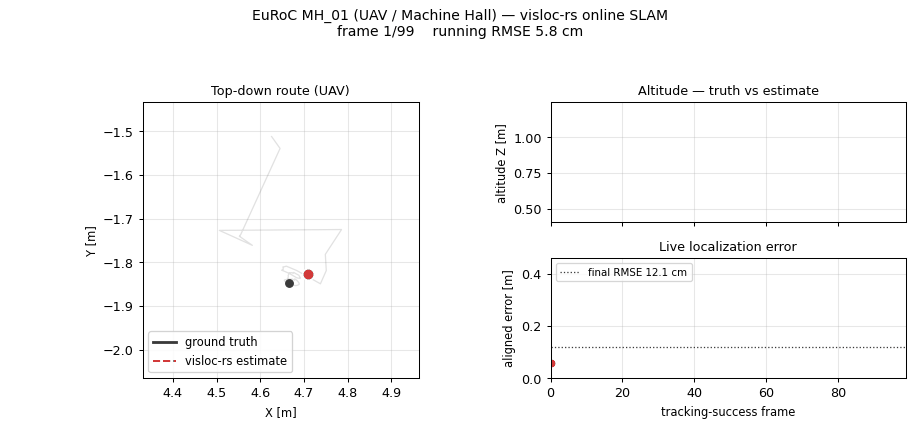

<h1 align="center">visloc-rs</h1>

<p align="center">
  <strong>GPS-denied visual &amp; visual-inertial localization for robots and UAVs &mdash; in pure Rust.</strong><br>
  Camera- and IMU-driven positioning for where GNSS is jammed, occluded, or
  absent: COLMAP/SfM map reuse, PnP + RANSAC localization, KITTI stereo VO,
  EuRoC MAV (UAV) visual-inertial SLAM with an empirically documented adaptive
  IMU/pose tracker, loop-candidate diagnostics, bundle-adjusted trajectory
  demos, and an opt-in in-Rust SuperPoint ONNX path.
</p>

<p align="center">
  <a href="https://github.com/rsasaki0109/visloc-rs/actions/workflows/ci.yml"></a>
  
  
  
  
</p>

<p align="center">
  
  <br>
  <em>Real Rust-pipeline output on the COLMAP South Building map+query pair `P1180141 -> P1180144`:
  classical Corner+BF (top, orange) lands 132 inliers; deep HogLike+MutualSoftmax (bottom, cyan)
  lands 289 (+119 %). Reproduce with the demo command under <a href="#try-it">Try It</a>.</em>
</p>

<table>
  <tr>
    <td width="50%">
      
      <br>
      <strong>KITTI stereo VO</strong><br>
      Metric rectified-stereo VO with confidence-weighted PnP and BA diagnostics.
    </td>
    <td width="50%">
      
      <br>
      <strong>KITTI loop candidate</strong><br>
      Real revisit scan with 41 verified cross-segment candidates and strongest-pair inlier overlay.
    </td>
  </tr>
</table>

<p align="center">
  
  <br>
  <em>Real EuRoC MH_01 (Machine Hall, GPS-denied UAV stereo + IMU): the online
  VI-SLAM estimate (red) tracking ground truth (black) frame by frame &mdash;
  top-down route, altitude, and live localization error. Rigidly aligned, as
  the reported rigid ATE: <strong>0.12 m</strong> over the tracked window
  (99 frames). Regenerate with <code>scripts/animate_euroc_slam.py</code>.</em>
</p>

<p align="center">
  <a href="#why-visloc-rs"><strong>Why visloc-rs</strong></a> /
  <a href="#try-it"><strong>Try it</strong></a> /
  <a href="#demos"><strong>Demos</strong></a> /
  <a href="#benchmark-snapshot"><strong>Benchmarks</strong></a> /
  <a href="docs/phase_20_to_27_closeout.md"><strong>EuRoC closeout</strong></a> /
  <a href="PLAN.md"><strong>Handoff plan</strong></a>
</p>

`visloc-rs` is a Rust foundation library for **GPS-denied localization** -
estimating where a robot or UAV is from cameras and an IMU when GNSS is jammed,
occluded, or simply absent: indoors, in urban canyons, under bridges, or in
low-altitude flight. It centers on map-based visual localization and the
building blocks above it: load an existing COLMAP/SfM map, match query features
to landmarks, estimate camera pose with PnP + RANSAC. Optional pipelines grow
toward stereo VO, online VI-SLAM with an adaptive IMU/pose tracker,
loop-candidate reporting, pose-graph optimization, and bundle adjustment.

The aerial side is exercised on the EuRoC MAV (micro-aerial-vehicle) datasets -
GPS-denied indoor drone flight with stereo + IMU. The project is built for work
where you want inspectable geometry, explicit diagnostics, reusable trait
boundaries, and an honest empirical record before committing to a heavy runtime
or a full SLAM stack.

## Why visloc-rs?

Most open visual-SLAM and SfM stacks are mature C++ projects that pull in heavy
runtimes (OpenCV, Pangolin, Ceres, CUDA) and hand you a finished pipeline.
`visloc-rs` takes the opposite bet: a **pure-Rust, dependency-light, trait-based
foundation** you can read, extend, and trust - with an honest empirical record
instead of leaderboard claims. There is no established pure-Rust visual
localization / VI-SLAM stack today; this is meant to be that building-block layer.

- **GPS-denied / UAV focus** - positioning when GNSS is jammed, occluded, or
  absent; validated on the EuRoC MAV drone datasets and KITTI, with GNSS treated
  as an optional prior rather than a requirement.
- **Pure Rust, memory-safe** - no C++ toolchain, no OpenCV / Pangolin / Ceres to build.
- **No mandatory ML runtime** - default crates need no PyTorch / ONNX / CUDA; learned
  frontends (SuperPoint / LightGlue, in-Rust ONNX) are strictly opt-in behind features.
- **Inspectable geometry & diagnostics** - every stage exposes inlier counts,
  reprojection error, and tracking / loop diagnostics instead of a black box.
- **Trait-based, replaceable frontends** - feature extractors, matchers, pose
  estimators, priors, and VO frontends are swap-in trait boundaries.
- **Reproducible by construction** - a toolchain pin plus a 3-run determinism
  protocol confirms bit-identical rebuilds across tested configurations.

| | visloc-rs | ORB-SLAM3 | COLMAP |
| --- | --- | --- | --- |
| Language | **Rust** | C++ | C++ |
| Mandatory heavy runtime | none (opt-in ONNX) | OpenCV, Pangolin | OpenCV, Ceres |
| Primary focus | GPS-denied localization (map reuse + VO / VI building blocks) | real-time VI-SLAM | offline SfM / MVS |
| Maturity | young foundation (v0.1) | research / production | production |
| License | MIT OR Apache-2.0 | GPLv3 | BSD |

`visloc-rs` is deliberately **not** a finished SLAM system (see
[Project Boundaries](#project-boundaries)); it is the layer you reach for when you
want to compose and understand the pipeline, not just run a black box.

**30-second taste** - no dataset download, no extra features:

```bash
cargo run --example localize_dummy
```

## Highlights

| Area | What works now |
| --- | --- |
| Map localization | COLMAP text/binary IO, descriptor stores, 2D-3D correspondence building, DLT PnP, PnP RANSAC, optional Gauss-Newton pose refinement |
| Stereo VO | Rectified-stereo triangulation, confidence-weighted 2D-3D PnP, Kabsch fallback, pair diagnostics, KITTI trajectory export/eval |
| **EuRoC VI-SLAM** | Adaptive IMU/pose tracker (`ImuVelocityRefreshPolicy` Phase-25), motion-based VI init, local VI-BA sliding window, stereo-strict bootstrap, recovery PnP scaffold. **V1_01 strict + SuperPoint -> 0.0029 m rigid ATE on tracked frames** (Phase-26 #1). See [`docs/phase_20_to_27_closeout.md`](docs/phase_20_to_27_closeout.md) |
| Deep-style frontend | Pure-Rust HOG-like descriptors, LightGlue-style mutual-softmax matcher, external SuperPoint/LightGlue file bridge, **opt-in in-Rust SuperPoint ONNX runtime** behind `--features onnx-inference` (Phase-27) |
| Optimization | Sparse Cholesky bundle adjustment with Huber/Cauchy kernels; full SE(3) pose-graph optimizer (GN/LM, 6x6 anisotropic info matrices, `.g2o` IO, fill-reducing reordering, a `BxB`-block Cholesky ~3-4x faster than scalar, default-on chordal rotation init); Graduated Non-Convexity outlier rejection for both PGO and BA; 7-DOF Sim(3) pose graph for monocular scale drift. Runs on the standard SE-Sync `.g2o` benchmarks and ties GTSAM - details in [`docs/pgo_internals.md`](docs/pgo_internals.md) |
| Sequence tooling | Tracking states, local mapping skeleton, loop-candidate reports, ATE/RPE/KITTI/TUM trajectory evaluators |
| Fusion hooks | Timestamped frames, GNSS/pose/IMU measurements, loose localization priors, VI initialization workstream |
| Reproducibility | `rust-toolchain.toml` pin + `scripts/verify_binary_determinism.sh` 3-run protocol confirms bit-identical cross-rebuild on all tested configurations |

## Benchmark Snapshot

Local public-data development measurements, not official leaderboard submissions.

| Demo | Dataset | Result |
| --- | --- | ---: |
| COLMAP localization sweep | South Building, 25 map/query pairs | Deep-style descriptors give **+37% to +98%** more verified inliers as viewpoint gap grows |
| KITTI loop scanner | KITTI 00 start + revisit sandwich | Quick deep run (`50x30`, 200 features/frame) finds **41** verified cross-segment candidates; strongest pair `49 -> 4501` has **57/95** inliers |
| SP/LG stereo VO + BA | KITTI odometry train `00..10`, 260 frames each | `mean_t_rel = 1.2715%`, `mean_max_t_rel = 2.9785%` with tuned SuperPoint/LightGlue + BA |
| EuRoC VI-SLAM (SuperPoint + strict-stereo) | EuRoC V1_01_easy, Phase-26 #1 strict | rigid ATE **0.0029 m** on 93 surviving frames, coverage 6 % - see *EuRoC vs baselines* below |
| EuRoC VI-SLAM (HOG + ThreePoseSmoother) | EuRoC V2_01_easy, Phase-25 strict | rigid ATE **0.198 m** on 102 surviving frames, coverage 6.8 % |
| KITTI stereo VO + PGO | KITTI 00 real stereo image window | README asset run lowers max translation error **2.01 m -> 0.72 m** after pose-graph correction |

### Pose-graph optimization (g2o benchmarks)

The pure-Rust SE(3) optimizer (`PoseGraph::optimize_se3_iterative`, GN/LM on the
SE(3) manifold, `.g2o` `EDGE_SE3:QUAT` IO) runs directly on the canonical
back-end datasets - no C++, no Ceres, no ROS. A `BxB`-block Cholesky (~3-4x
faster than scalar `CscCholesky`), fill-reducing reordering, and a default-on
chordal rotation init make the hard 3D graphs tractable, and it **ties GTSAM 4.x
LM** from the same odometry (and converges `sphere`/`cubicle`/`rim` from a
chordal seed GTSAM's own `InitializePose3` cannot). Full method, parallelism,
and GTSAM-parity tables: [`docs/pgo_internals.md`](docs/pgo_internals.md).

| Dataset | Poses | Edges | initial chi^2 | final chi^2 (+chordal) | GTSAM final |
| --- | ---: | ---: | ---: | ---: | ---: |
| `parking-garage` | 1661 | 6275 | 1.67e4 | 1.27e0 | 1.27e0 |
| `sphere2500` | 2500 | 4949 | 2.61e6 | 1.35e3 | 1.35e3 |
| `torus3D` | 5000 | 9048 | 4.80e6 | **2.42e4** | 5.996e4 |
| `cubicle` | 5750 | 16869 | 1.08e7 | 2.75e3 | 2.749e3 |
| `rim` | 10195 | 29743 | 1.28e8 | **8.34e4** | 6.11e5 |

For graphs with **wrong** loop closures, `PoseGraph::optimize_se3_gnc` adds
Graduated Non-Convexity (Yang et al. 2020): on `sphere2500` + 30 injected
outliers an L2 solve lands **89x** the outlier-free baseline while GNC recovers
**1.0x** (30/30 rejected, 0 false positives). The same machinery is available
per-observation in BA as `BundleAdjustment::optimize_gnc`.

```sh
scripts/fetch_pgo_g2o_datasets.sh datasets/pgo_g2o
cargo run --release --example pgo_g2o_benchmark -- --chordal-init datasets/pgo_g2o/rim.g2o
cargo run --example pgo_g2o_benchmark   # zero-setup built-in loop graph
```

### EuRoC vs published baselines (honest read)

The strict-stereo bootstrap is **accuracy-favouring, not coverage-favouring**:
it gives up tracking on EuRoC cliff regions rather than admit wrong-scale
solutions. On the frames it tracks, per-frame accuracy is competitive with
published full-sequence numbers; on full-sequence coverage it is not. The full
trade-off (Phase-{20..27} honest negatives) is in
[`docs/phase_20_to_27_closeout.md`](docs/phase_20_to_27_closeout.md).

| Method | V1_01 ATE | V2_01 ATE | Coverage | Stack |
| --- | --- | --- | --- | --- |
| ORB-SLAM3 stereo-inertial *[Campos 2021]* | 0.037 m | 0.038 m | full sequence | C++, OpenCV/Eigen |
| VINS-Fusion stereo-inertial *[Qin 2019]* | 0.087 m | 0.150 m | full sequence | C++, Ceres, ROS-tied |
| **visloc-rs V1_01 strict + SuperPoint** | **0.0029 m\*** | - | **6 % of frames** | Rust, no mandatory ML runtime |
| **visloc-rs V2_01 strict + HOG (Phase-25)** | - | **0.198 m\*** | **6.8 % of frames** | Rust, classical descriptor only |

`\*` Per-frame rigid-ATE-on-surviving-frames; not directly comparable to the
full-sequence ATE of the ORB-SLAM3 / VINS-Fusion rows. Use visloc-rs as a
Rust-side foundation to build on; use ORB-SLAM3 / VINS-Fusion for turnkey
full-sequence VI-SLAM.

## Project Boundaries

The first public slice is deliberately narrow: make visual localization solid,
observable, and easy to extend instead of hiding an unfinished SLAM stack behind
a large API.

- **Input:** existing COLMAP/SfM maps, landmark descriptors, query features, stereo image sequences, file-backed external deep features/matches, or pre-exported SuperPoint features
- **Output:** `SE3` / `Pose` estimates, inlier counts, reprojection error, tracking diagnostics, loop-candidate diagnostics, pose trajectories
- **Extensible:** feature extractors, matchers, pose estimators, priors, and VO frontends are trait-based
- **Core stays light:** no mandatory OpenCV, PyTorch, ONNX, TensorRT, or GPU runtime in default crates
- **Not claimed:** production full SLAM, dense mapping, production loop closure, full SfM, tightly coupled VIO/GNSS, or official KITTI leaderboard results

## Try It

```bash
# Smallest end-to-end: localize a synthetic query against a 1-landmark map.
cargo run --example localize_dummy

# COLMAP South Building localization (downloads ~100 MB on first run).
cargo run --features image-io --example deep_localization_demo -- \
    --root ~/datasets/south-building/south-building \
    --map-image P1180141.JPG --query-image P1180144.JPG

# Image-sequence tracking smoke.
cargo run --features image-io --example track_image_sequence_from_common_images

# Public-data KITTI 00 revisit scanner (downloads start/revisit slices).
python scripts/run_kitti_deep_vo_revisit_smoke.py

# Full local quality gate (fmt + clippy + test + doc).
scripts/check.sh
```

## Demos

Each row points at a runnable example or sweep script; longer walkthroughs live
under `docs/` (full index in [`docs/demo_strategy.md`](docs/demo_strategy.md)).

| Demo | Stack | Reference |
| --- | --- | --- |
| COLMAP South Building localization | Real images vs sparse SfM map, deep frontend optional | [`examples/deep_localization_demo.rs`](examples/deep_localization_demo.rs), [`docs/public_data_demo.md`](docs/public_data_demo.md) |
| KITTI stereo VO + BA + loop closure | Rectified stereo -> 2D-3D PnP -> multi-frame BA -> essential-matrix verifier -> SE(3) PGO | [`examples/online_slam_stereo_vo_kitti_demo.rs`](examples/online_slam_stereo_vo_kitti_demo.rs) |
| KITTI 00 sandwich loop detection | Start + revisit slices, quick deep scanner; writes `index.html` + verified-inlier overlay (`41` candidates) | [`examples/kitti_revisit_scanner_demo.rs`](examples/kitti_revisit_scanner_demo.rs), [`scripts/run_kitti_deep_vo_revisit_smoke.py`](scripts/run_kitti_deep_vo_revisit_smoke.py) |
| Synthetic scanner loop closure | 9-keyframe arc, appearance scan -> loop edge -> SE(3) PGO. `<2 cm` max error recovery | [`examples/scanner_loop_closure_demo.rs`](examples/scanner_loop_closure_demo.rs) |
| Sim(3) scale-drift correction | 24-node monocular loop with 3 %/keyframe scale shrink; worst `\|scale-1\|` **0.50 -> 0**, mean position error **1.49 m -> 0 m** | [`examples/sim3_scale_drift_pgo_demo.rs`](examples/sim3_scale_drift_pgo_demo.rs) |
| Outlier-robust PGO (GNC) | Injects wrong loop closures into a real `.g2o` graph; `sphere2500` +30: L2 **89x** baseline, GNC **1.0x** (30/30 rejected) | [`examples/pgo_g2o_robust_benchmark.rs`](examples/pgo_g2o_robust_benchmark.rs) |
| Deep frontend two-view geometry | HogLike + MutualSoftmax vs classical Corner + BF on a 30 deg baseline scene (~30x rot/trans-direction win) | [`examples/deep_frontend_two_view_demo.rs`](examples/deep_frontend_two_view_demo.rs) |
| SuperPoint/LightGlue VO + BA | File-backed SP/LG features -> confidence-weighted PnP -> BA. KITTI train `00..10` `mean_t_rel 1.27 %` | [`scripts/run_kitti_superpoint_lightglue_vo_train_benchmark.sh`](scripts/run_kitti_superpoint_lightglue_vo_train_benchmark.sh) |
| **EuRoC online VI-SLAM** | Adaptive IMU/pose tracker, motion-based VI init, local VI-BA, stereo-strict bootstrap. SuperPoint via offline replay or `--features onnx-inference` | [`examples/euroc_online_slam_vi_image_demo.rs`](examples/euroc_online_slam_vi_image_demo.rs), [`docs/phase_20_to_27_closeout.md`](docs/phase_20_to_27_closeout.md) |
| GNSS-prior moving-camera tracking | Image sequence + GNSS-derived submap narrowing, writes an `index.html` dashboard | [`examples/track_sequence_with_gnss_prior.rs`](examples/track_sequence_with_gnss_prior.rs), [`docs/gnss_demo.md`](docs/gnss_demo.md) |
| KITTI / TUM trajectory ATE + RPE evaluator | Frame-id-matched ATE (Umeyama SE(3)/Sim(3) alignment) and TUM-style RPE over Δ-spaced pairs | [`examples/evaluate_trajectory_from_tum_files.rs`](examples/evaluate_trajectory_from_tum_files.rs), [`examples/evaluate_kitti_odometry_benchmark.rs`](examples/evaluate_kitti_odometry_benchmark.rs) |
| Binary determinism verification | Three-run protocol on EuRoC V2_01 baseline + SuperPoint configurations | [`scripts/verify_binary_determinism.sh`](scripts/verify_binary_determinism.sh), [`docs/binary_determinism_findings.md`](docs/binary_determinism_findings.md) |

## Minimal Example

```rust
use nalgebra::{Point3, UnitQuaternion, Vector3};
use visloc_rs::prelude::*;

let camera = Camera::pinhole(1, 640, 480, 500.0, 500.0, 320.0, 240.0);
let pose = Pose::from_world_to_camera(UnitQuaternion::identity(), Vector3::zeros());
let point = Point3::new(0.0, 0.0, 5.0);

let mut map = VisualMap::new();
let mut landmark = Landmark::new(1, point);
landmark.descriptor = Some(vec![1.0, 0.0]);
map.landmarks.insert(1, landmark);

let query = QueryImage {
    camera: camera.clone(),
    keypoints: vec![camera.project(&pose.transform_world_point(&point)).unwrap()],
    descriptors: vec![vec![1.0, 0.0]],
};

let result = localize(query, map);
```

When descriptors live outside the map, use `LandmarkDescriptorStore` and
`localize_with_descriptor_store`. Applications can start from
`visloc_rs::prelude::*` for the common localization, map, IO, tracking, mapping,
SLAM, and fusion entry points.

## Layout

```text
crates/
  core/                geometry, map types, pose types
  vision/              features, matching, PnP, RANSAC, SuperPoint ONNX (opt-in)
  io/                  COLMAP text/binary, KITTI / TUM, external descriptors
pipelines/
  localization/        visual localization composition
  tracking/            sequence tracking, adaptive IMU/pose motion models
  mapping/             local mapping skeleton, staged updates
  slam/                online SLAM MVP, BA, PGO, relocalization
  fusion/              loose-coupling sensor prior foundations
examples/              executable examples (see Demos table above)
scripts/               sweep / benchmark / smoke scripts
docs/                  design notes, demo guides, EuRoC closeout, plan docs
```

## Roadmap

[`docs/roadmap.md`](docs/roadmap.md) has the staged plan; [`PLAN.md`](PLAN.md) is
the handoff checklist. Near-term layers: sequential tracking quality, local
mapping + keyframe policies, online Visual SLAM with incremental map updates,
deep VO frontend integration, loop-closure detection + visualization, VI/GNSS
priors and fusion, and larger public-data evaluation.

## Further reading

- [`docs/pgo_internals.md`](docs/pgo_internals.md) - pose-graph / BA back-end internals: block Cholesky, parallelism, chordal init, GTSAM parity, GNC.
- [`docs/phase_20_to_27_closeout.md`](docs/phase_20_to_27_closeout.md) - single-source-of-truth EuRoC arc synthesis: recommended-config table, per-phase outcomes, known issues, headline ATE evolution.
- [`docs/superpoint_onnx_runtime_plan.md`](docs/superpoint_onnx_runtime_plan.md) - Phase-27 activation contract, model sourcing, validation plan.
- [`docs/binary_determinism_findings.md`](docs/binary_determinism_findings.md) - toolchain-pin + verification protocol + empirical ledger.
- [`docs/gnss_demo.md`](docs/gnss_demo.md), [`docs/kitti_image_sequence_demo.md`](docs/kitti_image_sequence_demo.md) - per-demo guides.
- [`CONTRIBUTING.md`](CONTRIBUTING.md), [`SECURITY.md`](SECURITY.md), [`CHANGELOG.md`](CHANGELOG.md).
