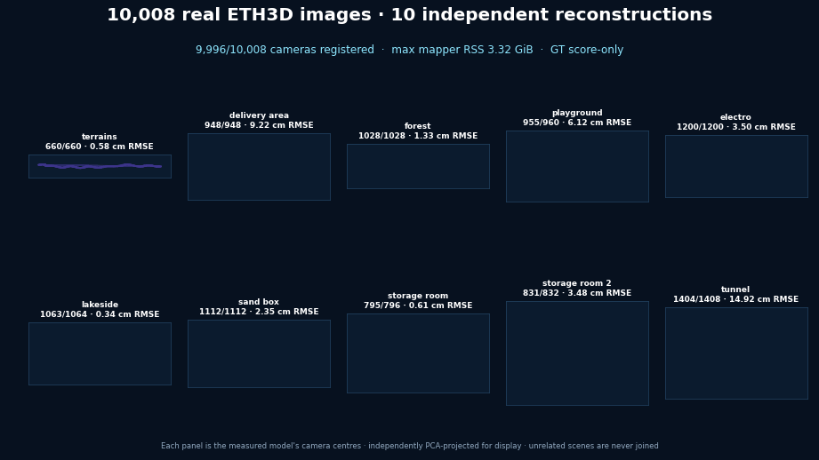

<h1 align="center">visloc-rs</h1>

<p align="center">
  <strong>GPS-denied visual localization, VO/SfM, and SLAM building blocks for robots and UAVs &mdash; in pure Rust.</strong>
</p>

<p align="center">
  <a href="https://github.com/rsasaki0109/visloc-rs/actions/workflows/ci.yml"></a>
  
  
  
</p>

## Measured at a glance

| Real-data result | visloc-rs | COLMAP 3.9.1 CPU | Outcome |
| --- | ---: | ---: | ---: |
| ETH3D Electro 1,200, same-input CPU8 end to end | **27:29** | 1:35:05 | **3.46× faster** |
| ETH3D Electro registered cameras | **1200/1200** | **1200/1200** | parity |
| ETH3D Electro camera-centre RMSE | **3.50 cm** | 4.68 cm | **25.2% lower** |
| ETH3D Courtyard camera-centre RMSE | **0.5379 cm** | 1.6166 cm | **66.7% lower** |

The comparisons use real images and measured runs; the
[SfM benchmark details](docs/sfm_benchmarks.md) state where inputs or accounting
differ. Separately, on the connected
OpenLORIS 10k stress set, streamed VLAD + LSH cuts visloc-rs candidate
generation from 49:49 to **8:51 (5.63×)**. That is a visloc retrieval A/B,
not an end-to-end COLMAP comparison. The frozen measurements
and output hashes are in
[`m6-ann-streaming.json`](benchmarks/electro/m6-ann-streaming.json).

Separately, the [Visual-Inertial SLAM (Basalt Rust port)](#visual-inertial-slam-basalt-rust-port)
— a distinct, tightly-coupled stereo-inertial VIO stack, not the vision-only
SfM/SLAM pipeline above — matches native Basalt's ATE to **within 0.1%** on
every one of the 11 EuRoC sequences at seed 7, with **0.563×** native's peak
RSS on the same-domain Linux runtime/RSS gate (1.133× runtime ratio). With
EuRoC's official calibration and its offline mapper stage, the same estimator
**beats measured ORB-SLAM3 (full-trajectory SE(3) ATE) on 8 of 11 EuRoC
sequences**, same evaluator, one run each.

On the connected OpenLORIS 10k stress set, visloc's experimental
observation-backed atlas preserves the connected frame counts and meets the p95
target, but **RMSE parity is still open** (0.3890 m vs the 0.3843 m COLMAP
control); the native diagnostic completes all 17 stages **20.41×** faster with
**17.0%** lower peak RSS. Full comparison tables and caveats:
[SfM benchmark details](docs/sfm_benchmarks.md).

## SfM and SLAM benchmarks

visloc-rs registers **9,996/10,008 cameras (99.88%)** across every ETH3D
low-resolution many-view scene with no mapper run above 3.32 GiB, reconstructs
the 1,200-image Electro set **3.46× faster than COLMAP** with **25.2% lower**
camera-centre RMSE, and beats official COLMAP on the 38-image courtyard control
(**0.5379 cm vs 1.6166 cm**).

<p align="center">
  
</p>

| Real scene (ETH3D low-res many-view) | Registered / supplied | Centre RMSE | RMSE / extent | Mapper peak RSS |
| --- | ---: | ---: | ---: | ---: |
| terrains | **660/660** | 0.58 cm | 0.12% | 1.56 GiB |
| delivery area | **948/948** | 9.22 cm | 0.99% | 2.31 GiB |
| forest | **1028/1028** | 1.33 cm | 0.19% | 2.65 GiB |
| playground | **955/960** | 6.12 cm | 2.52% | 2.44 GiB |
| electro | **1200/1200** | 3.50 cm | 0.55% | 1.39 GiB |
| lakeside | **1063/1064** | 0.34 cm | 0.08% | 3.19 GiB |
| sand box | **1112/1112** | 2.35 cm | 0.45% | **3.32 GiB** |
| storage room | **795/796** | 0.61 cm | 0.42% | 1.71 GiB |
| storage room 2 | **831/832** | 3.48 cm | 2.57% | 1.00 GiB |
| tunnel | **1404/1408** | 14.92 cm | 1.61% | 3.25 GiB |

<p align="center"><sub>tunnel includes one 5.32 m outlier (median 2.47 cm, p95 9.41 cm); playground excludes five hash-audited source outliers. The connected 10k corridor stress run, the 300-image reliability gate, the OpenLORIS comparison, and all reproduction commands are in the <a href="docs/sfm_benchmarks.md">SfM benchmark details</a>.</sub></p>

<p align="center">
  
</p>

<p align="center"><sub>Same-input CPU8 Electro 1,200: visloc-rs <b>3.46× faster</b> and <b>25.2% lower</b> camera-centre RMSE than COLMAP. Unordered SfM, sequential SfM vs COLMAP, and EuRoC reconstruction evidence are in the <a href="docs/unordered_sfm_benchmark.md">SfM benchmark docs</a>.</sub></p>

### GPU SfM vs COLMAP (CUDA) on EuRoC

Same 200 undistorted frames per sequence, same fixed intrinsics, same
GTX 1660 Ti, run back to back. visloc-rs uses GPU SIFT, batched GPU
matching and the COLMAP incremental-mapper port. COLMAP 4.1 uses GPU
extraction, GPU sequential matching and its default mapper. ATE is the
Sim(3) camera-centre RMSE against ground truth.

| Sequence | Time (visloc-rs / COLMAP) | ATE (visloc-rs / COLMAP) | Registered (visloc-rs / COLMAP) |
| --- | ---: | ---: | ---: |
| MH_01_easy | **96 s** / 634 s | 0.35 / 0.35 cm | 182 / **200** |
| MH_03_medium | **113 s** / 340 s | **1.32** / 2.61 cm | 166 / **200** |
| MH_05_difficult | **102 s** / 764 s | **2.58** / 193.66 cm | 194 / **200** |
| V1_01_easy | **104 s** / 219 s | **2.40** / 2.75 cm | 199 / **200** |
| V1_02_medium | **55 s** / 101 s | **1.76** / 1.83 cm | 198 / **200** |
| V2_01_easy | **81 s** / 172 s | 3.30 / **1.00** cm | 199 / **200** |
| V1_03_difficult | **45 s** / 93 s | 2.17 / **1.98** cm | 67 / **80** |
| V2_03_difficult | **42 s** / 60 s | 3.37 / **2.85** cm | 118 / **180** |

visloc-rs is faster on all 8 sequences (1.4–7.5×). It is more accurate
on 4 and equal on MH_01. COLMAP is more accurate on V2_01, V1_03 and V2_03,
and it registers more frames, most visibly on the blurred V1_03 and V2_03.

COLMAP's results vary between runs: an earlier run gave V2_01 34.9 cm, and
MH_05 failed in both runs. visloc-rs is deterministic.

Configuration, caveats and the ablation that got here:
[EuRoC GPU SfM vs COLMAP](docs/euroc_gpu_sfm_vs_colmap.md).

### Run the SfM demo

Reconstruct an unordered photo set in one command — SIFT features estimated
in-process, COLMAP text model (`cameras.txt`, `images.txt`, `points3D.txt`)
written to `--out-colmap`:

```bash
cargo run --release --example unordered_sfm_demo --features image-io -- \
  --feature-extractor sift \
  --images-dir /path/to/my_photos \
  --width 1920 --height 1080 --fx 1400 --fy 1400 --cx 960 --cy 540 \
  --sift-max-keypoints 4096 \
  --retrieval-topk 12 --min-matches 30 --match-ratio 0.8 \
  --verification-mode full --mapper incremental \
  --next-image-policy auto --post-refinement-registration \
  --final-iterative-refinement \
  --out-colmap /path/to/runs/my-photos-sfm
```

Pass a validated per-image calibration with `--input-colmap-calibration` instead
of the scalar intrinsics. The complete option set, the courtyard control
commands, and the connected-component export mode are in the
[SfM benchmark details](docs/sfm_benchmarks.md#run-the-sfm-demo).

## Visual-Inertial SLAM (Basalt Rust port)

A separate, faithful Rust port of upstream
[Basalt](https://github.com/VladyslavUsenko/basalt) commit `0f3b2b52` — a
tightly-coupled stereo-inertial VIO estimator plus a keyframe/loop-closure
mapper — in [`pipelines/basalt`](pipelines/basalt). On upstream Basalt's own
inputs it matches native Basalt's ATE to **within 0.1%** on all 11 EuRoC
sequences (**1.13×** runtime, **0.56×** peak RSS). With EuRoC's official
calibration, the mapper now runs **online** — a dedicated thread ingesting
each keyframe as the VIO produces it, not a separate offline batch job — and
beats measured ORB-SLAM3 (full-trajectory SE(3) ATE) on **8 of 11** EuRoC
sequences, the same 8 the original offline-mapper result won; the VIO stage
alone already wins MH_01_easy and V2_01_easy.

<p align="center">
  <br>
  <sub>Six of the eight winning EuRoC sequences: visloc-rs online VI-SLAM (blue) vs measured ORB-SLAM3 (red), both SE(3)-aligned to ground truth (black).</sub>
</p>

| Sequence | visloc-rs (online VI-SLAM) | ORB-SLAM3 stereo-inertial | Winner |
| --- | ---: | ---: | :---: |
| MH_01_easy | 0.017 | 0.036 | visloc-rs |
| MH_02_easy | 0.025 | 0.033 | visloc-rs |
| MH_03_medium | 0.027 | 0.028 | visloc-rs |
| MH_04_difficult | 0.082 | 0.043 | ORB-SLAM3 |
| MH_05_difficult | 0.059 | 0.055 | ORB-SLAM3 |
| V1_01_easy | 0.035 | 0.038 | visloc-rs |
| V1_02_medium | 0.014 | 0.017 | visloc-rs |
| V1_03_difficult | 0.022 | 0.029 | visloc-rs |
| V2_01_easy | 0.016 | 0.039 | visloc-rs |
| V2_02_medium | 0.012 | 0.014 | visloc-rs |
| V2_03_difficult | 0.108 | 0.056 | ORB-SLAM3 |

<p align="center">
  
</p>

<p align="center"><sub>8/11 wins; full-trajectory ATE translation RMSE in metres, lower is better, same protocol as the prior offline-mapper result. The mapper thread never blocked the VIO thread on any sequence (whole-run wall time stayed within ~10% of VIO-alone wall time; peak queue lag ≤4.5s) — see <a href="docs/vi_slam_benchmarks.md">VI-SLAM benchmark details</a> for the per-sequence RTF/lag/loop/RSS numbers and the two sequences (V1_03, V2_03) whose online ATE is a real, reported gap from the offline number rather than a match. RTF (dataset duration / wall time, 0.09-0.38× here) is bounded by the VIO estimator, which is still single-threaded on this branch — real-time VIO performance is a separate initiative (PR #153), not this stage's claim. The prior offline (batch, 2-18 min / 3-6 GB) mapper path still exists, unchanged and byte-for-byte untouched, for parity/comparison. Parity evidence: <a href="work/m11_basalt_faithful_port_final_closure_20260914.md">faithful-port closure report</a> and <a href="benchmarks/basalt/README.md">upstream oracle / provenance</a>; design and next steps: <a href="docs/basalt_online_mapper_design.md">online mapper design</a> and <a href="docs/vi_slam_global_consistency_plan.md">global-consistency plan</a>.</sub></p>

### Run the VI-SLAM demo

Build with AVX2/FMA and replay a EuRoC sequence through the online VIO +
mapper — the calibration and config are checked into the repo,
`--euroc-dir` is an external dataset path:

```bash
RUSTFLAGS="-C target-feature=+avx2,+fma" \
  cargo build --release --example basalt_euroc_online_slam_demo --features basalt-lm-workspace-reuse

cargo run --release --example basalt_euroc_online_slam_demo --features basalt-lm-workspace-reuse -- \
  --euroc-dir /path/to/MH_01_easy \
  --calibration configs/basalt/variants/official_euroc_ds/euroc_ds_calib.json \
  --config configs/basalt/variants/official_euroc_ds/euroc_config.json \
  --out-dir target/basalt_mh01_online \
  --max-frames 80
```

This writes `trajectory_online.tum` (the full-frame trajectory, mapper
corrections propagated to every VIO frame — what the table above scores),
`trajectory_online_kf.tum` (keyframes only), and `timing_breakdown_online.json`
(RTF, mapper queue lag, loop/trigger counts, peak RSS). The original offline
VIO + batch-mapper commands are unchanged and still documented in the
[VI-SLAM benchmark details](docs/vi_slam_benchmarks.md#run-it).

Add `--pipeline` to run the frontend (dataset decode + optical flow) and the
estimator on two threads instead of one -- mirroring upstream Basalt's
`OpticalFlow` thread / estimator thread split -- and `--threads N` to size
the `rayon` pool used by the frontend's per-track temporal KLT (unset lets
`rayon` size itself to `std::thread::available_parallelism()`). Both are
pure wall-clock optimizations: every frame is still processed in the same
order with the same arithmetic, so `trajectory.tum` is byte-for-byte
identical to a serial `--threads 1` run given the same inputs.

```bash
cargo run --release --example basalt_euroc_vio_demo --features basalt-lm-workspace-reuse -- \
  --euroc-dir /path/to/MH_01_easy \
  --calibration benchmarks/basalt/release_inputs/euroc_ds_calib.json \
  --config configs/basalt/euroc_config.json \
  --out-dir target/basalt_mh01 \
  --pipeline --pipeline-capacity 4 --threads 12
```

## Quickstart

Requires Rust 1.83+ only — no C++/OpenCV/CUDA toolchain.

Smallest end-to-end: localize a synthetic query against a 1-landmark map.

```bash
cargo build
cargo run --example localize_dummy
```

Load a real COLMAP model and localize a query photo against it (downloads ~100 MB
on first run). Datasets are external inputs and are not bundled with this
repository. Fetch the dataset once:

```bash
mkdir -p ~/datasets/south-building && cd ~/datasets/south-building && \
  curl -L -o south-building.zip \
    https://github.com/colmap/colmap/releases/download/3.11.1/south-building.zip && \
  unzip south-building.zip
```

Then, from the repository root, localize a query photo against the sparse model:

```bash
cargo run --release --features image-io --example deep_localization_demo -- \
  --root ~/datasets/south-building/south-building \
  --map-image P1180141.JPG --query-image P1180155.JPG
```

<p align="center">
  <br>
  <sub>Public-data localization: real query photos localized frame by frame against the same reusable sparse visual map (COLMAP South Building). Details: <a href="docs/public_data_demo.md">public COLMAP map-reuse demo</a>.</sub>
</p>

| First run | Command | What it shows |
| --- | --- | --- |
| Synthetic localization | `cargo run --example localize_dummy` | Smallest end-to-end: one query, one landmark, PnP RANSAC estimate |
| Map-reuse localization | `cargo run --release --features image-io --example deep_localization_demo -- --root <south-building> --map-image P1180141.JPG --query-image P1180155.JPG` | A real query photo localized against a COLMAP model, classical vs deep frontend |
| Sequence tracking | `cargo run --features image-io --example track_image_sequence_from_common_images` | Moving-camera tracking smoke with per-frame pose continuity |
| KITTI revisit scanner | `python scripts/run_kitti_deep_vo_revisit_smoke.py` | Public KITTI 00 revisit smoke (downloads start/revisit slices) |
| Full local quality gate | `scripts/check.sh` | `fmt` + `clippy` + `test` + `doc` in one command |

More runnable demos and the full index are in the
[demo strategy](docs/demo_strategy.md) and the
[archived README details](docs/readme_details.md#demos).

## Verified results

Local public-data development measurements, not official leaderboard submissions.
The headline snapshot is registry-backed by
[`benchmarks/registry/readme_claims_v1.json`](benchmarks/registry/readme_claims_v1.json);
see the [registered run evidence](docs/generated/registered_runs.md) and
[scoped claim matrix](docs/generated/benchmark_claim_matrix.md).

- **KITTI multi-sequence published-baseline comparison** — one uniform full-stack config over 00/02/05/06/07/09; narrow published-baseline wins on seq00 (**1.23 m vs ORB-SLAM2 1.3 m**) and seq09 (**2.07 m vs ORB-SLAM2 3.2 m**), with seq00/05/06 in the OV2SLAM-RT accuracy band. This is not a leaderboard or ORB-SLAM3 claim; the run also records real-world frontend failure-mode fixes.
- **EuRoC MH_03 / MH_05 full pipeline** — stereo visual loop-closure + BA on MH_03 / MH_05: **0.057 m / 0.072 m** ATE. The claim matrix marks ORB-SLAM3 comparisons as behind (**~2.4x / ~1.4x**), OV2SLAM as near, and VINS-Fusion stereo as a stereo-only win; this is not a tight-VIO claim.
- **TUM RGB-D fr1_xyz / fr1_desk** — indoor handheld via **virtual stereo** (depth as a synthetic right image, zero backend changes): **0.014 m / 0.026 m** ATE, compared against published ORB-SLAM2 RGB-D ranges in the claim matrix; loop closure is a **6x** lever on the revisit-heavy desk.
- **Sequential SfM vs COLMAP (metric video)** — same 2700-frame EuRoC flight, same evo scoring: visloc stereo VO + loop SfM **6 min, 0.13 m** (trajectory 0.066 m, metric) vs COLMAP mono incremental **11.7 h, 2.18 m** (scale-free) - **~117x faster, ~17-33x more accurate, metric scale**. (Stereo-vs-mono: the win is the metric-video regime, not COLMAP's unordered-photo home turf.)
- **Unordered SfM (real photo collections)** — Orderless monocular photos -> VLAD view graph -> incremental reconstruction (robust multi-seed init, P3P register, scale-gauge-fixed BA, iterative track filter), vs **COLMAP's own model** with an independent SuperPoint frontend: **COLMAP South Building** (128 photos) **128/128 reg, 1.09 cm**; **Gerrard Hall** (100 photos, 5616x3744 OPENCV) **98/100, 0.68 cm** (3/100 single-seed) - both **0.1 % of extent**. EuRoC V2_03 orbit **31/31, 1.08 cm**

## Documentation

The [detailed README material](docs/readme_details.md) preserves the project
boundaries, feature overview, full demos table, minimal Rust example, repository
layout, roadmap, further-reading index, and complete benchmark snapshot that
previously lived here.

- **Choose and run a demo:** [demo index](docs/demo_strategy.md), [public COLMAP map-reuse demo](docs/public_data_demo.md), [GNSS-prior tracking](docs/gnss_demo.md), and [interactive KITTI trajectory viewer](https://rsasaki0109.github.io/visloc-rs/kitti3d/).
- **Understand supported configurations:** [feature matrix](docs/feature_matrix.md), [API stability](docs/api_stability.md), [COLMAP compatibility](docs/colmap_compatibility.md), and [migration notes](docs/migration.md).
- **Inspect VO and loop-closure evidence:** [KITTI multi-sequence](docs/kitti_multiseq_benchmark.md), [KITTI loop closure](docs/kitti_loop_closure_benchmark.md), [EuRoC loop closure](docs/euroc_loop_closure_benchmark.md), [TUM RGB-D](docs/tum_rgbd_benchmark.md), and [tracking persistence](docs/tracking_persistence_benchmark.md).
- **Inspect VI-SLAM (Basalt Rust port) evidence:** [VI-SLAM benchmark details](docs/vi_slam_benchmarks.md), [faithful-port final closure report](work/m11_basalt_faithful_port_final_closure_20260914.md), and [upstream oracle / provenance](benchmarks/basalt/README.md).
- **Where VI-SLAM goes next:** [global-consistency plan](docs/vi_slam_global_consistency_plan.md) — same-protocol ORB-SLAM3 measurements, the 8/11 official-calibration + mapper result (now online, §1.5) and its scale-bias root cause, the paused persistent-map prototype, and the staged plan targeting VIO tracking robustness on the three remaining losses.
- **Inspect SfM evidence:** [SfM benchmark details](docs/sfm_benchmarks.md), [EuRoC reconstruction](docs/euroc_sfm_benchmark.md), [sequential SfM vs COLMAP](docs/sfm_vs_colmap_benchmark.md), [unordered SfM](docs/unordered_sfm_benchmark.md), and [registry evidence for the head-to-head](docs/generated/sfm_vs_colmap_headtohead.md).
- **Inspect learned frontend evidence:** [SuperPoint ONNX/CUDA](docs/superpoint_onnx_cuda_benchmark.md), [LightGlue ONNX](docs/lightglue_onnx_benchmark.md), and [single-binary deep stereo SLAM](docs/inprocess_slam_benchmark.md).
- **Inspect mapping and optimization evidence:** [learned retrieval for relocalization](docs/learned_retrieval_relocalization.md), [multi-session lifelong mapping](docs/multi_session_lifelong_benchmark.md), and [pose-graph / BA internals with GTSAM parity](docs/pgo_internals.md).
- **Follow the project:** [roadmap](docs/roadmap.md), [contributing](CONTRIBUTING.md), [security](SECURITY.md), and [changelog](CHANGELOG.md).

## License

Licensed under either of [Apache License, Version 2.0](LICENSE-APACHE) or
[MIT license](LICENSE-MIT), at your option.
