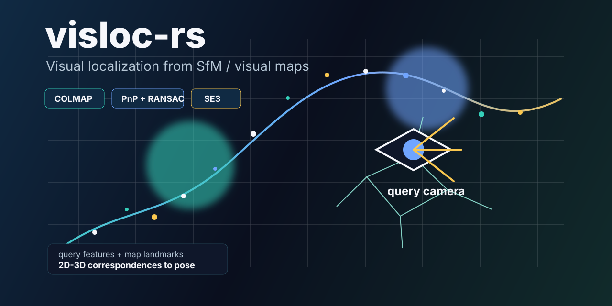
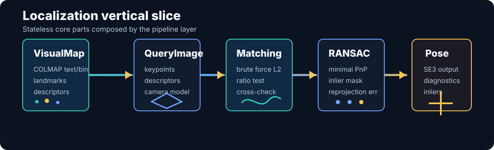
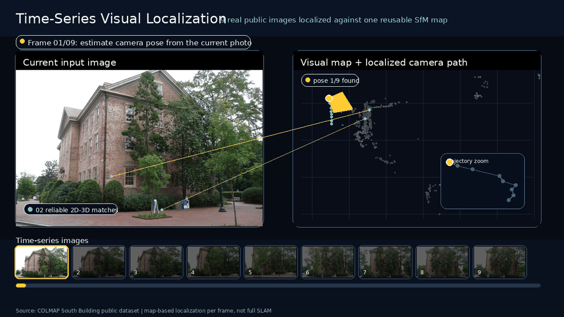
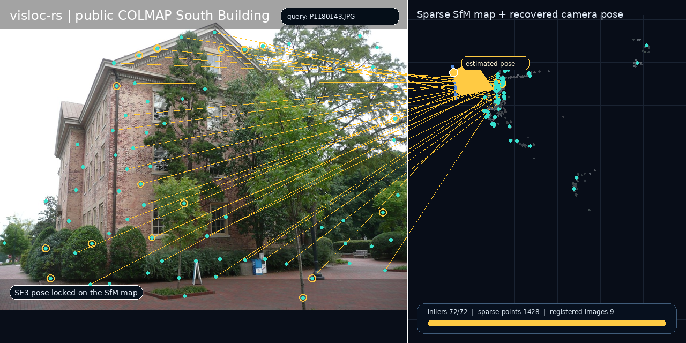

# visloc-rs

<p align="center">
  
</p>

<p align="center">
  <a href="https://github.com/rsasaki0109/visloc-rs/actions/workflows/ci.yml"></a>
  
  
  
</p>

`visloc-rs` is a Rust foundation library for visual localization with existing SfM / visual maps. The practical target is robotics visual localization, with automotive and UAV image sequences as the main demo directions.

The initial scope is intentionally narrow: load or build a visual map, connect query-image 2D features to map 3D landmarks, and estimate a camera pose with PnP + RANSAC. This gives a working vertical slice before adding heavier SLAM machinery.

<p align="center">
  
</p>

## Public Data Localization Demo

<p align="center">
  
</p>

This README demo uses the public COLMAP South Building dataset. A small 9-image SfM model was rebuilt from the public images with `pycolmap`, producing 9 registered cameras and 1,428 sparse 3D points. The animation plays the 9 real images as a short sequence: each frame is localized against the same reusable visual map, and the estimated camera path advances on the map. This is map-based localization over a sequence, not full SLAM.

Data source: the COLMAP official South Building dataset, distributed as [`south-building.zip`](https://github.com/colmap/colmap/releases/download/3.11.1/south-building.zip) from the COLMAP example datasets.

Static view:

<p align="center">
  
</p>

## Demo Direction

The strongest near-term public demo path is automotive / robotics sequence localization: a moving camera, a reusable sparse visual map, and a pose trajectory that is easy to understand at a glance. UAV localization remains a primary target use case, especially when GNSS/altitude priors are added, but automotive public datasets are a good first showcase because they make sequence motion, relocalization, and map reuse visually obvious.

## Scope

Implemented now:

- Core map and pose types: `Frame`, `Keyframe`, `VisualMap`, `Landmark`, `Observation`, `Camera`, `Pose`, `LocalizationResult`
- `SE3` / `SO3` wrappers and reprojection
- Brute-force descriptor matching with L2 distance, ratio test, cross-check wrapper, and per-match diagnostics
- Minimal DLT PnP estimator
- PnP RANSAC with configurable iterations and reprojection threshold
- Optional Gauss-Newton pose refinement after RANSAC inlier selection
- Pose-estimator diagnostics in `LocalizationResult`, including refinement status and before/after reprojection error
- Pose-estimation failure diagnostics for insufficient correspondences and RANSAC failures
- COLMAP text and binary parsers for cameras, images, and 3D points
- Visual map validation for structural references and descriptor availability
- Feature extractor adapters for validated externally supplied features
- Lightweight grayscale corner feature extractor for dependency-free image-input smoke tests
- Query feature text parser and file-based localization example
- Public-data README demo built from COLMAP South Building images and a `pycolmap` sparse reconstruction
- Localization pipeline over query descriptors and map landmark descriptors, including an external landmark descriptor store
- Localization-based tracking scaffold with motion priors, lost/relocalized events, and a pose-prior translation quality gate
- Local mapping skeleton with keyframe policy, local map windows, staged map updates, landmark candidates, linear triangulation, and local refinement hooks
- Online SLAM MVP composition over tracking and local mapping, without loop closure or global optimization
- Loose-coupling fusion foundation with timestamped frames/poses, GNSS/pose/IMU measurements, covariance types, and external localization-prior tracking hooks

Not implemented yet:

- Full Visual SLAM
- Full SfM
- Loop closure
- Dense mapping
- Full bundle adjustment
- Full tightly-coupled visual-inertial or GNSS/INS fusion

## Why not start with full SLAM?

SLAM combines tracking, mapping, optimization, loop closure, persistence, and recovery logic. Implementing all of that first would make the core geometry and map interfaces harder to validate. `visloc-rs` starts with visual localization because it is the smallest useful slice: a map exists, a query image arrives, and the library estimates a camera pose.

The design keeps the path open for Visual SLAM, SfM map reuse, visual-inertial fusion, and GNSS fusion by separating core data types, geometry, matching, PnP, RANSAC, IO, and pipeline composition.

## Roadmap

The current public release focuses on map-based Visual Localization. Online Visual SLAM is planned, but it will build on this localization core instead of replacing it.

See [docs/roadmap.md](docs/roadmap.md) for the staged plan. Planned next layers:

- Sequential localization and tracking quality improvements
- Local mapping and lightweight keyframe policies
- Online Visual SLAM with incremental map updates
- Visual-inertial and GNSS priors/fusion
- Larger public-data evaluation scripts

See [docs/demo_strategy.md](docs/demo_strategy.md) for the automotive/UAV demo plan.
See [docs/colmap_compatibility.md](docs/colmap_compatibility.md) for supported COLMAP/SfM map formats and current limitations.
See [docs/migration.md](docs/migration.md) for the pre-1.0 to v1.0 API migration guidance.
See [docs/publishing.md](docs/publishing.md) for workspace publish order and package checks.

## Minimal Example

```rust
use nalgebra::{Point3, UnitQuaternion, Vector3};
use visloc_rs::prelude::*;

let camera = Camera::pinhole(1, 640, 480, 500.0, 500.0, 320.0, 240.0);
let pose = Pose::from_world_to_camera(UnitQuaternion::identity(), Vector3::zeros());
let point = Point3::new(0.0, 0.0, 5.0);

let mut map = VisualMap::new();
let mut landmark = Landmark::new(1, point);
landmark.descriptor = Some(vec![1.0, 0.0]);
map.landmarks.insert(1, landmark);

let query = QueryImage {
    camera: camera.clone(),
    keypoints: vec![camera.project(&pose.transform_world_point(&point)).unwrap()],
    descriptors: vec![vec![1.0, 0.0]],
};

let result = localize(query, map);
```

When descriptors live outside the map, use `LandmarkDescriptorStore` and call `localize_with_descriptor_store`.

Applications can start with `visloc_rs::prelude::*` for the common localization, map, IO, tracking, mapping, SLAM, and fusion entry points. Explicit module paths such as `visloc_rs::io::colmap` remain available for narrower imports.

The initial text descriptor format is intentionally simple:

```text
# LANDMARK_ID D0 D1 D2 ...
1000 0.1 0.2 0.3
1001 1.0 0.0 0.5
```

Load it with `visloc_io::descriptors::read_landmark_descriptors_txt`.

Run the dummy vertical slice:

```bash
cargo run --example localize_dummy
```

Run the trajectory-evaluation example:

```bash
cargo run --example evaluate_trajectory_dummy
cargo run --example evaluate_trajectory_from_kitti_files
cargo run --example evaluate_trajectory_from_kitti_files -- --out-dir target/visloc_eval_kitti
cargo run --example evaluate_trajectory_from_kitti_files -- --align-origin
cargo run --example evaluate_trajectory_from_tum_files
cargo run --example evaluate_trajectory_from_tum_files -- --out-dir target/visloc_eval
cargo run --example evaluate_trajectory_from_tum_files -- --align-origin
```

The file-based KITTI / TUM evaluators write `translation_errors.csv`, `error_summary.json`, `evaluation_result.json`, and a browser-viewable `trajectory_report.html` when `--out-dir` is provided. They can also enforce benchmark-style thresholds with `--max-mean`, `--max-rmse`, `--max-max`, `--min-matched`, and `--min-match-ratio`; threshold failures exit with a non-zero status.

Run the IO-backed example that loads a COLMAP text map and external descriptor text file:

```bash
cargo run --example localize_colmap_text
```

Run the provider-based COLMAP example with map validation and provider diagnostics:

```bash
cargo run --example localize_colmap_provider
```

Run the file-based localization example, which reads a COLMAP text model, landmark descriptors, and query features:

```bash
cargo run --example localize_from_files
```

Run the dependency-free grayscale corner extractor example, which creates a synthetic marker image, extracts corner features, builds a small descriptor map, and localizes the image:

```bash
cargo run --example localize_with_corner_extractor
```

Run the PGM-backed variant, which writes and reads a grayscale image file before extracting features:

```bash
cargo run --example localize_from_pgm
```

Run the file-based sequence localization example, which tracks multiple query feature files and prints CSV / KITTI / TUM trajectory exports. With `--out-dir`, it also writes `summary.json`, `tracking.csv`, `tracking_summary.json`, `trajectory_report.html`, and `tracking_report.html`:

```bash
cargo run --example localize_sequence_from_files
cargo run --example localize_sequence_from_files -- --out-dir target/visloc_sequence_demo
```

`PoseTrajectory::to_html_report` creates a compact single-trajectory plot and metric table for demos. When reference poses are available, `PoseTrajectory::translation_error_summary_against` reports frame-id matched translation errors with mean, RMSE, max, and missing-pose counts. `TrajectoryAlignment::FirstMatchedTranslation` can remove a simple origin offset before computing errors, and `PoseTrajectory::to_html_report_against` creates a comparison report. This is intentionally a small ATE-style helper for demos and regression checks, not a full benchmark suite.

Run the tracking skeleton example:

```bash
cargo run --example track_sequence_dummy
cargo run --example track_sequence_dummy -- --out-dir target/visloc_tracking_demo
```

With `--out-dir`, sequence/tracking examples write `tracking.csv`, `tracking_summary.json`, `tracking_report.html` for frame-by-frame state transitions, and `trajectory_report.html` for the estimated pose path. The GNSS-prior demo also writes `tracking_evaluation.json` so success-rate, lost-count, prior-usage, and inlier-quality thresholds can be checked by CI.
Tracking diagnostics distinguish motion pose priors from external localization priors, so GNSS-derived submap narrowing is visible in the CSV, JSON, and HTML reports.

Run a moving-camera GNSS-prior tracking example that narrows the visual map before localization and writes an `index.html` dashboard, `manifest.json`, `tracking.csv`, `trajectory.csv`, KITTI/TUM pose exports, synthetic-reference error reports, JSON summaries, and browser-viewable reports:

```bash
cargo run --example track_sequence_with_gnss_prior
cargo run --example track_sequence_with_gnss_prior -- --out-dir target/visloc_gnss_tracking_demo
```

Open `target/visloc_gnss_tracking_demo/index.html` first; it is the dashboard for the tracking, trajectory, and evaluation reports. See [docs/gnss_demo.md](docs/gnss_demo.md) for the file-by-file guide and expected metrics. CI also uploads the checked GNSS demo output directory as the `gnss-demo-outputs` artifact.

Run the full local quality gate:

```bash
scripts/check.sh
```

Run only the user-facing examples:

```bash
scripts/run_examples.sh
sh scripts/check_gnss_demo_outputs.sh
```

## Layout

```text
crates/core/              geometry, map types, pose types
crates/vision/            features, matching, PnP, RANSAC
crates/io/                COLMAP text model parser
pipelines/localization/   visual localization composition
pipelines/tracking/       sequence tracking over localization
pipelines/mapping/        local mapping skeleton and staged map updates
pipelines/slam/           online SLAM MVP composition
pipelines/fusion/         loose-coupling sensor prior foundations
examples/                 executable examples
tests/                    integration tests
docs/                     design notes and interfaces
docs/assets/              README images and visual explainers
docs/api_stability.md     public API stability policy toward v1.0
docs/colmap_compatibility.md COLMAP/SfM map compatibility notes
docs/demo_strategy.md     public demo strategy for automotive and UAV localization
docs/gnss_demo.md         GNSS-prior sequence demo output guide
docs/migration.md         pre-1.0 to v1.0 API migration guidance
docs/publishing.md        workspace publish order and package checks
docs/public_data_demo.md  public-data demo provenance and reproduction notes
docs/assets/south-building-query.jpg real query image from COLMAP South Building
docs/assets/south-building-localization.png public-data localization visualization
docs/assets/south-building-localization.gif animated public-data localization demo
CONTRIBUTING.md          contribution guide and local check expectations
SECURITY.md              security and safety-critical use policy
CHANGELOG.md             unreleased changes and release notes
LICENSE-APACHE           Apache-2.0 license text
LICENSE-MIT              MIT license text
docs/release_checklist.md pre-release quality checklist
scripts/check.sh          local fmt/clippy/test/doc gate
scripts/run_examples.sh   runs all user-facing examples
scripts/check_trajectory_evaluation.sh checks trajectory metric thresholds and exports
scripts/check_gnss_demo_outputs.sh checks GNSS demo dashboard/export outputs
scripts/package_check.sh  checks package metadata and crate contents
.github/ISSUE_TEMPLATE/   bug report and feature request templates
.github/pull_request_template.md PR checklist
.github/dependabot.yml    dependency update configuration
.github/workflows/ci.yml  GitHub Actions CI gate
```
