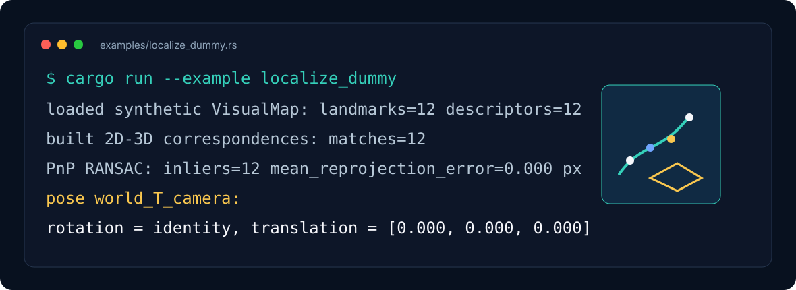
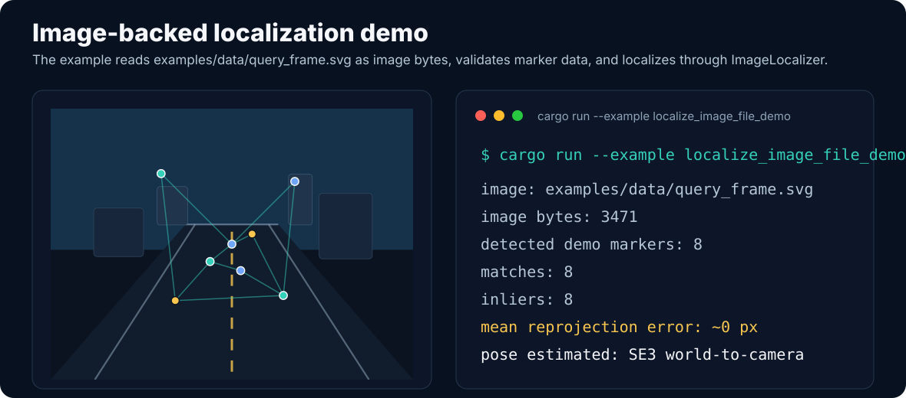
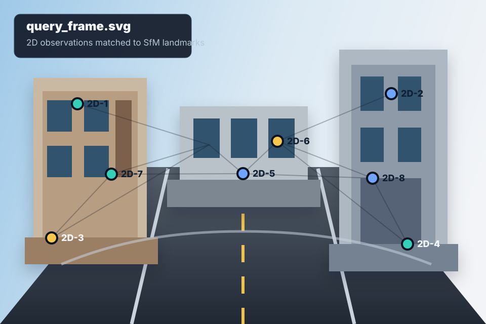

# visloc-rs

<p align="center">
  
</p>

<p align="center">
  <a href="https://github.com/rsasaki0109/visloc-rs/actions/workflows/ci.yml"></a>
  
  
  
</p>

`visloc-rs` is a Rust foundation library for visual localization with existing SfM / visual maps.

The initial scope is intentionally narrow: load or build a visual map, connect query-image 2D features to map 3D landmarks, and estimate a camera pose with PnP + RANSAC. This gives a working vertical slice before adding heavier SLAM machinery.

<p align="center">
  
</p>

## Demo Preview

<p align="center">
  
</p>

The preview above is README-safe SVG. A real screen recording or benchmark clip can be added later under `docs/assets/` and linked from this section.

## Image-backed Demo

<p align="center">
  
</p>

The demo below reads an actual image asset from `examples/data/query_frame.svg` and passes its bytes through the image-localization API. The bundled extractor is intentionally tiny and deterministic; production users are expected to plug in their own extractor, such as SuperPoint, SIFT, ORB, or a learned local-feature model.

```bash
cargo run --example localize_image_file_demo
```

Query image used by the demo:

<p align="center">
  
</p>

## Scope

Implemented now:

- Core map and pose types: `Frame`, `Keyframe`, `VisualMap`, `Landmark`, `Observation`, `Camera`, `Pose`, `LocalizationResult`
- `SE3` / `SO3` wrappers and reprojection
- Brute-force descriptor matching with L2 distance, ratio test, cross-check wrapper, and per-match diagnostics
- Minimal DLT PnP estimator
- PnP RANSAC with configurable iterations and reprojection threshold
- Optional Gauss-Newton pose refinement after RANSAC inlier selection
- Pose-estimator diagnostics in `LocalizationResult`, including refinement status and before/after reprojection error
- Pose-estimation failure diagnostics for insufficient correspondences and RANSAC failures
- COLMAP text and binary parsers for cameras, images, and 3D points
- Visual map validation for structural references and descriptor availability
- Feature extractor adapters for validated externally supplied features
- Query feature text parser and file-based localization example
- Image-backed localization example that reads a checked-in query image asset
- Localization pipeline over query descriptors and map landmark descriptors, including an external landmark descriptor store

Not implemented yet:

- Full Visual SLAM
- Full SfM
- Loop closure
- Keyframe management beyond core data types
- Dense mapping
- Full bundle adjustment

## Why not start with full SLAM?

SLAM combines tracking, mapping, optimization, loop closure, persistence, and recovery logic. Implementing all of that first would make the core geometry and map interfaces harder to validate. `visloc-rs` starts with visual localization because it is the smallest useful slice: a map exists, a query image arrives, and the library estimates a camera pose.

The design keeps the path open for Visual SLAM, SfM map reuse, visual-inertial fusion, and GNSS fusion by separating core data types, geometry, matching, PnP, RANSAC, IO, and pipeline composition.

## Minimal Example

```rust
use nalgebra::{Point3, UnitQuaternion, Vector3};
use visloc_rs::core::geometry::Pose;
use visloc_rs::core::types::{Camera, Landmark, QueryImage, VisualMap};
use visloc_rs::localize;

let camera = Camera::pinhole(1, 640, 480, 500.0, 500.0, 320.0, 240.0);
let pose = Pose::from_world_to_camera(UnitQuaternion::identity(), Vector3::zeros());
let point = Point3::new(0.0, 0.0, 5.0);

let mut map = VisualMap::new();
let mut landmark = Landmark::new(1, point);
landmark.descriptor = Some(vec![1.0, 0.0]);
map.landmarks.insert(1, landmark);

let query = QueryImage {
    camera: camera.clone(),
    keypoints: vec![camera.project(&pose.transform_world_point(&point)).unwrap()],
    descriptors: vec![vec![1.0, 0.0]],
};

let result = localize(query, map);
```

When descriptors live outside the map, use `LandmarkDescriptorStore` and call `localize_with_descriptor_store`.

The initial text descriptor format is intentionally simple:

```text
# LANDMARK_ID D0 D1 D2 ...
1000 0.1 0.2 0.3
1001 1.0 0.0 0.5
```

Load it with `visloc_io::descriptors::read_landmark_descriptors_txt`.

Run the dummy vertical slice:

```bash
cargo run --example localize_dummy
```

Run the IO-backed example that loads a COLMAP text map and external descriptor text file:

```bash
cargo run --example localize_colmap_text
```

Run the provider-based COLMAP example with map validation and provider diagnostics:

```bash
cargo run --example localize_colmap_provider
```

Run the file-based localization example, which reads a COLMAP text model, landmark descriptors, and query features:

```bash
cargo run --example localize_from_files
```

Run the image-backed demo, which reads `examples/data/query_frame.svg` and localizes through `ImageLocalizer`:

```bash
cargo run --example localize_image_file_demo
```

Run the tracking skeleton example:

```bash
cargo run --example track_sequence_dummy
```

Run the full local quality gate:

```bash
scripts/check.sh
```

## Layout

```text
crates/core/              geometry, map types, pose types
crates/vision/            features, matching, PnP, RANSAC
crates/io/                COLMAP text model parser
pipelines/localization/   visual localization composition
examples/                 executable examples
tests/                    integration tests
docs/                     design notes and interfaces
docs/assets/              README images and visual explainers
examples/data/query_frame.svg image asset used by the image-backed demo
CHANGELOG.md             unreleased changes and release notes
LICENSE-APACHE           Apache-2.0 license text
LICENSE-MIT              MIT license text
docs/release_checklist.md pre-release quality checklist
scripts/check.sh          local fmt/clippy/test/doc gate
.github/workflows/ci.yml  GitHub Actions CI gate
```
