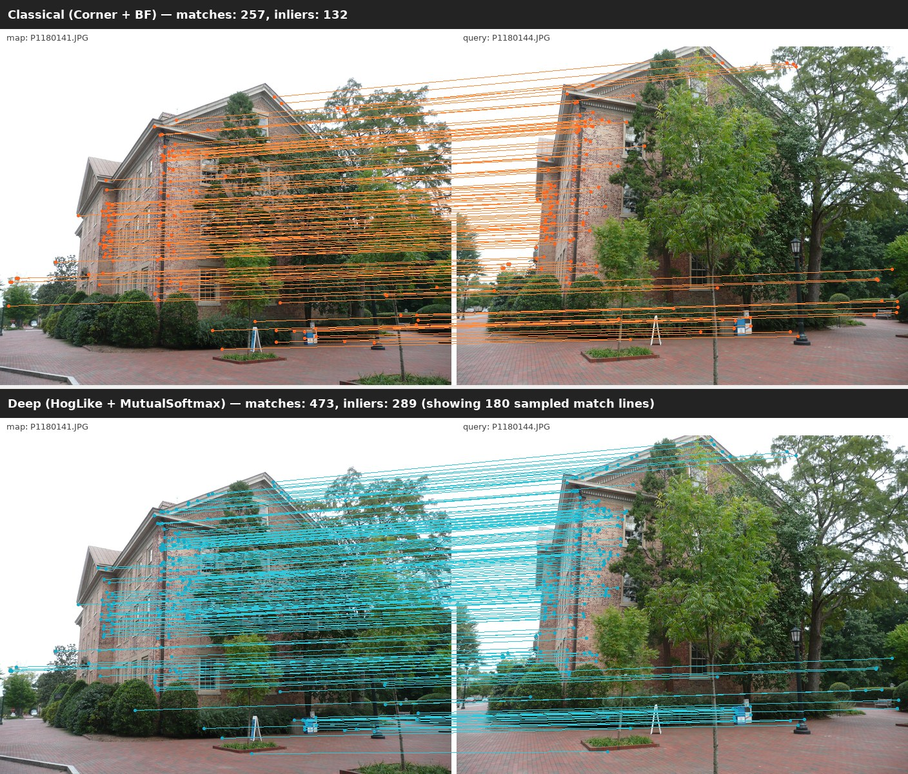
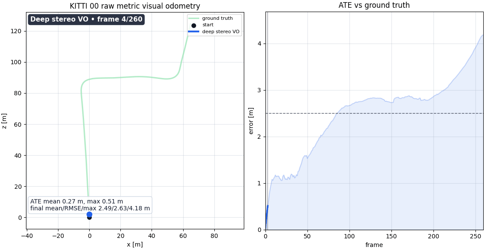
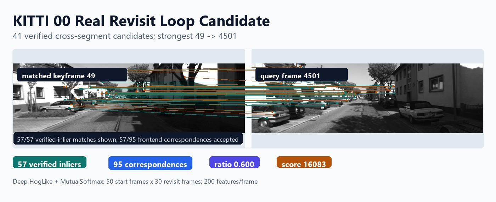

<h1 align="center">visloc-rs</h1>

<p align="center">
  <strong>Visual localization, stereo VO, and visual-inertial SLAM building blocks in Rust.</strong><br>
  COLMAP/SfM map reuse, PnP + RANSAC localization, KITTI stereo VO,
  EuRoC visual-inertial SLAM with an empirically documented adaptive
  IMU/pose tracker, loop-candidate diagnostics, bundle-adjusted
  trajectory demos, and an opt-in in-Rust SuperPoint ONNX path.
</p>

<p align="center">
  <a href="https://github.com/rsasaki0109/visloc-rs/actions/workflows/ci.yml"></a>
  
  
  
  
</p>

<p align="center">
  
  <br>
  <em>Real Rust-pipeline output on the COLMAP South Building map+query pair `P1180141 -> P1180144`:
  classical Corner+BF (top, orange) lands 132 inliers; deep HogLike+MutualSoftmax (bottom, cyan)
  lands 289 (+119 %). Reproduce with the demo command under <a href="#try-it">Try It</a>.</em>
</p>

<table>
  <tr>
    <td width="50%">
      
      <br>
      <strong>KITTI stereo VO</strong><br>
      Metric rectified-stereo VO with confidence-weighted PnP and BA diagnostics.
    </td>
    <td width="50%">
      
      <br>
      <strong>KITTI loop candidate</strong><br>
      Real revisit scan with 41 verified cross-segment candidates and strongest-pair inlier overlay.
    </td>
  </tr>
</table>

<p align="center">
  <a href="#why-visloc-rs"><strong>Why visloc-rs</strong></a> /
  <a href="#try-it"><strong>Try it</strong></a> /
  <a href="#demos"><strong>Demos</strong></a> /
  <a href="#euroc-characterisation-vs-published-baselines-honest-read"><strong>EuRoC vs ORB-SLAM3</strong></a> /
  <a href="#scope"><strong>Scope</strong></a> /
  <a href="docs/phase_20_to_27_closeout.md"><strong>EuRoC closeout</strong></a> /
  <a href="PLAN.md"><strong>Handoff plan</strong></a>
</p>

`visloc-rs` is a Rust foundation library for map-based visual localization and
the building blocks above it: load an existing COLMAP/SfM map, match query
features to landmarks, estimate camera pose with PnP + RANSAC. Optional
pipelines grow toward stereo VO, online VI-SLAM with an adaptive IMU/pose
tracker, loop-candidate reporting, pose-graph optimization, and bundle
adjustment.

The project is built for robotics localization work where you want inspectable
geometry, explicit diagnostics, reusable trait boundaries, and an honest
empirical record before committing to a heavy runtime or a full SLAM stack.

## Why visloc-rs?

Most open visual-SLAM and SfM stacks are mature C++ projects that pull in heavy
runtimes (OpenCV, Pangolin, Ceres, CUDA) and hand you a finished pipeline.
`visloc-rs` takes the opposite bet: a **pure-Rust, dependency-light, trait-based
foundation** you can read, extend, and trust - with an honest empirical record
instead of leaderboard claims. There is no established pure-Rust visual
localization / VI-SLAM stack today; this is meant to be that building-block layer.

- **Pure Rust, memory-safe** - no C++ toolchain, no OpenCV / Pangolin / Ceres to build.
- **No mandatory ML runtime** - default crates need no PyTorch / ONNX / CUDA; learned
  frontends (SuperPoint / LightGlue, in-Rust ONNX) are strictly opt-in behind features.
- **Inspectable geometry & diagnostics** - every stage exposes inlier counts,
  reprojection error, and tracking / loop diagnostics instead of a black box.
- **Trait-based, replaceable frontends** - feature extractors, matchers, pose
  estimators, priors, and VO frontends are swap-in trait boundaries.
- **Reproducible by construction** - a toolchain pin plus a 3-run determinism
  protocol confirms bit-identical rebuilds across tested configurations.

| | visloc-rs | ORB-SLAM3 | COLMAP |
| --- | --- | --- | --- |
| Language | **Rust** | C++ | C++ |
| Mandatory heavy runtime | none (opt-in ONNX) | OpenCV, Pangolin | OpenCV, Ceres |
| Primary focus | map-reuse localization + VO / VI building blocks | real-time VI-SLAM | offline SfM / MVS |
| Maturity | young foundation (v0.1) | research / production | production |
| License | MIT OR Apache-2.0 | GPLv3 | BSD |

`visloc-rs` is deliberately **not** a finished SLAM system (see
[Project Boundaries](#project-boundaries)); it is the layer you reach for when you
want to compose and understand the pipeline, not just run a black box.

**30-second taste** - no dataset download, no extra features:

```bash
cargo run --example localize_dummy
```

## Highlights

| Area | What works now |
| --- | --- |
| Map localization | COLMAP text/binary IO, descriptor stores, 2D-3D correspondence building, DLT PnP, PnP RANSAC, optional Gauss-Newton pose refinement |
| Stereo VO | Rectified-stereo triangulation, confidence-weighted 2D-3D PnP, Kabsch fallback, pair diagnostics, KITTI trajectory export/eval |
| **EuRoC VI-SLAM** | Adaptive IMU/pose tracker (`ImuVelocityRefreshPolicy` Phase-25), motion-based VI init, local VI-BA sliding window, stereo-strict bootstrap, recovery PnP scaffold. **V1_01 strict + SuperPoint -> 0.0029 m rigid ATE on tracked frames** (Phase-26 #1). See [`docs/phase_20_to_27_closeout.md`](docs/phase_20_to_27_closeout.md) |
| Deep-style frontend | Pure-Rust HOG-like descriptors, LightGlue-style mutual-softmax matcher, external SuperPoint/LightGlue file bridge, **opt-in in-Rust SuperPoint ONNX runtime** behind `--features onnx-inference` (Phase-27) |
| Optimization | Sparse Cholesky bundle adjustment, Huber/Cauchy robust kernels, full SE(3) pose-graph optimization (GN/LM, 6x6 anisotropic information matrices) with `.g2o` `EDGE_SE3:QUAT` IO, automatic fill-reducing reordering (Reverse Cuthill-McKee vs. nested dissection by symbolic factor size, with a minimum-degree rescue for dense ICP graphs), a block (`BxB`-kernel) Cholesky that is ~3-4x faster than scalar `CscCholesky`, and a default-on chordal rotation initialization that takes the hard 3D graphs from stalled to converged - runs on the standard `sphere2500`/`torus3D`/`parking-garage`/`cubicle`/`rim` benchmarks (see [Benchmark Snapshot](#benchmark-snapshot)); plus a 7-DOF Sim(3) pose graph for monocular scale-drift correction |
| Sequence tooling | Tracking states, local mapping skeleton, loop-candidate reports, ATE/RPE/KITTI/TUM trajectory evaluators |
| Fusion hooks | Timestamped frames, GNSS/pose/IMU measurements, loose localization priors, VI initialization workstream |
| Reproducibility | `rust-toolchain.toml` pin + `scripts/verify_binary_determinism.sh` 3-run protocol confirms bit-identical cross-rebuild on all tested configurations (baseline corner + SP+strict V1_01 / V2_01) |

## Benchmark Snapshot

These are local public-data development measurements, not official benchmark
leaderboard submissions.

| Demo | Dataset | Result |
| --- | --- | ---: |
| COLMAP localization sweep | South Building, 25 map/query pairs | Deep-style descriptors give **+37% to +98%** more verified inliers as viewpoint gap grows |
| KITTI loop scanner | KITTI 00 start + revisit sandwich | Quick deep run (`50x30`, 200 features/frame) finds **41** verified cross-segment candidates; strongest pair `49 -> 4501` has **57/95** inliers |
| SP/LG stereo VO + BA | KITTI odometry train `00..10`, 260 frames each | `mean_t_rel = 1.2715%`, `mean_max_t_rel = 2.9785%` with tuned SuperPoint/LightGlue + BA |
| EuRoC VI-SLAM (SuperPoint + strict-stereo) | EuRoC V1_01_easy, Phase-26 #1 strict | rigid ATE **0.0029 m** (sim_scale 1.026 ~= metric) on 93 surviving frames, coverage 6 % - see *EuRoC characterisation* below |
| EuRoC VI-SLAM (HOG + ThreePoseSmoother) | EuRoC V2_01_easy, Phase-25 strict | rigid ATE **0.198 m** on 102 surviving frames, coverage 6.8 % |
| KITTI stereo VO + PGO | KITTI 00 real stereo image window | README asset run lowers max translation error **2.01 m -> 0.72 m** after pose-graph correction |

Rough KITTI context: the local SP/LG + BA `mean_t_rel = 1.2715%` would sit
around **overall rank 70** on the public KITTI odometry table by translation
error if naively inserted - scale reference, not a leaderboard claim. The
local run uses training sequences `00..10` and 260-frame subsets; the official
benchmark ranks hidden test sequences `11..21` with `100..800 m` segment
evaluation.

### Pose-graph optimization on the g2o benchmarks

visloc-rs ships a pure-Rust, deterministic SE(3) pose-graph optimizer
(`PoseGraph::optimize_se3_iterative` - iterative Gauss-Newton / Levenberg-
Marquardt on the SE(3) manifold, full 6x6 anisotropic information matrices,
robust kernels, dense or sparse Cholesky) plus `.g2o` `EDGE_SE3:QUAT` read/write
([`read_g2o`](pipelines/slam/src/g2o.rs)), so it runs directly on the canonical
pose-graph datasets the SLAM back-end literature reports on - no C++, no Ceres,
no ROS.

| Dataset | Poses | Edges | initial chi^2 | final chi^2 | reduction | solve |
| --- | ---: | ---: | ---: | ---: | ---: | ---: |
| `parking-garage` | 1661 | 6275 | 1.68e4 | 1.27e0 | **99.99 %** | ~0.3 s |
| `sphere2500` | 2500 | 4949 | 2.63e6 | 1.66e3 | **99.94 %** | ~1.8 s |
| `torus3D` | 5000 | 9048 | 4.75e6 | 6.02e4 | **98.73 %** | ~9.7 s |
| `cubicle` | 5750 | 16869 | 1.09e7 | 9.59e3 | **99.91 %** | ~10 s |
| `rim` | 10195 | 29743 | 1.26e8 | 8.99e7 | 28.81 % | ~15 s |
| built-in synthetic loop | 120 | 120 | 2.68e2 | ~1e-21 | **100 %** | <0.2 s |

(`solve` is the SE(3) optimization from raw odometry, no chordal seeding; the
[chordal init](#chordal-rotation-initialization-chordal-init) below converges
the hard 3D graphs to a far lower chi^2 in even less time.)

The fill-reducing reordering is what makes these tractable at all - solved in the
natural variable order, the Cholesky factor fills in catastrophically. For each
graph it picks the cheaper of a Reverse Cuthill-McKee (band-minimizing) and a
nested-dissection (separator) ordering by symbolic Cholesky factor size, and -
since the sparsity pattern is identical across iterations - computes that
ordering just once. RCM wins on the near-banded `parking-garage` corridor;
nested dissection wins on the wide 3D meshes, taking `torus3D` from *no
convergence within minutes* to seconds.

The dense ICP graphs `cubicle` and `rim` defeat *both* geometric orderings - the
factor blows up past the dense-matrix size, so even *counting* it dominates the
solve. A **minimum-degree** rescue ordering (the local heuristic behind
AMD/SuiteSparse) is held in reserve for exactly this case: the symbolic count is
capped at a small multiple of the minimum-degree factor, so a blown-up geometric
ordering is abandoned cheaply and the rescue ordering is adopted, taking
`cubicle` from a >10-minute timeout to ~10 s. It is *only* used on that
catastrophic blow-up - minimum degree's factor, though it has fewer nonzeros,
factorizes more slowly than a balanced geometric ordering (its elimination tree
is deeper and less cache-friendly), so it never second-guesses a healthy
ordering (e.g. it leaves `torus3D` on nested dissection). The minimum-degree
pivot is selected with a lazy binary heap rather than an `O(n^2)` linear scan.

#### Block Cholesky factorization

The pose-graph normal matrix is not an arbitrary sparse matrix: every variable
is a fixed-size block (`6x6` for an SE(3) pose, `3x3` for a rotation column or a
translation center), and an edge couples two *blocks*, never two stray scalars.
A scalar sparse Cholesky (such as `nalgebra_sparse`'s `CscCholesky`) ignores
that and factors one scalar column at a time, paying the sparse gather/scatter
bookkeeping `b^2` times per block. visloc-rs factors at block granularity
instead: a left-looking Cholesky over the block elimination tree whose "scalars"
are stack-allocated `BxB` matrices, so each diagonal factorization, triangular
solve, and trailing update is a single dense `nalgebra` kernel the compiler
unrolls and vectorizes (the block size is a const generic, fully monomorphized
for `B = 3` and `B = 6`). The numeric phase scatters each column's trailing
updates through a precomputed relative-index map rather than a `binary_search`
per touched block, so on the same fill-reducing order this is **~5.6x** faster
than scalar `CscCholesky` on a `sphere2500`-scale `6x6` system in isolation, and
**~3-4x** faster end-to-end at bit-equivalent solutions:

| Dataset | scalar `CscCholesky` | **block Cholesky** | speedup |
| --- | ---: | ---: | ---: |
| `parking-garage` | ~0.9 s | **~0.3 s** | ~2.9x |
| `sphere2500` | ~6.8 s | **~1.8 s** | ~3.7x |
| `torus3D` | ~42 s | **~9.7 s** | ~4.3x |
| `cubicle` | ~34 s | **~10 s** | ~3.4x |
| `rim` | ~55 s | **~15 s** | ~3.8x |

The same back-end factors the **bundle-adjustment** Schur complement. After the
landmarks are eliminated, the reduced camera system is itself block-structured
(`6x6` pose blocks), so visual BA routes it through the identical `B = 6` block
Cholesky rather than scalar `CscCholesky` - bit-comparable to the dense solve
(an integration test cross-checks `Sparse` against `Dense`) and ~1.4x faster
end-to-end on a covisibility-dense 120-keyframe synthetic scene (the reduced
factorization is one of several costs per iteration, so the gain tracks its
share). Visual-inertial systems interleave `3`-DOF velocity blocks that break
the uniform `6x6` tiling and keep the scalar factorization.

Across the iterations of one optimization the normal matrix changes values but
never its sparsity, so the solver splits the classic way: the **symbolic
analysis** (elimination tree, per-column fill patterns, levels) and the COO->block
pattern assembly are computed once and cached alongside the fill-reducing order,
and every subsequent iteration only re-scatters the block values and re-runs the
numeric factorization. On the g2o benchmarks that pattern work was ~20-30% of each
solve, so caching it is a clean ~1.1x (and more on the small chain graphs, whose
numeric phase is tiny next to the per-iteration assembly) at an identical result.

The numeric phase is also parallelized across the block elimination tree: columns
are grouped into independent *levels* (a column depends only on its descendants,
which sit at strictly lower levels), and each sufficiently heavy level is factored
on a `rayon` pool while the finished lower levels are read - a topological
reordering of the sequential sweep, so the factor stays bit-identical (and disabled
cleanly with `RAYON_NUM_THREADS=1`). Across-level parallelism alone is bounded by
the tree shape - the work concentrates in the narrow separator levels near the root
while the wide levels are cheap leaves, leaving the width-1 separator chain serial.
That chain is attacked by a second, orthogonal axis: a heavy separator column's
trailing update is a sum over its hundreds of (already-finished) contributors, so
when a column stays off the level path it is instead factored by reducing that sum
across the pool. This is pure-Rust *intra-separator* parallelism - it splits the
left-looking updates across contributors, not a dense panel across cores, so unlike
the supernodal/BLAS-3 route it needs no tuned BLAS (it trades exact bit-identity for
a deterministic, agrees-to-rounding factor). Together the two axes reach ~1.4x
end-to-end on `torus3D` and ~1.26x on `rim` (up from ~1.17x / ~1.09x with across-level
alone), staying neutral and never regressing on small or chain-like graphs (a
per-level work gate keeps `parking-garage` off the parallel path).

The loader is also robust to the malformed information matrices that real
scan-matching datasets ship: `cubicle` and `rim` contain edges whose `Omega` is
not positive-semidefinite (a rotation sub-block with off-diagonal entries
dwarfing its diagonal, eigenvalues down to ~-6e6), which would make the
Gauss-Newton `H` indefinite and the Cholesky factorization fail outright.
`read_g2o` projects every information matrix onto the PSD cone (clamping
negative eigenvalues to zero) on load, which is the exact identity on a valid
matrix, so these datasets optimize instead of aborting. `cubicle` then drives
down cleanly (**99.91 %**); `rim`, started from raw odometry, is genuinely
harder - LM makes early progress then stalls (its damping saturates), reaching
only **28.81 %** (the table above). That stall is a *basin* problem, not a
solver bug, and a chordal rotation initialization fixes it (next).

#### Chordal rotation initialization (`--chordal-init`)

On strongly non-convex 3D graphs the SE(3) cost surface has deep local minima in
rotation, so Levenberg-Marquardt started from odometry settles into a poor basin
and stalls. Seeding it with a **chordal rotation initialization** (Carlone et
al., *Initialization Techniques for 3D SLAM*, ICRA 2015) lands it near the global
optimum. `PoseGraph::initialize_rotations_chordal` relaxes every rotation from
`SO(3)` to an unconstrained `3x3` matrix, minimizing the Frobenius residual
`sum_e w_e * ||R_to - R_meas * R_from||^2` as one linear least-squares problem;
because the relaxation decouples by rotation column, the per-node `9`-vector
splits into three `3`-vector systems that share *one* `3n x 3n` normal matrix
(factored once, solved for three right-hand sides), and each relaxed block is
projected back onto `SO(3)` with an SVD. Translations are then re-derived by the
existing linear translation solve before the full SE(3) run.

`optimize_se3_iterative` runs this seeding **by default** (`PoseGraphSe3Config {
chordal_init: true, .. }`): the rotation optimum is a fixed point of the
relaxation, so on an already-consistent graph it leaves the estimate essentially
unchanged (a cheap extra factorization) while rescuing the hard ones, and the
step is best-effort (a singular relaxation is silently skipped) so it can never
turn a solvable problem into a failure. The `pgo_g2o_benchmark` example disables
the in-solver default and drives the step manually behind `--chordal-init`, so
its before/after chi^2 below stays a clean, independently-measured comparison.

The effect is a uniform win on the hard 3D graphs - never a worse final chi^2,
always equal-or-faster, and it flips three datasets from non-converged to
converged:

(times below use the block Cholesky throughout):

| Dataset | LM from odometry (final chi^2, time) | **+chordal init** (final chi^2, time) |
| --- | --- | --- |
| `sphere2500` | 1.66e3, ~1.8 s | 1.66e3, **~1.1 s** |
| `torus3D` | 6.02e4, ~9.7 s | **2.45e4**, **~5.5 s** (converges) |
| `cubicle` | 9.59e3, ~10 s | **4.40e3**, **~4.0 s** |
| `rim` | 8.99e7, ~15 s (28.8 %) | **1.16e5**, **~10 s** (**99.9 %**, converges) |

`rim`'s final chi^2 drops by ~775x and it finally converges; `torus3D` and
`cubicle` reach a ~2x lower chi^2 in ~2x less wall-clock. The chordal solve
itself is cheap (~0.4 s on `torus3D`, ~0.8 s on `rim`). `parking-garage` is
already trivial from odometry, so the init leaves it unchanged - no regression.

Reproduce (the fetch script pulls the standard SE-Sync dataset suite -
`sphere2500`, `torus3D`, `parking-garage`, `cubicle`, `grid3D`, `rim`):

```sh
scripts/fetch_pgo_g2o_datasets.sh datasets/pgo_g2o
cargo run --release --example pgo_g2o_benchmark -- datasets/pgo_g2o/parking-garage.g2o
# hard 3D graphs: seed LM with a chordal rotation initialization
cargo run --release --example pgo_g2o_benchmark -- --chordal-init datasets/pgo_g2o/rim.g2o
# or, zero-setup, the built-in deterministic loop graph:
cargo run --example pgo_g2o_benchmark
```

chi^2 is the sum of Mahalanobis edge residuals in visloc-rs's world-frame
residual convention - it is not bit-comparable to a specific g2o/GTSAM build
(those use a body-frame residual), so the figure of merit here is the optimizer
deterministically driving a drifted graph down to a near-consistent optimum,
not the absolute number.

### EuRoC characterisation vs published baselines (honest read)

The EuRoC numbers above are from the systematic Phase-{20..27} EuRoC
visual-inertial workstream documented in
[`docs/phase_20_to_27_closeout.md`](docs/phase_20_to_27_closeout.md).
The strict-stereo bootstrap visloc-rs uses is **accuracy-favouring rather
than coverage-favouring**: it gives up tracking on EuRoC cliff regions
where descriptor / IMU disagreement spikes, rather than admit wrong-scale
solutions. On the frames it does track, per-frame accuracy is competitive
with published full-sequence numbers; on full-sequence coverage it is not.

| Method | V1_01_easy ATE | V2_01_easy ATE | Coverage | Stack |
| --- | --- | --- | --- | --- |
| ORB-SLAM3 mono-inertial *[Campos et al. 2021]* | 0.038 m | 0.032 m | full sequence | C++, OpenCV/Eigen, manual CMake, full bundle adjustment |
| ORB-SLAM3 stereo-inertial *[Campos et al. 2021]* | 0.037 m | 0.038 m | full sequence | C++ |
| VINS-Fusion stereo-inertial *[Qin et al. 2019]* | 0.087 m | 0.150 m | full sequence | C++, Ceres, ROS-tied |
| **visloc-rs V1_01 strict + SuperPoint** | **0.0029 m\*** | - | **6 % of frames** | Rust, no mandatory ML runtime, library-first, sandbox-friendly, no CMake |
| **visloc-rs V2_01 strict + SuperPoint** | - | **0.201 m\*** | **6 % of frames** | Same stack as above; V2_01 strict lands in a wrong-scale regime (sim_scale 1.955) on the pinned binary |
| **visloc-rs V2_01 strict + HOG (Phase-25)** | - | **0.198 m\*** | **6.8 % of frames** | Rust, classical descriptor only |

`\*` Per-frame rigid-ATE-on-surviving-frames; not directly comparable to
the full-sequence ATE of the ORB-SLAM3 / VINS-Fusion rows.
[`docs/phase_20_to_27_closeout.md`](docs/phase_20_to_27_closeout.md)
covers the trade-off (Phase-26 #2 / #2b / #4 honest negatives, Phase-26
#3c MH_01 decomposition) - recovery PnP on EuRoC cliffs is structurally
unsalvageable with the tracker-side intervention space tested, so the
coverage gap vs published full-sequence methods is real and known.

**Use visloc-rs today** if you want a Rust-side foundation library you can
build your own SLAM-style stack on top of, with the documented empirical
journey as a guide to what works and what doesn't.
**Use ORB-SLAM3 / VINS-Fusion today** if you need turnkey full-sequence
visual-inertial SLAM on the EuRoC profile.

## Project Boundaries

The first public slice is deliberately narrow: make visual localization solid,
observable, and easy to extend instead of hiding an unfinished SLAM stack
behind a large API.

- **Input:** existing COLMAP/SfM maps, landmark descriptors, query features, stereo image sequences, file-backed external deep features/matches, or pre-exported SuperPoint features
- **Output:** `SE3` / `Pose` estimates, inlier counts, reprojection error, tracking diagnostics, loop-candidate diagnostics, pose trajectories
- **Extensible:** feature extractors, matchers, pose estimators, priors, and VO frontends are trait-based
- **Core stays light:** no mandatory OpenCV, PyTorch, ONNX, TensorRT, or GPU runtime in default crates
- **Not claimed:** production full SLAM, dense mapping, production loop closure, full SfM, tightly coupled VIO/GNSS, or official KITTI leaderboard results

## Try It

```bash
# Smallest end-to-end: localize a synthetic query against a 1-landmark map.
cargo run --example localize_dummy

# COLMAP South Building localization (downloads ~100 MB on first run).
cargo run --features image-io --example deep_localization_demo -- \
    --root ~/datasets/south-building/south-building \
    --map-image P1180141.JPG --query-image P1180144.JPG

# Image-sequence tracking smoke.
cargo run --features image-io --example track_image_sequence_from_common_images

# Public-data KITTI 00 revisit scanner (downloads start/revisit slices).
python scripts/run_kitti_deep_vo_revisit_smoke.py
# Default quick run: deep frontend, 50 start frames, 30 revisit frames,
# 200 features/frame, writes target/kitti_revisit_deep_smoke/index.html.
# Add --readme-asset-out docs/assets/kitti_revisit_loop_candidate.jpg to
# regenerate the verified-inlier README image from the same report.
# Add --readme-headline-gate to guard the README headline numbers
# (41 candidates, strongest 49 -> 4501, 57 inliers, ratio 0.600).

# Full local quality gate (fmt + clippy + test + doc).
scripts/check.sh
```

## Demos

Each row points at a runnable example or sweep script; longer walkthroughs
live under `docs/`.

| Demo | Stack | Reference |
| --- | --- | --- |
| COLMAP South Building localization | Real images vs sparse SfM map, deep frontend optional | [`examples/deep_localization_demo.rs`](examples/deep_localization_demo.rs), [`docs/public_data_demo.md`](docs/public_data_demo.md) |
| KITTI stereo VO + BA + loop closure | Rectified stereo -> 2D-3D PnP -> multi-frame BA -> essential-matrix verifier -> SE(3) PGO | [`examples/online_slam_stereo_vo_kitti_demo.rs`](examples/online_slam_stereo_vo_kitti_demo.rs), [`scripts/run_kitti_deep_vo_smoke.sh`](scripts/run_kitti_deep_vo_smoke.sh) |
| KITTI 00 sandwich loop detection | Start + revisit slices, quick deep scanner by default; pass `--frontend both` for classical-vs-deep comparison. Cross-platform runner writes `index.html`, strongest-pair verified-inlier overlay SVG, and README asset thumbnails (`41` candidates in the default quick run) | [`examples/kitti_revisit_scanner_demo.rs`](examples/kitti_revisit_scanner_demo.rs), [`scripts/run_kitti_deep_vo_revisit_smoke.py`](scripts/run_kitti_deep_vo_revisit_smoke.py), [`scripts/run_kitti_deep_vo_revisit_smoke.sh`](scripts/run_kitti_deep_vo_revisit_smoke.sh), [`scripts/render_kitti_revisit_report_asset.py`](scripts/render_kitti_revisit_report_asset.py) |
| Synthetic scanner loop closure | 9-keyframe arc, appearance scan -> loop edge -> SE(3) PGO. `<2 cm` max error recovery | [`examples/scanner_loop_closure_demo.rs`](examples/scanner_loop_closure_demo.rs) |
| Sim(3) scale-drift correction | 24-node monocular loop with a compounding 3 %/keyframe scale shrink; a Sim(3) pose graph drives the loop closure to recover ground truth: worst `\|scale-1\|` **0.50 -> 0**, mean position error **1.49 m -> 0 m** | [`examples/sim3_scale_drift_pgo_demo.rs`](examples/sim3_scale_drift_pgo_demo.rs) |
| Deep frontend two-view geometry | HogLike + MutualSoftmax vs classical Corner + BF on a synthetic 30 deg baseline scene (~30x rot/translation-direction win) | [`examples/deep_frontend_two_view_demo.rs`](examples/deep_frontend_two_view_demo.rs) |
| SuperPoint/LightGlue VO + multi-frame BA | File-backed SP/LG features -> confidence-weighted PnP -> BA. KITTI train `00..10` `mean_t_rel 1.27 %` | [`scripts/run_kitti_superpoint_lightglue_vo_train_benchmark.sh`](scripts/run_kitti_superpoint_lightglue_vo_train_benchmark.sh) |
| **EuRoC online VI-SLAM** | Adaptive IMU/pose tracker, motion-based VI init, local VI-BA, stereo-strict bootstrap. SuperPoint optional via offline replay or `--features onnx-inference` | [`examples/euroc_online_slam_vi_image_demo.rs`](examples/euroc_online_slam_vi_image_demo.rs), [`docs/phase_20_to_27_closeout.md`](docs/phase_20_to_27_closeout.md) |
| GNSS-prior moving-camera tracking | Image sequence + GNSS-derived submap narrowing, writes an `index.html` dashboard | [`examples/track_sequence_with_gnss_prior.rs`](examples/track_sequence_with_gnss_prior.rs), [`docs/gnss_demo.md`](docs/gnss_demo.md) |
| KITTI / TUM trajectory ATE + RPE evaluator | Frame-id-matched ATE (Umeyama SE(3)/Sim(3) alignment, `--max-mean / --max-rmse / --min-matched` thresholds) **and TUM-style relative pose error (RPE)** over Δ-spaced pairs (`--rpe-delta`), reporting alignment-free translation/rotation RMSE | [`examples/evaluate_trajectory_from_tum_files.rs`](examples/evaluate_trajectory_from_tum_files.rs), [`examples/evaluate_trajectory_from_kitti_files.rs`](examples/evaluate_trajectory_from_kitti_files.rs), [`examples/evaluate_kitti_odometry_benchmark.rs`](examples/evaluate_kitti_odometry_benchmark.rs) |
| Binary determinism verification | Three-run protocol on EuRoC V2_01 baseline + SuperPoint configurations | [`scripts/verify_binary_determinism.sh`](scripts/verify_binary_determinism.sh), [`docs/binary_determinism_findings.md`](docs/binary_determinism_findings.md) |

A walkable index of every example file lives in
[`docs/demo_strategy.md`](docs/demo_strategy.md); the per-area numbers and
methodology behind the benchmarks above are in the corresponding `docs/`
notes.

## EuRoC visual-inertial SLAM (Phase-{20..27})

The Phase-{20..27} arc (2026) systematically explored adaptive
IMU/pose motion modelling, motion-based VI initialization, local VI-BA,
SuperPoint integration, relocalization, and binary determinism on the
EuRoC MAV benchmark. The single-source-of-truth synthesis is
[`docs/phase_20_to_27_closeout.md`](docs/phase_20_to_27_closeout.md).
Major shipped artifacts:

- `pipelines/tracking/src/lib.rs::AdaptiveImuPoseMotionModel` + `ImuVelocityRefreshPolicy` enum (Phase-25, recommended default `ThreePoseSmoother` gave V2_01 strict -25 % rigid ATE).
- `pipelines/slam/src/lib.rs::OnlineSlamRelocalizationConfig` + `maybe_run_relocalization` (Phase-23 #1, Phase-26 #4 active-frontier submap + IMU sanity check fields).
- `crates/vision/src/features/superpoint_onnx.rs` opt-in in-Rust SuperPoint ONNX extractor (`--features onnx-inference`, Phase-27). Empirically bit-identical to the existing Python pre-export path; choose based on deployment / latency.
- `rust-toolchain.toml` pin + `scripts/verify_binary_determinism.sh` (binary determinism mitigation #1, confirmed bit-identical cross-rebuild on every tested configuration).

The closeout doc lists every CLI flag with a justification, the empirical
headlines per phase, and the known issues (V2_01 strict SP wrong-scale
regime on the pinned binary; recovery PnP structurally unsalvageable on
EuRoC cliffs; MH-class accuracy/continuity trade-off).

## Scope

Implemented now: core map/pose types, `SE3`/`SO3` wrappers, brute-force +
mutual-softmax matchers, DLT PnP, PnP RANSAC with weighted variants and
optional Gauss-Newton refinement, COLMAP text/binary IO, KITTI calibration
parsing, image-sequence loaders, validated visual maps, localization pipeline
with descriptor stores, sequence tracking with motion priors and loss/
relocalization events, local mapping skeleton with keyframe policies +
windowed local refinement, online SLAM MVP with loop-candidate diagnostics,
loose-coupling fusion foundation with GNSS/pose/IMU measurements, rectified-
stereo VO frontend, Schur-complement bundle adjustment with sparse Cholesky +
Huber/Cauchy robust kernels, SE(3) pose-graph optimizer with essential-matrix
/ PnP / hybrid loop-closure verifiers, KITTI/TUM ATE evaluators, and a
documented EuRoC VI-SLAM workstream (Phase-{20..27}).

Not implemented yet: production-grade full SLAM; full SfM; production loop
closure across long real revisits; dense mapping; full tightly-coupled
visual-inertial or GNSS/INS fusion.

`visloc-rs` starts with visual localization because it is the smallest useful
slice: a map exists, a query image arrives, the library estimates a camera
pose. The design keeps the path open for Visual SLAM, SfM map reuse, VI
fusion, and GNSS fusion by separating core data types, geometry, matching,
PnP, RANSAC, IO, and pipeline composition.

## Roadmap

[`docs/roadmap.md`](docs/roadmap.md) has the staged plan; [`PLAN.md`](PLAN.md)
is the handoff checklist. Near-term layers:

- Sequential localization and tracking quality improvements
- Local mapping and lightweight keyframe policies
- Online Visual SLAM with incremental map updates
- Deep visual odometry frontend integration
- Loop-closure candidate detection and visualization
- Visual-inertial and GNSS priors/fusion
- Larger public-data evaluation scripts

Public showcase bets that are likely to matter most for new users:

- One-command KITTI revisit demo that fetches the start/revisit slices, runs a quick deep scanner by default, and writes a compact HTML report.
- Real-data loop-closure gallery: strongest pairs, inlier overlays, trajectory edge, and accepted/rejected verifier diagnostics.
- Browser-first run reports for sequence demos: thumbnails, match counts, ATE curves, PGO deltas, and exact reproduction commands.
- 3DGS/NeRF bootstrap export from the stereo VO path, so users can turn a moving-camera sequence into a COLMAP-compatible sparse scene.

## Minimal Example

```rust
use nalgebra::{Point3, UnitQuaternion, Vector3};
use visloc_rs::prelude::*;

let camera = Camera::pinhole(1, 640, 480, 500.0, 500.0, 320.0, 240.0);
let pose = Pose::from_world_to_camera(UnitQuaternion::identity(), Vector3::zeros());
let point = Point3::new(0.0, 0.0, 5.0);

let mut map = VisualMap::new();
let mut landmark = Landmark::new(1, point);
landmark.descriptor = Some(vec![1.0, 0.0]);
map.landmarks.insert(1, landmark);

let query = QueryImage {
    camera: camera.clone(),
    keypoints: vec![camera.project(&pose.transform_world_point(&point)).unwrap()],
    descriptors: vec![vec![1.0, 0.0]],
};

let result = localize(query, map);
```

When descriptors live outside the map, use `LandmarkDescriptorStore` and call
`localize_with_descriptor_store`. The text descriptor format is intentionally
simple:

```text
# LANDMARK_ID D0 D1 D2 ...
1000 0.1 0.2 0.3
1001 1.0 0.0 0.5
```

Load it with `visloc_io::descriptors::read_landmark_descriptors_txt`.

Applications can start with `visloc_rs::prelude::*` for the common
localization, map, IO, tracking, mapping, SLAM, and fusion entry points.
Explicit module paths such as `visloc_rs::io::colmap` remain available for
narrower imports.

## Layout

```text
crates/
  core/                geometry, map types, pose types
  vision/              features, matching, PnP, RANSAC, SuperPoint ONNX (opt-in)
  io/                  COLMAP text/binary, KITTI / TUM, external descriptors
pipelines/
  localization/        visual localization composition
  tracking/            sequence tracking, adaptive IMU/pose motion models
  mapping/             local mapping skeleton, staged updates
  slam/                online SLAM MVP, BA, PGO, relocalization
  fusion/              loose-coupling sensor prior foundations
examples/              executable examples (see Demos table above)
scripts/               sweep / benchmark / smoke scripts
docs/                  design notes, demo guides, EuRoC closeout, plan docs
```

## Further reading

- [`docs/phase_20_to_27_closeout.md`](docs/phase_20_to_27_closeout.md) - single-source-of-truth EuRoC arc synthesis with recommended-config table, per-phase outcomes, known issues, headline ATE evolution.
- [`docs/superpoint_onnx_runtime_plan.md`](docs/superpoint_onnx_runtime_plan.md) - Phase-27 activation contract, model sourcing, validation plan.
- [`docs/binary_determinism_findings.md`](docs/binary_determinism_findings.md) - toolchain-pin + verification protocol + empirical ledger.
- [`docs/motion_based_vi_alignment.md`](docs/motion_based_vi_alignment.md) - narrative log of the motion-based VI alignment workstream (Phase-13 onwards).
- [`docs/colmap_compatibility.md`](docs/colmap_compatibility.md) - COLMAP/SfM map compatibility notes.
- [`docs/gnss_demo.md`](docs/gnss_demo.md), [`docs/kitti_image_sequence_demo.md`](docs/kitti_image_sequence_demo.md), [`docs/timestamped_gnss_image_demo.md`](docs/timestamped_gnss_image_demo.md) - per-demo guides.
- [`docs/migration.md`](docs/migration.md), [`docs/publishing.md`](docs/publishing.md), [`docs/api_stability.md`](docs/api_stability.md) - release / publish / stability notes.
- [`CONTRIBUTING.md`](CONTRIBUTING.md), [`SECURITY.md`](SECURITY.md), [`CHANGELOG.md`](CHANGELOG.md).
