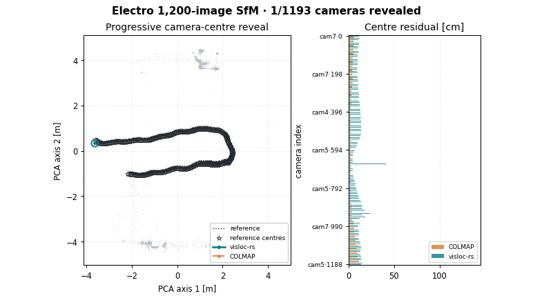

<h1 align="center">visloc-rs</h1>

<p align="center">
  <strong>GPS-denied visual localization, VO/SfM, and SLAM building blocks for robots and UAVs &mdash; in pure Rust.</strong>
</p>

<p align="center">
  <a href="https://github.com/rsasaki0109/visloc-rs/actions/workflows/ci.yml"></a>
  
  
  
</p>

## 1,200-image Electro scale checkpoint

<p align="center">
  
</p>

**visloc-rs now registers all 1,200 cameras with 31.1% lower centre RMSE than
COLMAP, while its mapper is 3.31× faster on the same frozen images and
deterministic 12,000-pair schedule.** This is an honest phase-level result:
matching is still 4.43× slower, mapper peak RSS is 3.20× higher, and feature
extraction has not yet been measured under the same contract.

| Same-input phase / result | visloc-rs | COLMAP 3.9.1 CPU | Current outcome |
| --- | ---: | ---: | --- |
| Exact-pair matching | 2,085.89 s | **471.37 s** | 4.43× slower |
| Mapper wall time | **1,490.07 s** | 4,929.56 s | **3.31× faster** |
| Mapper peak RSS | 3.83 GiB | **1.20 GiB** | 3.20× higher |
| Registered cameras | **1200/1200** | **1200/1200** | parity |
| Camera-centre RMSE | **3.22 cm** | 4.68 cm | **31.1% lower** |

<p align="center"><sub>The camera-centre plot uses all 1,200 stems and Sim(3)
alignment to the supplied calibration proxy. Ground truth is score-only. The
quality champion uses an explicit 96-correspondence mapper cap plus one bounded
post-refinement registration pass; the cap is not a global default. Feature
extraction is not yet measured under the same contract, so this is not an
end-to-end speed claim. See the
<a href="docs/electro_performance_roadmap.md">performance and memory roadmap</a>
and <a href="benchmarks/electro/quality-attribution.json">quality-attribution ledger</a>.</sub></p>

<p align="center"><sub><a href="docs/assets/electro_1200_sfm_comparison.png">Open the full-resolution still comparison</a>.</sub></p>

### 300-image reliability gate

Before another 1,200-image tuning run, the resumable pipeline was killed,
restarted, corrupted, and repeated on a frozen 300-image probe. The bounded
K=64 schedule retained **99.871%** of exhaustive verified pairs and lost only
**0.667 percentage point** of registration; two complete runs reproduced the
same candidate, feature, snapshot, and COLMAP-model hashes.

| Measured probe result | Bounded K=64 | Exhaustive control |
| --- | ---: | ---: |
| Candidate / verified pairs | 10,634 / 3,878 | 44,850 / 3,883 |
| Verified-pair recall | **99.871%** | 100% |
| Registered cameras | 200/300 | 202/300 |
| Matching / mapper wall | 90.65 s / 75.97 s | 160.58 s / 90.38 s |
| Mapper peak RSS | **169.7 MiB** | 170.2 MiB |

<p align="center"><sub>Feature extraction was 630.76 s with 193.4 MiB peak
RSS; the full generated feature + run footprint was 318.8 MiB. Same-size
corruption is rejected and SIGKILL resume reproduces uninterrupted hashes. See the
<a href="benchmarks/electro/electro-300-phase-ledger.json">phase ledger</a>
and <a href="benchmarks/electro/electro-300-failure-injection.log">failure-injection record</a>.</sub></p>

## Measured courtyard SfM control

<p align="center">
  
</p>

**38/38 cameras registered at 0.5379 cm centre RMSE for visloc-rs, versus 1.6166 cm for official COLMAP CPU SIFT — 66.7% lower (3.01×).** Both results use the same 38 official high-resolution courtyard images, exhaustive 703-pair features/matches, and per-image PINHOLE calibration; only downstream verification/mapping differs.

| Metric | visloc-rs | Official COLMAP CPU |
| --- | ---: | ---: |
| Registered cameras | **38/38** | **38/38** |
| Sparse structure | 43,852 tracks / 152,432 observations | 38,422 points / 169,590 observations |
| Reported mean reprojection / point error | 0.579 px | 0.744758 px |
| Camera-centre RMSE after Sim(3) alignment | **0.5379 cm** | 1.6166 cm |

<p align="center"><sub>Lower centre RMSE is better. The plot is aligned to the supplied calibration proxy; tracks versus points and reprojection reports are not identical accounting schemes. <a href="#courtyard-control-details">Details, provenance, and reproduction</a>.</sub></p>

## Run the SfM demo

Build the example with the `image-io` feature. The unordered demo accepts a
directory of photos, estimates SIFT features in process, and writes a COLMAP
text model (`cameras.txt`, `images.txt`, and `points3D.txt`) to the path given
by `--out-colmap`. Supply either scalar intrinsics, as below, or a validated
per-image model with `--input-colmap-calibration`; datasets and calibration
files are external inputs and are not bundled with this repository.

```bash
cargo run --release --example unordered_sfm_demo --features image-io -- \
  --feature-extractor sift \
  --images-dir /path/to/my_photos \
  --width 1920 --height 1080 --fx 1400 --fy 1400 --cx 960 --cy 540 \
  --sift-max-keypoints 4096 \
  --retrieval-topk 12 --min-matches 30 --match-ratio 0.8 \
  --verification-mode full --mapper incremental \
  --next-image-policy auto --post-refinement-registration \
  --final-iterative-refinement \
  --out-colmap /path/to/runs/my-photos-sfm
```

For the measured courtyard control, keep the artifact, image, and calibration
paths explicit. `--verify-only` is fast and read-only; `--full` starts a fresh
mapping run and writes its JSON summary/model under `--output-dir`.

```bash
ARTIFACT_ROOT=/path/to/colmap_highres_exhaustive_allpairs_20260830
IMAGES_DIR=/path/to/dslr_images_undistorted
CALIBRATION_MODEL=/path/to/dslr_calibration_undistorted

scripts/benchmark_courtyard.sh --verify-only \
  --artifact-root "$ARTIFACT_ROOT" \
  --images-dir "$IMAGES_DIR" \
  --calibration-model "$CALIBRATION_MODEL" \
  --colmap-control validate --visuals check

scripts/benchmark_courtyard.sh --full --no-build \
  --artifact-root "$ARTIFACT_ROOT" \
  --images-dir "$IMAGES_DIR" \
  --calibration-model "$CALIBRATION_MODEL" \
  --output-dir /path/to/runs/courtyard-sfm \
  --colmap-control validate --visuals skip
```

The example header documents the complete unordered-SfM option set; the
[courtyard benchmark guide](docs/courtyard_benchmark.md) documents artifact
validation, candidate schedules, and reproducible large-run details.

<p align="center">
  <br>
  <sub>Online stereo SLAM on EuRoC MH_01 — onboard camera and the live map growing in real time: uninterrupted tracking throughout the shown 583-frame measured segment (100% coverage, 0.344 m rigid ATE RMSE), with the landmark map grown by stereo landmark replenishment. Still version: <a href="docs/assets/hero_euroc_mh01_light.png">light</a> · <a href="docs/assets/hero_euroc_mh01_dark.png">dark</a>.</sub>
</p>

## Quickstart

Requires Rust 1.82+.

```bash
cargo build
cargo run --example localize_dummy
```

## Verified results

Local public-data development measurements, not official leaderboard submissions.
The headline snapshot is registry-backed by
[`benchmarks/registry/readme_claims_v1.json`](benchmarks/registry/readme_claims_v1.json);
see the [registered run evidence](docs/generated/registered_runs.md) and
[scoped claim matrix](docs/generated/benchmark_claim_matrix.md).

- **KITTI multi-sequence published-baseline comparison** — one uniform full-stack config over 00/02/05/06/07/09; narrow published-baseline wins on seq00 (**1.23 m vs ORB-SLAM2 1.3 m**) and seq09 (**2.07 m vs ORB-SLAM2 3.2 m**), with seq00/05/06 in the OV2SLAM-RT accuracy band. This is not a leaderboard or ORB-SLAM3 claim; the run also records real-world frontend failure-mode fixes.
- **EuRoC MH_03 / MH_05 full pipeline** — stereo visual loop-closure + BA on MH_03 / MH_05: **0.057 m / 0.072 m** ATE. The claim matrix marks ORB-SLAM3 comparisons as behind (**~2.4x / ~1.4x**), OV2SLAM as near, and VINS-Fusion stereo as a stereo-only win; this is not a tight-VIO claim.
- **TUM RGB-D fr1_xyz / fr1_desk** — indoor handheld via **virtual stereo** (depth as a synthetic right image, zero backend changes): **0.014 m / 0.026 m** ATE, compared against published ORB-SLAM2 RGB-D ranges in the claim matrix; loop closure is a **6x** lever on the revisit-heavy desk.
- **Sequential SfM vs COLMAP (metric video)** — same 2700-frame EuRoC flight, same evo scoring: visloc stereo VO + loop SfM **6 min, 0.13 m** (trajectory 0.066 m, metric) vs COLMAP mono incremental **11.7 h, 2.18 m** (scale-free) - **~117x faster, ~17-33x more accurate, metric scale**. (Stereo-vs-mono: the win is the metric-video regime, not COLMAP's unordered-photo home turf.)
- **Unordered SfM (real photo collections)** — Orderless monocular photos -> VLAD view graph -> incremental reconstruction (robust multi-seed init, P3P register, scale-gauge-fixed BA, iterative track filter), vs **COLMAP's own model** with an independent SuperPoint frontend: **COLMAP South Building** (128 photos) **128/128 reg, 1.09 cm**; **Gerrard Hall** (100 photos, 5616x3744 OPENCV) **98/100, 0.68 cm** (3/100 single-seed) - both **0.1 % of extent**. EuRoC V2_03 orbit **31/31, 1.08 cm**

### Courtyard control details

The central apples-to-apples control uses the same 38 official high-resolution
courtyard images, official CPU-SIFT features, exhaustive 703-pair raw matches,
and per-image PINHOLE calibration. The downstream verification/mapping
implementation differs; no features are re-extracted. Camera centres in the
plot are independently Sim(3)-aligned to the supplied
calibration model, so both trajectories share one frame and scale.


The centre RMSE is lower by **66.7% (3.01×)** for this measured control;
lower is better. “Tracks” versus “points” and the two reprojection reports are
not claimed to be identical accounting schemes. The centre reference is the
supplied ETH3D calibration proxy, not an independent laser-camera ground-truth
archive. Reproduction details, hashes, and the exact COLMAP 4.2 CPU commands
are in [`docs/colmap_highres_exhaustive_audit_20260830.md`](docs/colmap_highres_exhaustive_audit_20260830.md)
and [`docs/reproducibility_ci_closure_20260830.md`](docs/reproducibility_ci_closure_20260830.md).
The committed visuals can be regenerated with
[`scripts/generate_courtyard_readme_visuals.py`](scripts/generate_courtyard_readme_visuals.py)
(`numpy`, `matplotlib`, and `Pillow` are optional asset-generation dependencies):

```bash
python3 scripts/generate_courtyard_readme_visuals.py \
  --visloc-model <visloc_model> \
  --colmap-model <colmap_model> \
  --reference-model <calibration_model> \
  --output-dir docs/assets
```

For a hash-checked, one-command validation or fresh rerun of this control, see
[`docs/courtyard_benchmark.md`](docs/courtyard_benchmark.md) and run
[`scripts/benchmark_courtyard.sh`](scripts/benchmark_courtyard.sh). Large
dataset-derived artifacts remain external to the repository.

Secondary frozen-cache measurements are kept separate from that central
control:

| Suite | Current measured result | Provenance / caveat |
| --- | --- | --- |
| South Building | **128/128**, 1.406 px, 0.73 cm | Demo no-flag `Auto`; frozen cache and calibration-proxy score |
| ETH3D terrace | **23/23**, 1.574 px, 2.56 cm | Current frozen cache; historical 12.37 cm feature cache is unavailable |
| ETH3D office | **18/26**, 1.512 px, 0.45 cm | Auto adds one camera and lowers reprojection; reference RMSE is 0.43→0.45 cm vs Count, so no accuracy gain is claimed; historical cache unavailable |
| EuRoC MH_03 | **2,700/2,700** poses; ATE Sim(3) 2.1740 m (open), 0.4393 m (loop), 0.0843 m (full), 0.0537 m (full2vhi) | Same-cache baseline/current non-regression pass under one fixed `max(5%, 5 mm)` rule; this runner has no Auto policy |

See the [current handover](docs/codex_handover.md) and [full non-regression
record](docs/nonregression_20260830.md) for exact commands, artifacts, and
classification of unavailable historical caches.

## Documentation

The [detailed README material](docs/readme_details.md) preserves the project
boundaries, feature overview, full demos table, minimal Rust example, repository
layout, roadmap, further-reading index, and complete benchmark snapshot that
previously lived here.

- **Choose and run a demo:** [demo index](docs/demo_strategy.md), [public COLMAP map-reuse demo](docs/public_data_demo.md), [GNSS-prior tracking](docs/gnss_demo.md), and [interactive KITTI trajectory viewer](https://rsasaki0109.github.io/visloc-rs/kitti3d/).
- **Understand supported configurations:** [feature matrix](docs/feature_matrix.md), [API stability](docs/api_stability.md), [COLMAP compatibility](docs/colmap_compatibility.md), and [migration notes](docs/migration.md).
- **Inspect VO and loop-closure evidence:** [KITTI multi-sequence](docs/kitti_multiseq_benchmark.md), [KITTI loop closure](docs/kitti_loop_closure_benchmark.md), [EuRoC loop closure](docs/euroc_loop_closure_benchmark.md), [TUM RGB-D](docs/tum_rgbd_benchmark.md), and [tracking persistence](docs/tracking_persistence_benchmark.md).
- **Inspect SfM evidence:** [EuRoC reconstruction](docs/euroc_sfm_benchmark.md), [sequential SfM vs COLMAP](docs/sfm_vs_colmap_benchmark.md), [unordered SfM](docs/unordered_sfm_benchmark.md), and [registry evidence for the head-to-head](docs/generated/sfm_vs_colmap_headtohead.md).
- **Inspect learned frontend evidence:** [SuperPoint ONNX/CUDA](docs/superpoint_onnx_cuda_benchmark.md), [LightGlue ONNX](docs/lightglue_onnx_benchmark.md), and [single-binary deep stereo SLAM](docs/inprocess_slam_benchmark.md).
- **Inspect mapping and optimization evidence:** [learned retrieval for relocalization](docs/learned_retrieval_relocalization.md), [multi-session lifelong mapping](docs/multi_session_lifelong_benchmark.md), and [pose-graph / BA internals with GTSAM parity](docs/pgo_internals.md).
- **Follow the project:** [roadmap](docs/roadmap.md), [contributing](CONTRIBUTING.md), [security](SECURITY.md), and [changelog](CHANGELOG.md).

## License

Licensed under either of [Apache License, Version 2.0](LICENSE-APACHE) or
[MIT license](LICENSE-MIT), at your option.
