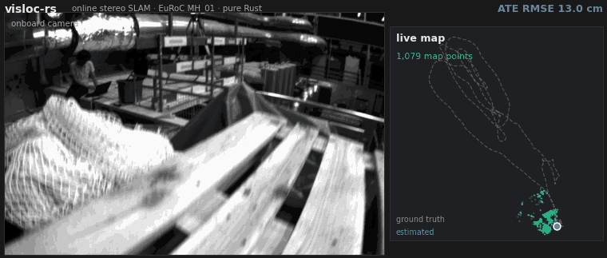

<h1 align="center">visloc-rs</h1>

<p align="center">
  <strong>GPS-denied visual localization, VO/SfM, and SLAM building blocks for robots and UAVs &mdash; in pure Rust.</strong><br>
  Three pillars: <strong>visual SLAM building blocks</strong> (stereo VO · loop closure · PGO &amp; BA) ·
  <strong>map-reuse localization</strong> (PnP + RANSAC) ·
  <strong>structure-from-motion</strong> (COLMAP-compatible reconstruction/export).<br>
  Public-data measurements are registry-backed and scoped by dataset, sensor mode, and protocol.
</p>

<p align="center">
  <a href="https://github.com/rsasaki0109/visloc-rs/actions/workflows/ci.yml"></a>
  
  
  
</p>

<p align="center">
  <br>
  <sub>Online stereo SLAM on EuRoC MH_01 — onboard camera and the live map growing in real time: estimated trajectory (tracked segments incl. relocalization recoveries, ~45% coverage) vs ground truth, landmark map grown by stereo landmark replenishment. Still version: <a href="docs/assets/hero_euroc_mh01_light.png">light</a> · <a href="docs/assets/hero_euroc_mh01_dark.png">dark</a>.</sub>
</p>

**Showcases and artifacts**

- [KITTI loop-closure benchmark](docs/kitti_loop_closure_benchmark.md): seq00 drift correction and loop diagnostics.
- [EuRoC loop-closure benchmark](docs/euroc_loop_closure_benchmark.md): MH_03 visual loop-closure evidence and limitations.
- [Public COLMAP map-reuse demo](docs/public_data_demo.md): classical vs deep localization artifacts.
- [Unordered SfM benchmark](docs/unordered_sfm_benchmark.md): South Building and Gerrard Hall reconstruction / 3DGS outputs.
- [Tracking persistence benchmark](docs/tracking_persistence_benchmark.md): death-spiral diagnosis, opt-in gate fixes, and honest coverage/ATE tradeoffs on EuRoC MH.
- [Interactive trajectory viewer](https://rsasaki0109.github.io/visloc-rs/kitti3d/) and [EuRoC splat viewer](https://rsasaki0109.github.io/visloc-rs/euroc_splat/).

`visloc-rs` is a pure-Rust foundation for **GPS-denied localization** — estimating
where a robot or UAV is, from cameras and an IMU, when GNSS is jammed, occluded, or
absent (indoors, urban canyons, under bridges, low-altitude flight). Load a COLMAP/SfM
map and localize with PnP + RANSAC, or run the optional pipelines: stereo VO,
visual-inertial experiments, loop closure, pose-graph optimization, and bundle adjustment — every stage
with inspectable geometry and an honest empirical record, no heavy C++ runtime required.

## Why visloc-rs?

There is no established pure-Rust visual-localization / visual-inertial SLAM foundation. Most open
SLAM/SfM is mature C++ (OpenCV, Pangolin, Ceres, CUDA) handed to you as a finished
black box. `visloc-rs` takes the opposite bet: a **pure-Rust, dependency-light,
trait-based foundation** you can read, extend, and trust.

- **Pure Rust, memory-safe** — no C++ toolchain; no mandatory OpenCV / Ceres / ONNX / CUDA. Learned frontends (SuperPoint / LightGlue) are strictly opt-in behind features.
- **GPS-denied / UAV focus** — validated on the EuRoC MAV drone datasets and KITTI, with GNSS treated as an optional prior, not a requirement.
- **Inspectable & honest** — every stage exposes inlier counts, reprojection error, and loop diagnostics; results are an empirical record, not leaderboard claims.

| | visloc-rs | ORB-SLAM3 | COLMAP |
| --- | --- | --- | --- |
| Language | **Rust** | C++ | C++ |
| Mandatory heavy runtime | none (opt-in ONNX) | OpenCV, Pangolin | OpenCV, Ceres |
| Primary focus | GPS-denied localization (map reuse + VO / VI building blocks) | real-time VI-SLAM | offline SfM / MVS |
| License | MIT OR Apache-2.0 | GPLv3 | BSD |

`visloc-rs` is deliberately **not** a finished SLAM system (see
[Project Boundaries](#project-boundaries)) — it is the layer you reach for to compose
and understand the pipeline, not just run a black box.

**30-second taste** — no dataset download, no extra features:

```bash
cargo run --example localize_dummy
```

## What works now

- **Map localization** — COLMAP text/binary IO, 2D-3D correspondence building, DLT PnP, PnP RANSAC, Gauss-Newton pose refinement.
- **Stereo VO** — rectified-stereo triangulation, confidence-weighted PnP, Kabsch fallback, KITTI trajectory export/eval.
- **Structure-from-motion** — *ordered*: chain temporal matches into merged multi-view tracks, one global bundle adjustment over all poses + landmarks, COLMAP-compatible export (genuine multi-view `TRACK[]`) for 3DGS / MVS (`--sfm-colmap-out`). *Unordered*: from a bare photo set, discover the view graph by VLAD retrieval, verify pairs by essential-matrix RANSAC, and grow one reconstruction incrementally (seed → PnP register → triangulate → BA) — a compact COLMAP-style mapper loop in pure Rust (`incremental_sfm`, `examples/unordered_sfm_demo.rs`).
- **Visual-inertial experiments** — adaptive IMU/pose tracker, motion-based VI init, local VI-BA sliding window, stereo-strict bootstrap; useful building blocks, not a production tight-VIO claim.
- **Optimization** — sparse-Cholesky bundle adjustment + full SE(3) / Sim(3) pose-graph optimizer with GNC outlier rejection; runs the SE-Sync `.g2o` benchmarks and ties GTSAM.
- **Deep frontend (opt-in)** — pure-Rust HOG-like descriptors, mutual-softmax matcher, SuperPoint/LightGlue file bridge, in-Rust SuperPoint ONNX behind `--features onnx-inference`.

## Benchmarks

Local public-data development measurements, not official leaderboard submissions.
The table below is the public headline snapshot generated from
[`benchmarks/registry/readme_claims_v1.json`](benchmarks/registry/readme_claims_v1.json).
Machine-readable run evidence, including supporting, exploratory, and negative
runs that should not be promoted to headline claims, is rendered separately in
[`docs/generated/registered_runs.md`](docs/generated/registered_runs.md), and
per-system comparison verdicts are scoped in
[`docs/generated/benchmark_claim_matrix.md`](docs/generated/benchmark_claim_matrix.md).

<!-- benchmark-registry:start -->
| Benchmark | Result |
| --- | ---: |
| **KITTI multi-sequence published-baseline comparison** | one uniform full-stack config over 00/02/05/06/07/09; narrow published-baseline wins on seq00 (**1.23 m vs ORB-SLAM2 1.3 m**) and seq09 (**2.07 m vs ORB-SLAM2 3.2 m**), with seq00/05/06 in the OV2SLAM-RT accuracy band. This is not a leaderboard or ORB-SLAM3 claim; the run also records real-world frontend failure-mode fixes. |
| **EuRoC MH_03 / MH_05 full pipeline** | stereo visual loop-closure + BA on MH_03 / MH_05: **0.057 m / 0.072 m** ATE. The claim matrix marks ORB-SLAM3 comparisons as behind (**~2.4x / ~1.4x**), OV2SLAM as near, and VINS-Fusion stereo as a stereo-only win; this is not a tight-VIO claim. |
| **TUM RGB-D fr1_xyz / fr1_desk** | indoor handheld via **virtual stereo** (depth as a synthetic right image, zero backend changes): **0.014 m / 0.026 m** ATE, compared against published ORB-SLAM2 RGB-D ranges in the claim matrix; loop closure is a **6x** lever on the revisit-heavy desk. |
| **KITTI seq00 loop closure** | open VO 36.3 m -> **2.6 m** Sim(3) ATE (**14x**), 35 verified loops |
| **EuRoC MH_03 SfM reconstruction** | merged multi-view tracks + global BA: mean reprojection **4.08 px -> 1.04 px**, 179 k tracks, COLMAP export for 3DGS / MVS |
| **Sequential SfM vs COLMAP (metric video)** | same 2700-frame EuRoC flight, same evo scoring: visloc stereo VO + loop SfM **6 min, 0.13 m** (trajectory 0.066 m, metric) vs COLMAP mono incremental **11.7 h, 2.18 m** (scale-free) - **~117x faster, ~17-33x more accurate, metric scale**. (Stereo-vs-mono: the win is the metric-video regime, not COLMAP's unordered-photo home turf.) |
| **Unordered SfM (real photo collections)** | Orderless monocular photos -> VLAD view graph -> incremental reconstruction (robust multi-seed init, P3P register, scale-gauge-fixed BA, iterative track filter), vs **COLMAP's own model** with an independent SuperPoint frontend: **COLMAP South Building** (128 photos) **128/128 reg, 1.09 cm**; **Gerrard Hall** (100 photos, 5616x3744 OPENCV) **98/100, 0.68 cm** (3/100 single-seed) - both **0.1 % of extent**. EuRoC V2_03 orbit **31/31, 1.08 cm** |
| COLMAP South Building localization | deep frontend gives **+37% to +98%** more verified inliers as the viewpoint gap grows |
| **Multi-session lifelong mapping (7-Scenes)** | a map bootstrapped from one session is **grown across later visits by relocalization alone** (no GT poses): learned EigenPlaces retrieval integrates **126 vs 120** later-session keyframes loose / **106 vs 93** strict-gate vs bag-of-features, the gap widening as the gate tightens, and its merges are **~0.09 m vs ~0.14 m** accurate - a cleaner lifelong map (test median **0.059 m vs 0.144 m**) |
| Pose-graph optimization (SE-Sync `.g2o`) | **ties GTSAM 4.x LM** on `parking`/`sphere`/`cubicle`; **beats** it on `torus3D` (2.4e4 vs 6.0e4) and `rim` (8.3e4 vs 6.1e5) |
| Outlier-robust PGO (GNC) | `sphere2500` + 30 wrong loops: L2 **89x** baseline, GNC **1.0x** (30/30 rejected) |
<!-- benchmark-registry:end -->

Details and reproduction: [KITTI multi-sequence published-baseline comparison](docs/kitti_multiseq_benchmark.md) ·
[registered run evidence](docs/generated/registered_runs.md) ·
[claim matrix](docs/generated/benchmark_claim_matrix.md) ·
[KITTI loop closure](docs/kitti_loop_closure_benchmark.md) ·
[EuRoC loop closure](docs/euroc_loop_closure_benchmark.md) ·
[TUM RGB-D (virtual stereo)](docs/tum_rgbd_benchmark.md) ·
[EuRoC SfM reconstruction](docs/euroc_sfm_benchmark.md) ·
[sequential SfM vs COLMAP](docs/sfm_vs_colmap_benchmark.md) ([registry evidence](docs/generated/sfm_vs_colmap_headtohead.md)) ·
[unordered SfM](docs/unordered_sfm_benchmark.md) ·
[learned retrieval for relocalization](docs/learned_retrieval_relocalization.md) ·
[multi-session lifelong mapping](docs/multi_session_lifelong_benchmark.md) ·
[pose-graph / BA internals + GTSAM parity](docs/pgo_internals.md) ·
[EuRoC vs published baselines](docs/phase_20_to_27_closeout.md).

## Project Boundaries

The first public slice is deliberately narrow: make visual localization solid,
observable, and easy to extend, rather than hide an unfinished SLAM stack behind a
large API.

- **In:** COLMAP/SfM maps, query/stereo features, file-backed deep features → `SE3`/`Pose` estimates with inlier counts, reprojection error, and tracking/loop diagnostics.
- **Extensible & light:** feature extractors, matchers, pose estimators, priors, and VO frontends are trait-based; no mandatory OpenCV / PyTorch / ONNX / GPU runtime in default crates.
- **Public surface:** common application imports should use `visloc_rs::prelude::*`; narrower imports should use the crate modules documented in [`docs/api_stability.md`](docs/api_stability.md). The root facade remains a convenience layer.
- **Feature support:** default and `--no-default-features` stay dependency-light; PNG/JPEG/KITTI image helpers live behind `image-io`; ONNX/CUDA paths are opt-in deployment tiers. See [`docs/feature_matrix.md`](docs/feature_matrix.md).
- **Not claimed:** production full SLAM, dense mapping, internet-scale / global SfM (the SfM here is a focused incremental pipeline, not production COLMAP at collection scale), tightly coupled VIO/GNSS, or official KITTI leaderboard results.

## Try It

```bash
# Smallest end-to-end: localize a synthetic query against a 1-landmark map.
cargo run --example localize_dummy

# COLMAP South Building localization (downloads ~100 MB on first run).
cargo run --features image-io --example deep_localization_demo -- \
    --root ~/datasets/south-building/south-building \
    --map-image P1180141.JPG --query-image P1180144.JPG

# Image-sequence tracking smoke.
cargo run --features image-io --example track_image_sequence_from_common_images

# Public-data KITTI 00 revisit scanner (downloads start/revisit slices).
python scripts/run_kitti_deep_vo_revisit_smoke.py

# Full local quality gate (fmt + clippy + test + doc).
scripts/check.sh
```

## Demos

Each row points at a runnable example or sweep script on **real public data**;
the full index (including synthetic correctness demos) lives in
[`docs/demo_strategy.md`](docs/demo_strategy.md).

| Demo | Stack | Reference |
| --- | --- | --- |
| COLMAP South Building localization | Real images vs sparse SfM map, deep frontend optional | [`examples/deep_localization_demo.rs`](examples/deep_localization_demo.rs), [`docs/public_data_demo.md`](docs/public_data_demo.md) |
| KITTI stereo VO + BA + loop closure | Rectified stereo → 2D-3D PnP → multi-frame BA → SE(3) PGO | [`examples/online_slam_stereo_vo_kitti_demo.rs`](examples/online_slam_stereo_vo_kitti_demo.rs) |
| **KITTI loop closure (14×)** | Open SP/LG stereo VO vs VLAD→PnP→GNC SE(3) PGO on seq00 (4541 frames, 35 loops). **36.29 m → 2.57 m Sim(3) ATE** | [`scripts/run_kitti_loop_closure_benchmark.sh`](scripts/run_kitti_loop_closure_benchmark.sh), [`docs/kitti_loop_closure_benchmark.md`](docs/kitti_loop_closure_benchmark.md) |
| **KITTI multi-sequence published-baseline comparison** | One uniform full-stack config over six loopy sequences vs published per-sequence ATE (ORB-SLAM2 Table I, OV2SLAM Table V). Narrow seq00/seq09 wins are scoped in the claim matrix; three real-world failure modes were caught and fixed: dynamic-object PnP capture, motion-scale rescue feedback freeze, BA dynamic-track contamination | [`scripts/run_kitti_multiseq_benchmark.sh`](scripts/run_kitti_multiseq_benchmark.sh), [`docs/kitti_multiseq_benchmark.md`](docs/kitti_multiseq_benchmark.md) |
| **EuRoC loop closure (UAV, 0.057 m)** | Same visual loop-closure + BA pipeline on MH_03. Window BA + loop **0.089 m** -> + two-view loop BA **0.065 m** -> + fixed-prefix local-map BA **0.061 m** -> + anisotropic loop-edge information **0.060 m** -> + BA init-residual gate **0.057 m**. The claim matrix marks the ORB-SLAM3 comparison as behind, not a win. | [`scripts/run_euroc_loop_closure_benchmark.sh`](scripts/run_euroc_loop_closure_benchmark.sh), [`docs/euroc_loop_closure_benchmark.md`](docs/euroc_loop_closure_benchmark.md) |
| **EuRoC SfM reconstruction** | Stereo VO → merged multi-view tracks → one global BA → COLMAP export (`--sfm-colmap-out`). MH_03: mean reprojection **4.08 px → 1.04 px**, 179 k tracks, for downstream 3DGS / MVS | [`scripts/run_euroc_sfm_benchmark.sh`](scripts/run_euroc_sfm_benchmark.sh), [`docs/euroc_sfm_benchmark.md`](docs/euroc_sfm_benchmark.md) |
| **Unordered SfM** | Orderless photo set → VLAD view graph → essential-RANSAC verification → incremental reconstruction (robust multi-seed init → **P3P** register → triangulate → scale-gauge-fixed BA → iterative track filter) → COLMAP export. Real COLMAP examples vs their own models: **South Building** (128 photos) **128/128, 1.09 cm**; **Gerrard Hall** (100, 5616×3744 OPENCV) **98/100, 0.68 cm** — both 0.1% of extent; EuRoC V2_03 orbit **31/31, 1.08 cm** | [`examples/unordered_sfm_demo.rs`](examples/unordered_sfm_demo.rs), [`scripts/run_colmap_sfm_benchmark.sh`](scripts/run_colmap_sfm_benchmark.sh), [`scripts/run_unordered_sfm_benchmark.sh`](scripts/run_unordered_sfm_benchmark.sh), [`docs/unordered_sfm_benchmark.md`](docs/unordered_sfm_benchmark.md) |
| **SfM → 3DGS (crisp, real building)** | The unordered-SfM model → undistort + recolour → gsplat **DefaultStrategy + degree-3 SH** → a photorealistic 3D Gaussian Splat. Reproduced on two real buildings (South-Building `SIMPLE_RADIAL`, Gerrard-Hall `OPENCV`) from the *same one command*. The crisp lever is the trainer's adaptive densification, *not* SfM precision (1.4 px and 0.66 px models render identically) | [`scripts/run_south_building_3dgs.sh`](scripts/run_south_building_3dgs.sh), [`scripts/gsplat_sfm_3dgs_train.py`](scripts/gsplat_sfm_3dgs_train.py), [`docs/unordered_sfm_benchmark.md`](docs/unordered_sfm_benchmark.md#photorealistic-3d-gaussian-splatting-from-the-sfm-model) |
| **In-process SuperPoint (CUDA, real-time)** | The deep feature front-end run *inside the process* via ONNX Runtime — no Python, no multi-GB feature export. EuRoC MH_03 752×480, top-1500: CPU **6 fps → CUDA 135 fps (≈22×)**, 6.7× over the 20 Hz camera rate; CPU/CUDA features identical | [`scripts/export_superpoint_onnx.py`](scripts/export_superpoint_onnx.py), [`scripts/run_superpoint_onnx_throughput.sh`](scripts/run_superpoint_onnx_throughput.sh), [`docs/superpoint_onnx_cuda_benchmark.md`](docs/superpoint_onnx_cuda_benchmark.md) |
| **In-process LightGlue → full deep front-end (CUDA, real-time)** | The learned **matcher** in-process too — the whole front-end (extract + match) in pure Rust + ONNX, **bit-identical matches to Python** (1500/1500 indices agree). MH_03: full front-end CPU **1.1 fps → CUDA 34 fps (≈31×)**, above the 20 Hz camera; LightGlue match alone ≈35× | [`scripts/export_lightglue_onnx.py`](scripts/export_lightglue_onnx.py), [`scripts/run_deep_frontend_onnx_demo.sh`](scripts/run_deep_frontend_onnx_demo.sh), [`docs/lightglue_onnx_benchmark.md`](docs/lightglue_onnx_benchmark.md) |
| **Single-binary deep stereo pipeline (opt-in ONNX)** | SuperPoint+LightGlue ONNX wired into the online stereo pipeline: raw rectified stereo -> learned frontend -> online BA + loop closure in one Rust binary. Registry-backed end-to-end wall-clock: in-process ONNX is **1.45x faster** than the file-based pre-export path it replaces (199 s vs 289 s) and at least as accurate (0.051 m vs 0.066 m ATE SE(3)), dropping the Python/PyTorch export and its ~30 GB feature dump; this remains an opt-in deployment tier, not the default build or a production full-SLAM claim. | [`examples/deep_stereo_slam.rs`](examples/deep_stereo_slam.rs), [`scripts/run_deep_stereo_slam.sh`](scripts/run_deep_stereo_slam.sh), [`scripts/run_deep_slam_3dgs.sh`](scripts/run_deep_slam_3dgs.sh), [`docs/inprocess_slam_benchmark.md`](docs/inprocess_slam_benchmark.md), [`docs/generated/inprocess_deep_slam_wallclock.md`](docs/generated/inprocess_deep_slam_wallclock.md) |
| EuRoC online visual-inertial experiment | Adaptive IMU/pose tracker, motion-based VI init, local VI-BA, stereo-strict bootstrap; experimental composition layer | [`examples/euroc_online_slam_vi_image_demo.rs`](examples/euroc_online_slam_vi_image_demo.rs), [`docs/phase_20_to_27_closeout.md`](docs/phase_20_to_27_closeout.md) |
| Outlier-robust PGO (GNC) | Wrong loop closures into a real `.g2o` graph; `sphere2500` +30: L2 **89×** baseline, GNC **1.0×** | [`examples/pgo_g2o_robust_benchmark.rs`](examples/pgo_g2o_robust_benchmark.rs) |
| GNSS-prior moving-camera tracking | Image sequence + GNSS-derived submap narrowing, writes an `index.html` dashboard | [`examples/track_sequence_with_gnss_prior.rs`](examples/track_sequence_with_gnss_prior.rs), [`docs/gnss_demo.md`](docs/gnss_demo.md) |

## Minimal Example

```rust
use nalgebra::{Point3, UnitQuaternion, Vector3};
use visloc_rs::prelude::*;

let camera = Camera::pinhole(1, 640, 480, 500.0, 500.0, 320.0, 240.0);
let pose = Pose::from_world_to_camera(UnitQuaternion::identity(), Vector3::zeros());
let point = Point3::new(0.0, 0.0, 5.0);

let mut map = VisualMap::new();
let mut landmark = Landmark::new(1, point);
landmark.descriptor = Some(vec![1.0, 0.0]);
map.landmarks.insert(1, landmark);

let query = QueryImage {
    camera: camera.clone(),
    keypoints: vec![camera.project(&pose.transform_world_point(&point)).unwrap()],
    descriptors: vec![vec![1.0, 0.0]],
};

let result = localize(query, map);
```

When descriptors live outside the map, use `LandmarkDescriptorStore` and
`localize_with_descriptor_store`. Applications can start from
`visloc_rs::prelude::*` for the common localization, map, IO, tracking, mapping,
SLAM, and fusion entry points.

## Layout

```text
crates/
  core/                geometry, map types, pose types
  vision/              features, matching, PnP, RANSAC, SuperPoint ONNX (opt-in)
  io/                  COLMAP text/binary, KITTI / TUM, external descriptors
pipelines/
  localization/        visual localization composition
  tracking/            sequence tracking, adaptive IMU/pose motion models
  mapping/             local mapping skeleton, staged updates
  slam/                online SLAM MVP, BA, PGO, relocalization
  fusion/              loose-coupling sensor prior foundations
examples/              executable examples (see Demos table above)
scripts/               sweep / benchmark / smoke scripts
docs/                  design notes, demo guides, EuRoC closeout, plan docs
```

## Roadmap

[`docs/roadmap.md`](docs/roadmap.md) has the staged plan ([`PLAN.md`](PLAN.md) is the
handoff checklist): sequential tracking quality, keyframe policies, incremental map
updates, deep VO integration, loop-closure visualization, VI/GNSS fusion, and larger
public-data evaluation.

## Further reading

- [`docs/pgo_internals.md`](docs/pgo_internals.md) — pose-graph / BA internals: block Cholesky, parallelism, chordal init, GTSAM parity, GNC.
- [`docs/kitti_loop_closure_benchmark.md`](docs/kitti_loop_closure_benchmark.md) · [`docs/euroc_loop_closure_benchmark.md`](docs/euroc_loop_closure_benchmark.md) — the loop-closure benchmarks above, with reproduction.
- [`docs/phase_20_to_27_closeout.md`](docs/phase_20_to_27_closeout.md) — EuRoC arc synthesis: recommended config, per-phase outcomes, honest negatives, headline ATE evolution.
- [`docs/demo_strategy.md`](docs/demo_strategy.md) — full demo index · [`docs/binary_determinism_findings.md`](docs/binary_determinism_findings.md) — determinism protocol.
- [`CONTRIBUTING.md`](CONTRIBUTING.md), [`SECURITY.md`](SECURITY.md), [`CHANGELOG.md`](CHANGELOG.md).
