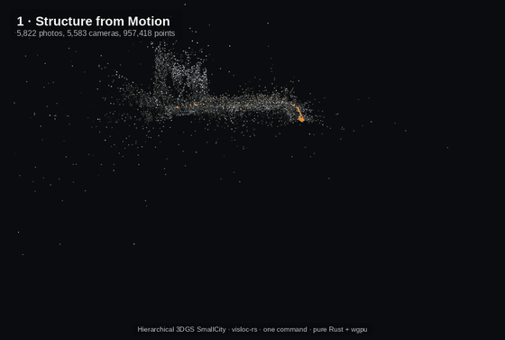
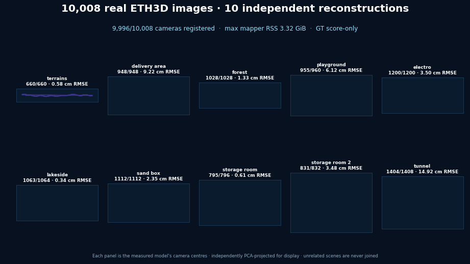
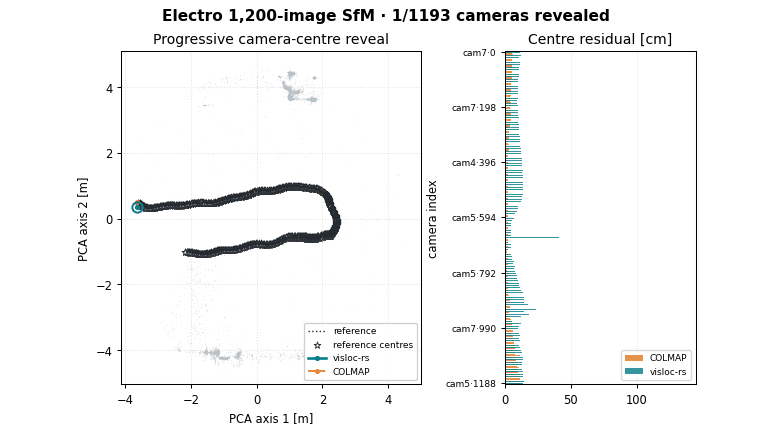
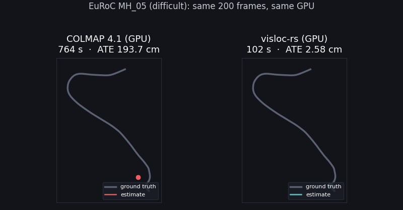
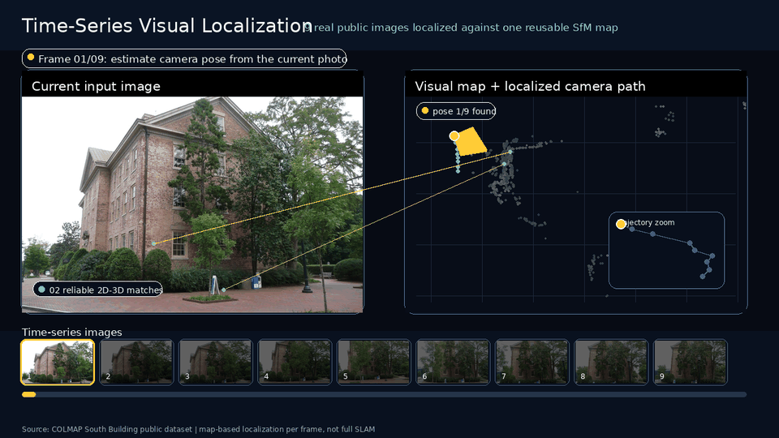

<h1 align="center">visloc-rs</h1>

<p align="center">
  <strong>Structure from Motion, visual-inertial SLAM, 3D Gaussian Splatting and map-based localization &mdash; in pure Rust.</strong>
</p>

<p align="center">
  <a href="https://github.com/rsasaki0109/visloc-rs/actions/workflows/ci.yml"></a>
  
  
  
</p>

<p align="center">
  <br>
  <sub>128 raw photos &rarr; camera poses &rarr; Gaussian splat &rarr; mesh, one command, no COLMAP or Python, orbited from a viewpoint none of the input photos have. <a href="#photos-to-splat-and-mesh-3d-gaussian-splatting">Details</a>.</sub>
</p>

## In a nutshell

visloc-rs turns camera images (optionally with an IMU) into camera poses, 3D
maps and photorealistic scenes, and localizes new images against those maps.
Everything is Rust: no C++, OpenCV or CUDA toolchain to build. GPU work runs
on any GPU through wgpu. Models are read and written in COLMAP format, so
results plug into existing tools.

| What | Headline result (measured, real data) | vs |
| --- | --- | --- |
| **Photo SfM** (unordered images) | ETH3D Electro 1,200 images: **3.46× faster**, **25% lower** camera-centre error; 9,996 / 10,008 cameras registered across all ten ETH3D many-view scenes | COLMAP 3.9 CPU |
| **GPU SfM** (video frames) | EuRoC: **faster on 8/8** sequences (1.4–7.5×), **more accurate on 4/8**, equal on 1; COLMAP breaks on MH_05 (194 cm vs 2.6 cm) | COLMAP 4.1 CUDA |
| **Stereo-inertial VI-SLAM** (Basalt port + online mapper) | **Real time on 11/11** EuRoC sequences on the dev machine (1.06–1.68×, thin margin on the slowest); **beats ORB-SLAM3 on 9/11** | ORB-SLAM3, Basalt |
| **Photos → 3D Gaussian Splatting + mesh** | **Faster than brush on 5/5** benchmark scenes, PSNR within 0.05 dB on 4 | brush 0.3 |
| **Localization against a prebuilt map** | OpenLORIS robot rig: **98.96%** of 1,250 held-out frames localized, median 2.9 mm; simulated house: 38 ms / frame | — |
| **Stereo / RGB-D VO** | KITTI 00 **1.23 m** and 09 **2.07 m** (ORB-SLAM2: 1.3 m / 3.2 m); TUM fr1_xyz 1.4 cm | ORB-SLAM2 |

**Where it still loses**, measured the same way: COLMAP CUDA is more
accurate on 3 of the 8 EuRoC sequences and registers more of the blurred
frames; ORB-SLAM3 wins 2 of 11 EuRoC sequences (MH_04, MH_05); OpenLORIS
10k rig SfM is not yet at
COLMAP's RMSE. Every number above links to a benchmark doc with the
commands to reproduce it.

### Contents

- [Sensor support](#sensor-support)
- [Try it](#try-it)
- [Structure from Motion](#structure-from-motion) — ETH3D, EuRoC GPU SfM vs COLMAP CUDA
- [Photos to splat and mesh](#photos-to-splat-and-mesh-3d-gaussian-splatting)
- [Visual-inertial SLAM](#visual-inertial-slam-basalt-rust-port)
- [Localize against a map](#localize-against-a-map)
- [Use from Python and ROS 2](#use-from-python-and-ros-2)
- [More results](#more-results) — KITTI, TUM RGB-D, sequential SfM
- [Documentation](#documentation)

## Sensor support

What each sensor setup can do today. **Benchmarked** means a measured
real-data result is in the repo. **Experimental** means the code runs but
the docs record open gaps.

| Sensor setup | Tasks | Status | Headline result | Entry point |
| --- | --- | --- | --- | --- |
| Monocular, unordered photos | SfM, 3DGS, mesh | **Benchmarked** | ETH3D Electro 1,200: 3.46× faster than COLMAP CPU, 3.50 vs 4.68 cm | `unordered_sfm_demo`, `gsplat_photos` |
| Monocular video | SfM | **Benchmarked** | EuRoC: faster than COLMAP 4.1 CUDA on 8/8 sequences, more accurate on 4/8 | `gsplat_euroc` |
| Monocular video | VO (DPVO port) | Experimental | MH_01 prefix 0.16 m, about 2× DPVO's published error; CPU only | `euroc_dpvo_vo_demo` |
| Monocular + IMU | VIO (Basalt port) | Experimental | Runs end to end; synthetic tests recover metric scale within 0.3% at 5–9 mm RMS over 5–7 m paths; no EuRoC result yet | `basalt_euroc_vio_demo --mono` ([notes](docs/mono_inertial_vio.md)) |
| Stereo | VO / SLAM | **Benchmarked** | KITTI seq00 1.23 m and seq09 2.07 m, vs 1.3 m and 3.2 m for ORB-SLAM2 | `deep_stereo_slam`, `online_slam_stereo_vo_kitti_demo` |
| Stereo + IMU | VIO + mapping (Basalt port) | **Benchmarked** | Beats ORB-SLAM3 on 9/11 EuRoC sequences; native-Basalt parity within 0.1%; real time (RTF 1.06–1.68) on all 11/11 EuRoC sequences on the dev machine, thin margin on the slowest | `basalt_euroc_online_slam_demo` |
| RGB-D (as virtual stereo) | VO | **Benchmarked** | TUM fr1_xyz 0.014 m, fr1_desk 0.026 m (about 1.3–1.6× ORB-SLAM2 RGB-D) | [TUM RGB-D](docs/tum_rgbd_benchmark.md) |
| Multi-camera rig | SfM | Experimental | OpenLORIS 10k: 9,998/10,000 registered; RMSE parity with COLMAP still open | `generalized_rig_sfm` |
| Robot rig cameras vs. a prebuilt map | Relocalization | **Benchmarked** | OpenLORIS (robot-mounted rig): 98.96% of 1,250 held-out frames localized against a map built from other frames, median 2.9 mm | `localize_openloris_map` |
| Robot camera sequence vs. a prebuilt map | Sequential map-matching localization | **Benchmarked** (simulation) | RNE house (drjohnson): 387/400 frames at 5.6 cm ATE, 38 ms per frame (median) with `--gpu --motion-model`. RNE checker corridor: 203/400 at 1.57 m, limited by repetitive texture | `localize_rne_map_sequence` |
| Camera + GNSS prior | Tracking | Example only | Synthetic smoke test; no tight GNSS fusion | `track_sequence_with_gnss_prior` |
| VO + GNSS positions | Joint pose-graph fusion | Experimental (synthetic) | ~1 km synthetic loop: ATE 5.25 m (VO only) → 0.90 m fused; multipath jumps rejected, 15 s dropout bridged. Loosely coupled (receiver ENU positions; no raw pseudoranges, no IMU) | `gnss_vo_fusion_demo` ([notes](docs/gnss_fusion.md)) |

LiDAR and wheel odometry are not supported.

## Try it

Requires Rust 1.88+ only. Datasets are external inputs and are not bundled.

```bash
# Photos -> camera poses, Gaussian splat and mesh (GPU via wgpu)
cargo run --release -p visloc-gsplat-train --features gpu,euroc --example gsplat_photos --   --images /path/to/my_photos --out runs/my-scene

# Stereo-inertial VI-SLAM on a EuRoC sequence
cargo run --release --example basalt_euroc_online_slam_demo --features basalt-lm-workspace-reuse --   --euroc-dir /path/to/MH_01_easy   --calibration configs/basalt/variants/official_euroc_ds/euroc_ds_calib.json   --config configs/basalt/variants/official_euroc_ds/euroc_config.json   --out-dir target/basalt_mh01_online

# Smallest end-to-end check: localize a synthetic query, no data needed
cargo run --example localize_dummy
```

Full options for each are in the sections below; `scripts/check.sh` runs the
complete local quality gate (`fmt`, `clippy`, `test`, `doc`).

## Structure from Motion

visloc-rs registers **9,996/10,008 cameras (99.88%)** across every ETH3D
low-resolution many-view scene with no mapper run above 3.32 GiB, reconstructs
the 1,200-image Electro set **3.46× faster than COLMAP** with **25.2% lower**
camera-centre RMSE, and beats official COLMAP on the 38-image courtyard control
(**0.5379 cm vs 1.6166 cm**).

<p align="center">
  
</p>

| Real scene (ETH3D low-res many-view) | Registered / supplied | Centre RMSE | RMSE / extent | Mapper peak RSS |
| --- | ---: | ---: | ---: | ---: |
| terrains | **660/660** | 0.58 cm | 0.12% | 1.56 GiB |
| delivery area | **948/948** | 9.22 cm | 0.99% | 2.31 GiB |
| forest | **1028/1028** | 1.33 cm | 0.19% | 2.65 GiB |
| playground | **955/960** | 6.12 cm | 2.52% | 2.44 GiB |
| electro | **1200/1200** | 3.50 cm | 0.55% | 1.39 GiB |
| lakeside | **1063/1064** | 0.34 cm | 0.08% | 3.19 GiB |
| sand box | **1112/1112** | 2.35 cm | 0.45% | **3.32 GiB** |
| storage room | **795/796** | 0.61 cm | 0.42% | 1.71 GiB |
| storage room 2 | **831/832** | 3.48 cm | 2.57% | 1.00 GiB |
| tunnel | **1404/1408** | 14.92 cm | 1.61% | 3.25 GiB |

<p align="center"><sub>tunnel includes one 5.32 m outlier (median 2.47 cm, p95 9.41 cm); playground excludes five hash-audited source outliers. The connected 10k corridor stress run, the 300-image reliability gate, the OpenLORIS comparison, and all reproduction commands are in the <a href="docs/sfm_benchmarks.md">SfM benchmark details</a>.</sub></p>

<p align="center">
  
</p>

<p align="center"><sub>Same-input CPU8 Electro 1,200: visloc-rs <b>3.46× faster</b> and <b>25.2% lower</b> camera-centre RMSE than COLMAP. Unordered SfM, sequential SfM vs COLMAP, and EuRoC reconstruction evidence are in the <a href="docs/unordered_sfm_benchmark.md">SfM benchmark docs</a>.</sub></p>

### Large connected collections

On the connected OpenLORIS 10k stress set, streamed VLAD + LSH cuts visloc-rs
candidate generation from 49:49 to **8:51 (5.63×)** (a retrieval A/B, not an
end-to-end COLMAP comparison; frozen measurements and output hashes in
[`m6-ann-streaming.json`](benchmarks/electro/m6-ann-streaming.json)). The
experimental observation-backed atlas preserves the connected frame counts and
meets the p95 target, but **RMSE parity is still open** (0.3890 m vs the
0.3843 m COLMAP control); the native diagnostic completes all 17 stages
**20.41×** faster with **17.0%** lower peak RSS. Full tables and caveats:
[SfM benchmark details](docs/sfm_benchmarks.md).

### GPU SfM vs COLMAP (CUDA) on EuRoC

Same 200 undistorted frames per sequence, same fixed intrinsics, same
GPU, run back to back. visloc-rs uses GPU SIFT, batched GPU
matching and the COLMAP incremental-mapper port. COLMAP 4.1 uses GPU
extraction, GPU sequential matching and its default mapper. ATE is the
Sim(3) camera-centre RMSE against ground truth.

| Sequence | Time (visloc-rs / COLMAP) | ATE (visloc-rs / COLMAP) | Registered (visloc-rs / COLMAP) |
| --- | ---: | ---: | ---: |
| MH_01_easy | **96 s** / 634 s | 0.35 / 0.35 cm | 182 / **200** |
| MH_03_medium | **113 s** / 340 s | **1.32** / 2.61 cm | 166 / **200** |
| MH_05_difficult | **102 s** / 764 s | **2.58** / 193.66 cm | 194 / **200** |
| V1_01_easy | **104 s** / 219 s | **2.40** / 2.75 cm | 199 / **200** |
| V1_02_medium | **55 s** / 101 s | **1.76** / 1.83 cm | 198 / **200** |
| V2_01_easy | **81 s** / 172 s | 3.30 / **1.00** cm | 199 / **200** |
| V1_03_difficult | **45 s** / 93 s | 2.17 / **1.98** cm | 67 / **80** |
| V2_03_difficult | **42 s** / 60 s | 3.37 / **2.85** cm | 118 / **180** |

visloc-rs is faster on all 8 sequences (1.4–7.5×). It is more accurate
on 4 and equal on MH_01. COLMAP is more accurate on V2_01, V1_03 and V2_03,
and it registers more frames, most visibly on the blurred V1_03 and V2_03.

COLMAP's results vary between runs: an earlier run gave V2_01 34.9 cm, and
MH_05 failed in both runs. visloc-rs is deterministic.

<p align="center">
  
</p>
<p align="center"><sub>EuRoC MH_05, same 200 frames, same GPU. COLMAP breaks (ATE 193.7 cm, 764 s), visloc-rs stays at <b>2.58 cm</b> in <b>102 s</b>. The visloc-rs poses then train a 3D Gaussian Splatting scene: raw frames to splat in pure Rust + wgpu, no COLMAP. <a href="scripts/make_euroc_vs_colmap_gif.py">Script</a>.</sub></p>

Configuration, caveats and the ablation that got here:
[EuRoC GPU SfM vs COLMAP](docs/euroc_gpu_sfm_vs_colmap.md).

To reproduce the table, run this per sequence. The script also runs
COLMAP, unless `--ours-only` is given:

```bash
cargo build --release -p visloc-gsplat-train --features gpu,euroc --example gsplat_euroc
python scripts/benchmark_euroc_vs_colmap.py MH_01_easy \
  --euroc-root <EuRoC dir with <seq>/mav0> --colmap <colmap exe> \
  --ours-exe target/release/examples/gsplat_euroc --out-root <out> --tag _final \
  --ours-args "--mapper colmap-port --sift-l1-root --keep-planar --verify-min-inliers 15 --sift-opt descriptor_magnification=3 --sift-opt max_orientations=2 --keypoints 4000 --sift-opt prefer_larger_scale=1 --register-gated"
```

Registration and ATE are deterministic for visloc-rs. Times depend on the
machine.

### Run the SfM demo

Reconstruct an unordered photo set in one command — SIFT features estimated
in-process, COLMAP text model (`cameras.txt`, `images.txt`, `points3D.txt`)
written to `--out-colmap`:

```bash
cargo run --release --example unordered_sfm_demo --features image-io -- \
  --feature-extractor sift \
  --images-dir /path/to/my_photos \
  --width 1920 --height 1080 --fx 1400 --fy 1400 --cx 960 --cy 540 \
  --sift-max-keypoints 4096 \
  --retrieval-topk 12 --min-matches 30 --match-ratio 0.8 \
  --verification-mode full --mapper incremental \
  --next-image-policy auto --post-refinement-registration \
  --final-iterative-refinement \
  --out-colmap /path/to/runs/my-photos-sfm
```

Pass a validated per-image calibration with `--input-colmap-calibration` instead
of the scalar intrinsics. The complete option set, the courtyard control
commands, and the connected-component export mode are in the
[SfM benchmark details](docs/sfm_benchmarks.md#run-the-sfm-demo).

## Photos to splat and mesh (3D Gaussian Splatting)

A folder of photos becomes a trained 3D Gaussian Splatting scene and a
coloured mesh in one command, in Rust + wgpu with no COLMAP or Python:

```bash
cargo run --release -p visloc-gsplat-train --features gpu,euroc --example gsplat_photos -- \
  --images /path/to/my_photos --out /path/to/runs/my-scene
```

<p align="center">
  
</p>

The GIF above is the 128 raw south-building JPGs, each next to the trained Gaussian splat and the extracted mesh rendered from that photo's own recovered pose. Every image registered, focal refined from EXIF 796 px to 847.0 px (COLMAP: 847.2), held-out PSNR 22.77 at 30k steps, 37 min end to end ([GIF script](scripts/make_photos_demo_gif.py)). The orbiting GIF at the top of this page is the same run, viewed from a camera path none of the input photos have; its generator is [`scripts/make_readme_hero.py`](scripts/make_readme_hero.py).

To reproduce the run and the GIF, use the raw `images/` of COLMAP's
south-building dataset. `gsplat_photos` prints the focal refinement and
the held-out PSNR:

```bash
cargo run --release -p visloc-gsplat-train --features gpu,euroc --example gsplat_photos -- \
  --images <south-building>/images --out runs/sb --max-size 1024 --steps 30000 --normal-weight 0.005
cargo run --release -p visloc-gsplat-train --features gpu --example gsplat_eval -- \
  --ply runs/sb/scene.ply --data runs/sb --eval-every 1 --save-dir runs/sb/renders
python scripts/make_photos_demo_gif.py --run runs/sb --out photos_to_mesh.gif --every 3 --panel-width 300 --fps 6
```

The pipeline has three stages:

1. **SfM.** Takes the focal length from EXIF, then runs GPU SIFT and
   matching, two-view verification and the COLMAP-port mapper (the
   configuration that beats COLMAP on EuRoC above). A final bundle
   adjustment refines the intrinsics. A COLMAP text model is written to
   `sparse/0`, so brush and Inria 3DGS can use the result too.
2. **Training.** brush's refine strategy on the hand-written wgpu forward
   and backward passes. On the same GPU, at 30k steps, it is faster than
   brush 0.3 on all five benchmark scenes (14–30%). PSNR is within
   0.05 dB of brush on four of them; details in
   [the 3DGS plan](docs/rust_3dgs_plan.md). Reproduce the table with
   [`scripts/benchmark_gsplat_vs_brush.py`](scripts/benchmark_gsplat_vs_brush.py);
   the dataset layout and the command are in its header.
3. **Mesh.** Median-depth rendering, TSDF fusion and surface nets. Surfaces
   with no SfM point nearby, such as the sky, are dropped. The
   `--normal-weight 0.005` depth-normal loss makes surfaces smoother for
   -0.2 dB.

## Visual-Inertial SLAM (Basalt Rust port)

A separate, faithful Rust port of upstream
[Basalt](https://github.com/VladyslavUsenko/basalt) commit `0f3b2b52` — a
tightly-coupled stereo-inertial VIO estimator plus a keyframe/loop-closure
mapper — in [`pipelines/basalt`](pipelines/basalt). On upstream Basalt's own
inputs it matches native Basalt's ATE to **within 0.1%** on all 11 EuRoC
sequences (**1.13×** runtime, **0.56×** peak RSS). With EuRoC's official
calibration, the mapper now runs **online** — a dedicated thread ingesting
each keyframe as the VIO produces it, not a separate offline batch job — and
beats measured ORB-SLAM3 (full-trajectory SE(3) ATE) on **9 of 11** EuRoC
sequences; on the development machine (12-thread CPU) the VIO+mapper
pipeline now also runs at **real time on all 11/11 sequences** (RTF
1.06–1.68, dataset duration / VIO wall time). The slowest sequences have
only a few percent of headroom, so RTF can dip below 1.0 depending on
machine state (one later clean MH_01 run measured 0.95). This is the
result of a `vio_max_iterations` reduction (7 -> 5, small accuracy-gated
change) plus two zero-accuracy-risk, bit-identical build-level changes (a
fat-LTO/single-codegen-unit/no-unwind-tables build profile and the
`mimalloc` global allocator) — see "VI-SLAM speed" below.

<p align="center">
  <br>
  <sub>Six of the eight winning EuRoC sequences: visloc-rs online VI-SLAM (blue) vs measured ORB-SLAM3 (red), both SE(3)-aligned to ground truth (black).</sub>
</p>

| Sequence | visloc-rs (online VI-SLAM) | ORB-SLAM3 stereo-inertial | Winner |
| --- | ---: | ---: | :---: |
| MH_01_easy | 0.016 | 0.036 | visloc-rs |
| MH_02_easy | 0.025 | 0.033 | visloc-rs |
| MH_03_medium | 0.026 | 0.028 | visloc-rs |
| MH_04_difficult | 0.070 | 0.043 | ORB-SLAM3 |
| MH_05_difficult | 0.063 | 0.055 | ORB-SLAM3 |
| V1_01_easy | 0.036 | 0.038 | visloc-rs |
| V1_02_medium | 0.014 | 0.017 | visloc-rs |
| V1_03_difficult | 0.021 | 0.029 | visloc-rs |
| V2_01_easy | 0.017 | 0.039 | visloc-rs |
| V2_02_medium | 0.012 | 0.014 | visloc-rs |
| V2_03_difficult | 0.045 | 0.056 | visloc-rs |

<p align="center">
  
</p>

<p align="center"><sub>9/11 wins; full-trajectory ATE translation RMSE in metres, lower is better, same protocol as the prior offline-mapper result. The mapper thread never blocked the VIO thread on any sequence — see the <a href="docs/vi_slam_benchmarks.md">VI-SLAM benchmark details</a> for the per-sequence RTF/lag/loop/RSS numbers. <b>Real time on all 11/11 sequences</b>: RTF (dataset duration / VIO wall time) is now 1.06-1.68x, clean (no other job sharing the machine, verified), up from 0.09-0.38x before this session's `--pipeline`-by-default change and later work. Getting there needed one accuracy-gated change, `vio_max_iterations` 7 -> 5 (the LM solver's own inner loop, ~78-82% of VIO wall time, is the dominant cost; fewer iterations cuts it proportionally): 9/11 wins held, but V2_01_easy's ATE grew from 0.015 to 0.017 (+12%, 3-run median) and V1_03_difficult's from 0.020 to 0.021 (+5%, 3-run median) — both still comfortably beat ORB-SLAM3 (2.3x and 1.3x margin respectively). On top of that, two build-level changes carry zero accuracy risk (bit-identical VIO trajectory, verified by SHA-256): a `release-rt` Cargo profile (fat LTO, one codegen unit, no unwind tables) and the `mimalloc` global allocator (the LM trial loop allocates a scratch buffer per factor per trial). MH_04_difficult and MH_05_difficult remain the two losses vs ORB-SLAM3 — VIO tracking-robustness limits on fast/motion-blurred sequences, not a speed or mapper issue. The prior offline (batch, 2-18 min / 3-6 GB) mapper path still exists, unchanged and byte-for-byte untouched, for parity/comparison. Parity evidence: <a href="work/m11_basalt_faithful_port_final_closure_20260914.md">faithful-port closure report</a> and <a href="benchmarks/basalt/README.md">upstream oracle / provenance</a>; design and next steps: <a href="docs/basalt_online_mapper_design.md">online mapper design</a> and <a href="docs/vi_slam_global_consistency_plan.md">global-consistency plan</a>.</sub></p>

### Run the VI-SLAM demo

Build with AVX2/FMA, the `release-rt` profile (fat LTO, one codegen unit, no
unwind tables — bit-identical to the default `release` profile, just faster
codegen; only used for this real-time-focused example) and the `mimalloc`
global allocator, then replay a EuRoC sequence through the online VIO +
mapper — the calibration and config are checked into the repo,
`--euroc-dir` is an external dataset path. This is the build the RTF numbers
above were measured with; a plain `cargo build --release` (no `--profile
release-rt`, no `mimalloc-global`) also works and is still correct, just
slower (the two levers above are additive, ~2-2.5x combined on this
machine):

```bash
RUSTFLAGS="-C target-feature=+avx2,+fma" \
  cargo build --profile release-rt --example basalt_euroc_online_slam_demo \
  --features basalt-lm-workspace-reuse,mimalloc-global

RUSTFLAGS="-C target-feature=+avx2,+fma" \
  cargo run --profile release-rt --example basalt_euroc_online_slam_demo \
  --features basalt-lm-workspace-reuse,mimalloc-global -- \
  --euroc-dir /path/to/MH_01_easy \
  --calibration configs/basalt/variants/official_euroc_ds/euroc_ds_calib.json \
  --config configs/basalt/variants/official_euroc_ds/euroc_config.json \
  --out-dir target/basalt_mh01_online \
  --max-frames 80
```

This writes `trajectory_online.tum` (the full-frame trajectory, mapper
corrections propagated to every VIO frame — what the table above scores),
`trajectory_online_kf.tum` (keyframes only), and `timing_breakdown_online.json`
(RTF, mapper queue lag, loop/trigger counts, peak RSS). The original offline
VIO + batch-mapper commands are unchanged and still documented in the
[VI-SLAM benchmark details](docs/vi_slam_benchmarks.md#run-it).

`--pipeline` runs the frontend (dataset decode + optical flow) and the
estimator on two threads instead of one -- mirroring upstream Basalt's
`OpticalFlow` thread / estimator thread split -- and `--threads N` sizes
the `rayon` pool used by the frontend's per-track temporal KLT and the
estimator's per-landmark LM reduction (unset lets `rayon` size itself to
`std::thread::available_parallelism()`). Both are pure wall-clock
optimizations: every frame is still processed in the same order with the
same arithmetic, so `trajectory.tum` is byte-for-byte identical to a serial
`--threads 1` run given the same inputs (verified on MH_03/MH_04). The
online demo enables `--pipeline` by default for this reason -- pass
`--no-pipeline` to restore the serial path; the VIO demo below still
defaults to serial and takes `--pipeline` as an opt-in flag.

```bash
cargo run --release --example basalt_euroc_vio_demo --features basalt-lm-workspace-reuse -- \
  --euroc-dir /path/to/MH_01_easy \
  --calibration benchmarks/basalt/release_inputs/euroc_ds_calib.json \
  --config configs/basalt/euroc_config.json \
  --out-dir target/basalt_mh01 \
  --pipeline --pipeline-capacity 4 --threads 12
```

## Localize against a map

Smallest end-to-end: localize a synthetic query against a 1-landmark map.

```bash
cargo build
cargo run --example localize_dummy
```

Load a real COLMAP model and localize a query photo against it (downloads ~100 MB
on first run). Datasets are external inputs and are not bundled with this
repository. Fetch the dataset once:

```bash
mkdir -p ~/datasets/south-building && cd ~/datasets/south-building && \
  curl -L -o south-building.zip \
    https://github.com/colmap/colmap/releases/download/3.11.1/south-building.zip && \
  unzip south-building.zip
```

Then, from the repository root, localize a query photo against the sparse model:

```bash
cargo run --release --features image-io --example deep_localization_demo -- \
  --root ~/datasets/south-building/south-building \
  --map-image P1180141.JPG --query-image P1180155.JPG
```

<p align="center">
  <br>
  <sub>Public-data localization: real query photos localized frame by frame against the same reusable sparse visual map (COLMAP South Building). Details: <a href="docs/public_data_demo.md">public COLMAP map-reuse demo</a>.</sub>
</p>

| First run | Command | What it shows |
| --- | --- | --- |
| Synthetic localization | `cargo run --example localize_dummy` | Smallest end-to-end: one query, one landmark, PnP RANSAC estimate |
| Map-reuse localization | `cargo run --release --features image-io --example deep_localization_demo -- --root <south-building> --map-image P1180141.JPG --query-image P1180155.JPG` | A real query photo localized against a COLMAP model, classical vs deep frontend |
| Sequence tracking | `cargo run --features image-io --example track_image_sequence_from_common_images` | Moving-camera tracking smoke with per-frame pose continuity |
| KITTI revisit scanner | `python scripts/run_kitti_deep_vo_revisit_smoke.py` | Public KITTI 00 revisit smoke (downloads start/revisit slices) |
| Full local quality gate | `scripts/check.sh` | `fmt` + `clippy` + `test` + `doc` in one command |

More runnable demos and the full index are in the
[demo strategy](docs/demo_strategy.md) and the
[archived README details](docs/readme_details.md#demos).

## Use from Python and ROS 2

### Python

[`bindings/python`](bindings/python/README.md) builds a `visloc` Python package
with pyo3 + maturin: cameras (COLMAP models), SE(3) poses, COLMAP text/binary
read/write as NumPy arrays, PnP + RANSAC localization, and ATE / RPE
trajectory evaluation.

```bash
cd bindings/python && pip install maturin numpy && maturin develop --release
python -c "import visloc; print(visloc.Camera('PINHOLE', 640, 480, [500, 500, 320, 240]))"
```

### ROS 2

[`ros2/visloc-ros2`](ros2/visloc-ros2/README.md) has two ROS 2 nodes built on
the pure-Rust `ros2-client` (RustDDS), so building them needs no ROS install:

- `visloc_vio_node` runs the Basalt stereo-inertial VIO on two
  `sensor_msgs/Image` topics plus `sensor_msgs/Imu`, and publishes
  `nav_msgs/Odometry`, `geometry_msgs/PoseStamped`, `nav_msgs/Path` and `/tf`.
- `visloc_localize_node` localizes `sensor_msgs/Image` frames against a COLMAP
  map and publishes `PoseWithCovarianceStamped`, an inlier count and
  diagnostics.

```bash
cd ros2/visloc-ros2 && cargo build --release
./target/release/visloc_vio_node --calibration <basalt_calib.json> --config <basalt_config.json> \
  --remap left/image_raw=/cam0/image_raw --remap right/image_raw=/cam1/image_raw --remap imu=/imu0
```

The nodes are tested over DDS (RustDDS to RustDDS) but not yet against a ROS 2
install; see the crate README for topics, parameters, QoS notes and limits.

## More results

Local public-data development measurements, not official leaderboard submissions.
The headline snapshot is registry-backed by
[`benchmarks/registry/readme_claims_v1.json`](benchmarks/registry/readme_claims_v1.json);
see the [registered run evidence](docs/generated/registered_runs.md) and
[scoped claim matrix](docs/generated/benchmark_claim_matrix.md).

- **KITTI multi-sequence published-baseline comparison** — one uniform full-stack config over 00/02/05/06/07/09; narrow published-baseline wins on seq00 (**1.23 m vs ORB-SLAM2 1.3 m**) and seq09 (**2.07 m vs ORB-SLAM2 3.2 m**), with seq00/05/06 in the OV2SLAM-RT accuracy band. This is not a leaderboard or ORB-SLAM3 claim; the run also records real-world frontend failure-mode fixes.
- **EuRoC MH_03 / MH_05 full pipeline** — stereo visual loop-closure + BA on MH_03 / MH_05: **0.057 m / 0.072 m** ATE. The claim matrix marks ORB-SLAM3 comparisons as behind (**~2.4x / ~1.4x**), OV2SLAM as near, and VINS-Fusion stereo as a stereo-only win; this is not a tight-VIO claim.
- **TUM RGB-D fr1_xyz / fr1_desk** — indoor handheld via **virtual stereo** (depth as a synthetic right image, zero backend changes): **0.014 m / 0.026 m** ATE, compared against published ORB-SLAM2 RGB-D ranges in the claim matrix; loop closure is a **6x** lever on the revisit-heavy desk.
- **Sequential SfM vs COLMAP (metric video)** — same 2700-frame EuRoC flight, same evo scoring: visloc stereo VO + loop SfM **6 min, 0.13 m** (trajectory 0.066 m, metric) vs COLMAP mono incremental **11.7 h, 2.18 m** (scale-free) - **~117x faster, ~17-33x more accurate, metric scale**. (Stereo-vs-mono: the win is the metric-video regime, not COLMAP's unordered-photo home turf.)
- **Unordered SfM (real photo collections)** — Orderless monocular photos -> VLAD view graph -> incremental reconstruction (robust multi-seed init, P3P register, scale-gauge-fixed BA, iterative track filter), vs **COLMAP's own model** with an independent SuperPoint frontend: **COLMAP South Building** (128 photos) **128/128 reg, 1.09 cm**; **Gerrard Hall** (100 photos, 5616x3744 OPENCV) **98/100, 0.68 cm** (3/100 single-seed) - both **0.1 % of extent**. EuRoC V2_03 orbit **31/31, 1.08 cm**

## Documentation

The [detailed README material](docs/readme_details.md) preserves the project
boundaries, feature overview, full demos table, minimal Rust example, repository
layout, roadmap, further-reading index, and complete benchmark snapshot that
previously lived here.

- **Choose and run a demo:** [demo index](docs/demo_strategy.md), [public COLMAP map-reuse demo](docs/public_data_demo.md), [GNSS-prior tracking](docs/gnss_demo.md), and [interactive KITTI trajectory viewer](https://rsasaki0109.github.io/visloc-rs/kitti3d/).
- **Understand supported configurations:** [feature matrix](docs/feature_matrix.md), [API stability](docs/api_stability.md), [COLMAP compatibility](docs/colmap_compatibility.md), and [migration notes](docs/migration.md).
- **Inspect VO and loop-closure evidence:** [KITTI multi-sequence](docs/kitti_multiseq_benchmark.md), [KITTI loop closure](docs/kitti_loop_closure_benchmark.md), [EuRoC loop closure](docs/euroc_loop_closure_benchmark.md), [TUM RGB-D](docs/tum_rgbd_benchmark.md), and [tracking persistence](docs/tracking_persistence_benchmark.md).
- **Inspect VI-SLAM (Basalt Rust port) evidence:** [VI-SLAM benchmark details](docs/vi_slam_benchmarks.md), [faithful-port final closure report](work/m11_basalt_faithful_port_final_closure_20260914.md), and [upstream oracle / provenance](benchmarks/basalt/README.md).
- **Where VI-SLAM goes next:** [global-consistency plan](docs/vi_slam_global_consistency_plan.md) — same-protocol ORB-SLAM3 measurements, the 9/11 official-calibration + mapper result (now online and real time on 11/11, §1.5-1.6) and its scale-bias root cause, the paused persistent-map prototype, and the staged plan targeting VIO tracking robustness on the two remaining losses (MH_04, MH_05).
- **Inspect SfM evidence:** [SfM benchmark details](docs/sfm_benchmarks.md), [EuRoC reconstruction](docs/euroc_sfm_benchmark.md), [sequential SfM vs COLMAP](docs/sfm_vs_colmap_benchmark.md), [unordered SfM](docs/unordered_sfm_benchmark.md), and [registry evidence for the head-to-head](docs/generated/sfm_vs_colmap_headtohead.md).
- **Inspect learned frontend evidence:** [SuperPoint ONNX/CUDA](docs/superpoint_onnx_cuda_benchmark.md), [LightGlue ONNX](docs/lightglue_onnx_benchmark.md), and [single-binary deep stereo SLAM](docs/inprocess_slam_benchmark.md).
- **Inspect mapping and optimization evidence:** [learned retrieval for relocalization](docs/learned_retrieval_relocalization.md), [multi-session lifelong mapping](docs/multi_session_lifelong_benchmark.md), and [pose-graph / BA internals with GTSAM parity](docs/pgo_internals.md).
- **Follow the project:** [roadmap](docs/roadmap.md), [contributing](CONTRIBUTING.md), [security](SECURITY.md), and [changelog](CHANGELOG.md).

## License

Licensed under either of [Apache License, Version 2.0](LICENSE-APACHE) or
[MIT license](LICENSE-MIT), at your option.
