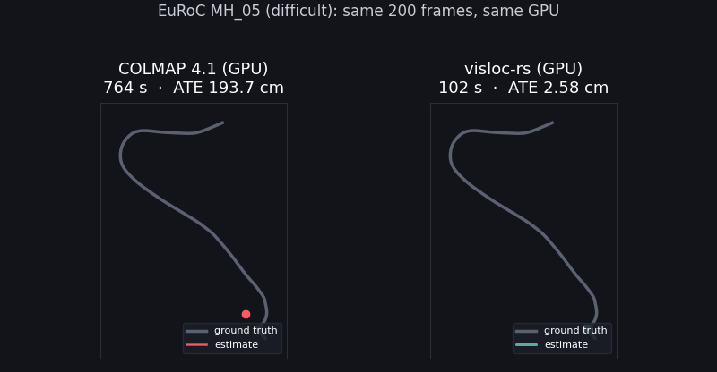

# EuRoC GPU SfM vs COLMAP (CUDA)

A same-input, same-machine, back-to-back comparison of the visloc-rs GPU
SfM pipeline (`gsplat_euroc`, COLMAP-port mapper) against COLMAP 4.1 with
GPU feature extraction and GPU matching. The frames come from 8 EuRoC MAV
sequences, and accuracy is scored against the Vicon/Leica ground truth.

## Setup

- **Input:** 200 frames per sequence (cam0, every 4th frame from the
  start), undistorted to a pinhole camera with the EuRoC intrinsics.
  - `gsplat_euroc` writes these PNGs, and COLMAP reads the *same* files
    with the *same* fixed `PINHOLE` intrinsics.
  - Neither side refines intrinsics.
- **Hardware:** GTX 1660 Ti (6 GB), Windows 11. Both pipelines ran back to
  back in one session, via `scripts/benchmark_euroc_vs_colmap.py`.
- **COLMAP 4.1 (CUDA):**
  - `feature_extractor` with GPU on.
  - `sequential_matcher` (COLMAP's video preset) with GPU on.
  - `mapper` with defaults; focal, principal point and extra parameters
    are held fixed.
  - The largest model is scored.
- **visloc-rs:** the command is

  ```text
  gsplat_euroc --euroc <seq> --work <dir> --stride 4 --max-frames 200 --steps 0 \
    --gpu-sift --gpu-ba --mapper colmap-port --sift-l1-root \
    --sift-opt descriptor_magnification=3 --sift-opt max_orientations=2 \
    --keypoints 4000 --sift-opt prefer_larger_scale=1 \
    --keep-planar --verify-min-inliers 15 --register-gated
  ```

  - Features come from GPU SIFT (RootSIFT, COLMAP/VLFeat descriptor window,
    ≤4000 keypoints, larger scales kept first).
  - Matching is batched on the GPU: cross-checked, window 10 plus
    long-range skip pairs. It is overlapped with CPU two-view verification
    that ports COLMAP's E/F/H classification.
  - Mapping uses the faithful COLMAP incremental-mapper port
    (`visloc_slam::colmap_incremental`).
  - Near-static frames are gated out and then re-registered by PnP.
- **Metric:** Sim(3)-aligned RMSE of camera centres against ground truth,
  over the frames each method registered. The "Time" column is:
  - **COLMAP:** extract + match + map.
  - **visloc-rs:** everything up to the SfM result, including decoding,
    undistorting and writing the frames.

## Results

| Sequence | visloc-rs time | COLMAP time | visloc-rs reg. | COLMAP reg. | visloc-rs ATE | COLMAP ATE |
| --- | ---: | ---: | ---: | ---: | ---: | ---: |
| MH_01_easy | **96 s** | 634 s | 182 | **200** | **0.35 cm** | **0.35 cm** |
| MH_03_medium | **113 s** | 340 s | 166 | **200** | **1.32 cm** | 2.61 cm |
| MH_05_difficult | **102 s** | 764 s | 194 | **200** | **2.58 cm** | 193.66 cm |
| V1_01_easy | **104 s** | 219 s | 199 | **200** | **2.40 cm** | 2.75 cm |
| V1_02_medium | **55 s** | 101 s | 198 | **200** | **1.76 cm** | 1.83 cm |
| V2_01_easy | **81 s** | 172 s | 199 | **200** | 3.30 cm | **1.00 cm** |
| V1_03_difficult | **45 s** | 93 s | 67 | **80** | 2.17 cm | **1.98 cm** |
| V2_03_difficult | **42 s** | 60 s | 118 | **180** | 3.37 cm | **2.85 cm** |

**Summary:**

- **Speed:** visloc-rs is faster on all 8 sequences, 1.4–7.5×.
- **Accuracy:** visloc-rs is more accurate on 4 of 8 (MH_03, MH_05, V1_01,
  V1_02) and equal on MH_01. COLMAP is more accurate on V2_01, V1_03 and
  V2_03.
- **Registration:** COLMAP registers more frames everywhere. The gap is
  small on the easy/medium sequences (182–199 vs 200) and large on
  V1_03/V2_03.

## MH_05 animation



**Trajectories:** the COLMAP and visloc-rs trajectories are Sim(3)-aligned
to ground truth, top-down. The data comes from the COLMAP run of the table
above and the `gsplat_euroc` run below.

**Flythrough:**

- **Pipeline:** the same `gsplat_euroc` configuration trains a 3DGS scene
  for 7000 steps (215 s) and renders every registered camera with
  `--render-dir`.
  - Eval: PSNR 24.1, SSIM 0.876 on 25 held-out views.
- **Frames shown:** the animation starts at 15% of the sequence. The first
  frames are near-static close-ups during take-off, seen from few
  viewpoints, and render poorly.
- **Rebuild:**

  ```text
  gsplat_euroc --euroc <MH_05> --work <run> --stride 4 --max-frames 200 --steps 7000     <configuration above> --render-dir <run>/renders
  python scripts/make_euroc_vs_colmap_gif.py --euroc-root <EuRoC> --bench-out <out>     --run <run> --out docs/assets/euroc_mh05_vs_colmap.gif --colmap-time 764 --ours-time 102
  ```

## Caveats

- **COLMAP varies between runs; visloc-rs does not.**
  - In an earlier run on the same inputs, COLMAP scored V2_01 at 34.9 cm
    instead of 1.00 cm, and V1_02 at 1.75 cm.
  - MH_05 failed (about 200 cm) in both runs.
  - visloc-rs is deterministic (seeded RANSAC, fixed GPU batch order).
- **Blur breaks the reconstruction on V1_03 and V2_03.**
  - On V2_03 the pairs that cross the break carry about half COLMAP's
    inliers, so the model splits and only the largest part is scored.
  - `--merge-models` (a similarity estimated from cross-model matches)
    cannot bridge it, because the bridging frames are unregistered.
  - The remaining gap is SIFT quality on blurred frames.
- **The visloc-rs time includes writing the undistorted PNGs** that COLMAP
  then reads.
- **The visloc-rs times come from a rerun.** They were re-measured the same
  day, on the same machine, after the two-view RANSAC speed-ups (commits
  2e0b525 and 79acc65). Those commits leave every verification decision,
  registration and ATE unchanged; before them the times were 131 / 175 /
  132 / 157 / 81 / 117 / 68 / 64 s. The COLMAP numbers come from the
  back-to-back run.

## What moved the numbers

These are V1_02, 200 frames. The rows below "COLMAP features +
correspondences" all use the COLMAP-port mapper.

| Change | ATE |
| --- | ---: |
| Original `incremental_sfm` mapper | 8.13 cm |
| COLMAP features + correspondences → our old mapper | ~100 cm (scale collapse mid-growth) |
| COLMAP features + correspondences → COLMAP-port mapper | 2.12 cm |
| Our GPU SIFT → COLMAP-port mapper | 7.54 cm |
| + RootSIFT + planar pairs kept | 4.16 cm |
| + `descriptor_magnification=3` (COLMAP/VLFeat window) | 2.73 cm |
| + `max_orientations=2` | 2.38 cm |
| + 4000 keypoints, larger scales first | **1.68 cm** |

- **Mapper:** the old mapper's growth path is the defect. Seeded with
  COLMAP's poses, its BA reaches 2.15 cm.
- **PnP inlier floor:** the port's `abs_pose_min_num_inliers` must be
  COLMAP's 30. The port default of 8 is a rig-benchmark override, and it
  broke MH_01 (13 cm).

## Reproduce

```text
cargo build --release -p visloc-gsplat-train --features gpu,euroc --example gsplat_euroc
python scripts/benchmark_euroc_vs_colmap.py V1_02_medium \
  --euroc-root <EuRoC dir with <seq>/mav0> --colmap <colmap.exe> \
  --ours-exe target/release/examples/gsplat_euroc --out-root <out> --tag _final \
  --ours-args "--mapper colmap-port --sift-l1-root --keep-planar --verify-min-inliers 15 --sift-opt descriptor_magnification=3 --sift-opt max_orientations=2 --keypoints 4000 --sift-opt prefer_larger_scale=1 --register-gated"
```
