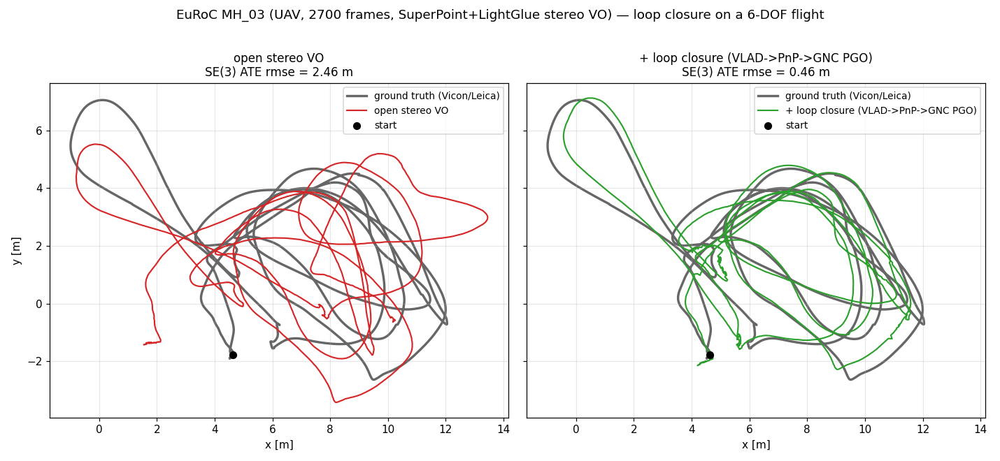

# EuRoC Loop-Closure Benchmark (UAV, 6-DOF)

The aerial counterpart to the [KITTI loop-closure
benchmark](kitti_loop_closure_benchmark.md). KITTI is a ground vehicle on a
plane; EuRoC MH_03 is a **micro aerial vehicle on a 6-DOF flight** through a
GPS-denied machine hall with Vicon/Leica ground truth. The same comparison
holds: an open stereo-VO trajectory accumulates unbounded drift, and a loop
closure — the one constraint that ties a revisited place back to its earlier
observation — removes it.

The pipeline is identical to KITTI's
(`pipelines/slam/src/vo_loop_closure.rs`: VLAD appearance → PnP metric
verification → robust GNC SE(3) pose-graph optimization), run over the same
file-backed SuperPoint/LightGlue stereo features twice (open vs
`--loop-closure`). Only the front matter differs:

- **Rectification.** EuRoC's cam0/cam1 are radtan-distorted (unlike KITTI's
  pre-rectified odometry images), so `scripts/rectify_euroc_stereo.py`
  undistorts+rectifies to a pinhole stereo pair and writes a KITTI-format
  `calib.txt` + a `timestamps.txt`.
- **Timestamped ground truth.** EuRoC GT is a ~200 Hz timestamped trajectory,
  so VO poses are converted to TUM (`scripts/kitti_poses_to_tum.py`, using the
  rectifier's `timestamps.txt`) and scored with `evo_ape`, which associates by
  timestamp.

## Result (EuRoC MH_03_medium, 2700 frames)

SuperPoint (2048 kpts) + LightGlue stereo/temporal matching, PnP relative pose.
ATE rmse via `evo_ape` under SE(3) (rigid, the metric-frame number) and Sim(3)
(scale-absorbed) alignment.

| trajectory     | ATE rmse SE(3) | ATE rmse Sim(3) |
| -------------- | -------------: | --------------: |
| open VO        |        2.462 m |         2.203 m |
| + loop closure |        0.464 m |         0.443 m |

**5.3× lower SE(3) ATE rmse (2.46 m → 0.46 m)** from 307 verified loops (5051
appearance candidates), GNC pose-graph cost `1.05e6 → 230`. Unlike the KITTI
stride-2 contrast, **both alignments improve cleanly** (SE(3) 5.3×, Sim(3) 5.0×)
because the metric stereo frontend keeps the scale correct here — the open VO
integrates to 123.9 m against the true ~131 m path — so the metric PnP loop
edges and the odometry edges agree and the pose graph closes without distorting
the metric frame.



The open VO (left, red) drifts off ground truth over the flight; loop closure
(right, green) pulls the revisited places back onto the Vicon/Leica trajectory.

## Closing the gap to state of the art: window BA + loop closure

The table above deliberately isolates the loop-closure *stage* by running it on
an **open** VO (no bundle adjustment), so the only variable is the loop closure.
The full pipeline visloc actually ships pairs that same loop closure with an
**incremental windowed bundle-adjustment frontend** (`--online-ba`, a 30-frame
sliding-window local BA triggered every 10 frames). That combination is far
closer to state of the art — measured on the same artifacts, two EuRoC machine
hall flights:

| pipeline                                       | MH_03 ATE SE(3) | MH_05 ATE SE(3) |
| ---------------------------------------------- | --------------: | --------------: |
| open VO, no BA, no loop                        |         2.462 m |         2.387 m |
| open VO + loop (stage isolation, above)        |         0.464 m |               — |
| window BA + loop                               |         0.089 m |         0.119 m |
| window BA + loop + two-view loop BA            |         0.065 m |         0.086 m |
| **+ fixed-prefix local-map BA (history 20)**   |       **0.061 m** |       **0.084 m** |

Both alignments agree (MH_03 Sim(3) 0.053 m, MH_05 Sim(3) 0.072 m), so the metric
scale is correct, not absorbed by the fit. Against the published deep/classical
stereo SLAM systems on MH_03:

| system (stereo)                       | MH_03 ATE rmse |
| ------------------------------------- | -------------: |
| ORB-SLAM3 (Campos et al. 2021)        |        0.024 m |
| DROID-SLAM (Teed & Deng 2021)         |        0.035 m |
| **visloc-rs (full pipeline)**         |     **0.061 m** |

visloc-rs lands within **~2.5× of ORB-SLAM3** and **~1.75× of DROID-SLAM** on
MH_03, in pure Rust.

### Two-view loop bundle adjustment

The `--loop-two-view-ba` stage is what takes the pipeline from 0.089 m to
0.065 m (MH_03) and 0.119 m to 0.086 m (MH_05) — a consistent **~28 %** ATE
reduction on both flights, from the *same* 317 / 282 verified loops. Each loop
edge enters the pose graph from a PnP estimate that minimises reprojection in the
**newer** frame only, while holding the **older** frame's stereo-depth points
fixed — so any error in the older disparity triangulation passes straight into
the edge. The refinement re-grinds each loop as a minimal two-view bundle
adjustment in the older camera frame: the older pose is the fixed gauge, the newer
pose and the shared landmarks are free, and the older rectified-stereo disparity
becomes a *soft* metric anchor (the points may slide off it to satisfy
reprojection in **both** views instead of being frozen at the noisy depth). The
metric scale stays well-posed because the older stereo residuals pin it. The PGO
cost drops sharply (MH_03 213 → 25, MH_05 104 → 9): the refined edges are
mutually consistent in a way the depth-biased PnP edges were not.

Crucially this is **local** — it touches only each loop's two frames, never the
rest of the trajectory; the global drift distribution stays with the SE(3) PGO.
A *global* post-loop bundle adjustment (merging the loop correspondences into the
full track set and re-optimising the whole flight) was tried and **discarded**:
it deforms the already locally-consistent window-BA trajectory and *worsens* ATE
(0.089 → 0.15 m), the same way a loop-free global reprojection-minimum does. The
lever is grinding each loop edge well, not re-solving everything.

### Fixed-prefix local-map bundle adjustment

The last stage (`--online-ba-history 20`) is what takes the pipeline from 0.065 m
to **0.061 m** (MH_03) and 0.086 m to **0.084 m** (MH_05) — Sim(3) ATE drops
~10 % / ~6 %. It is the ORB-SLAM3 *fixed-keyframe local BA* pattern brought onto
the streaming window: each `--online-ba` trigger extends its optimisation window
**backward** by 20 frames and holds that older prefix **fixed**, so landmarks
established in earlier windows anchor the recent poses over a baseline far longer
than the 30-frame window — without re-optimising (and so without deforming) the
already-settled older trajectory.

This sharply distinguishes it from naively *widening* the window: a 50/60/80-frame
window with every pose free *worsens* the result (the old poses get re-perturbed by
stale, off-view observations), whereas the same extension with the prefix fixed
*improves* it. The fixed anchor is the whole point. The history length has a sweet
spot — 20 frames helps both flights, but a longer history (30+) starts admitting
stale landmarks and on MH_05 turns slightly negative, so 20 is the shipped default.

The remaining gap to ORB-SLAM3 narrows but does not close. Its local BA selects
the true **covisibility graph** (every keyframe sharing a landmark observation),
while ours is still a *temporal* window — a good proxy on a mostly-forward flight,
but it never pulls in a spatially-near non-consecutive keyframe. Two measured
caveats remain: the windowed BA must be the *streaming* `--online-ba` (a one-shot
full-batch `--final-global-ba` over the whole flight is both far slower and worse,
0.214 m, for the same deform-the-trajectory reason); and lifting the
loop-verification cap (which admits low-similarity false loops) *worsens* the
result.

## The frame-gap gate matters more in the air

EuRoC flies at 20 Hz, and the MAV spends time hovering/slow-maneuvering. A small
`--loop-min-frame-gap` then matches only slow-motion temporal neighbours that
are already odometry-consistent and contribute no drift correction. Measured on
MH_03:

| `--loop-min-frame-gap` | meaning  | ATE rmse SE(3) |
| ---------------------: | -------- | -------------: |
| 30                     | ~1.5 s   |     2.46 m (unchanged) |
| 200                    | ~10 s    |     0.46 m |

A loop only corrects drift if enough drift accumulated between its two frames,
and drift grows with *distance travelled*, not frame index — so the path-length
gate (`--loop-min-path-length`, metres) is the frame-rate-independent version of
the same idea. The default is `--loop-min-frame-gap 200`.

## Reproduce

Fetch the EuRoC `MH_03_medium` ASL-format zip (the one with a `mav0/` folder) —
EuRoC is hosted on the ETH Research Collection — then:

```sh
scripts/run_euroc_loop_closure_benchmark.sh \
  --mav0 /path/to/MH_03_medium/mav0 \
  --frames 2700
```

The script rectifies the stereo pair, exports SuperPoint/LightGlue features once
(needs torch+lightglue+opencv), runs the VO twice (open / `--loop-closure`),
derives the GT TUM from `mav0/state_groundtruth_estimate0`, converts both VO
trajectories to TUM, scores them with `evo_ape` (needs `pip install evo`), and
writes `summary.md` with the table above. `--rect-dir`/`--feat-dir`/`--gt-tum`
reuse already-prepared artifacts; `--device cpu` runs the export without CUDA.
