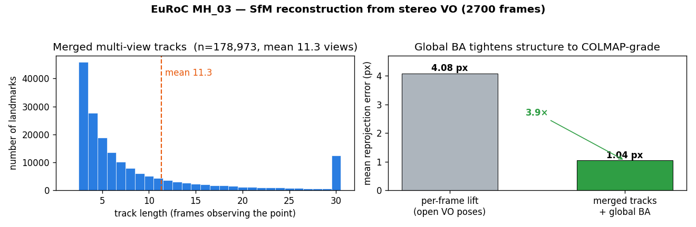
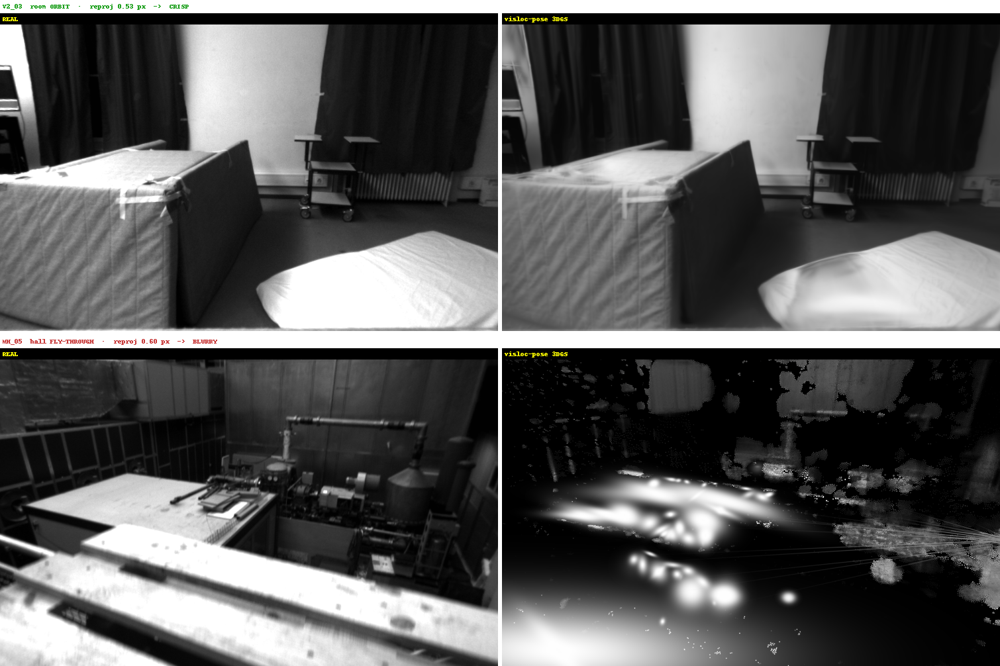

# EuRoC Structure-from-Motion Benchmark

The loop-closure benchmarks ([KITTI](kitti_loop_closure_benchmark.md),
[EuRoC](euroc_loop_closure_benchmark.md)) measure **trajectory** accuracy. This
one measures the **structure** visloc-rs's SfM pillar produces: how close to
COLMAP-grade a single global bundle adjustment can drive the reconstruction, so
the output can feed a downstream 3D Gaussian Splatting / MVS pipeline.



## Why a per-frame stereo lift is not COLMAP-grade

The streaming stereo VO (and the plain `--colmap-export`) lifts **one fresh
landmark per frame**: every 3D point is observed exactly once. A model like that
has no multi-view constraint for a bundle adjustment to exploit — the points are
independent per-frame depth lifts that overlap into fog, and feeding it to a
3DGS optimizer reconstructs that fog rather than crisp geometry.

A real SfM model shares each physical point across every frame that sees it. The
`--sfm-colmap-out` path builds exactly that:

1. **Merged multi-view tracks.** Chain the temporal (frame→frame) matches into
   forward tracks, so one landmark accumulates the full list of frames that
   observe it (`reconstruct_stereo_vo_with_ba`,
   `pipelines/slam/src/stereo_vo_ba.rs`).
2. **Metric initialisation.** Seed each track's 3D point from its stereo
   observation; the rectified-stereo baseline anchors absolute scale, so no
   extra gauge is needed beyond fixing pose 0.
3. **One global bundle adjustment.** A sparse-Cholesky Schur-complement BA over
   *all* poses and *all* landmarks at once (`pipelines/slam/src/bundle.rs`).
4. **COLMAP export with real tracks.** `write_colmap_reconstruction_for_3dgs`
   writes `cameras.txt` / `images.txt` / `points3D.txt` whose `POINT3D` lines
   carry genuine multi-view `TRACK[]` tails.

## Result (EuRoC MH_03_medium, 2700 frames)

SuperPoint (2048 kpts) + LightGlue stereo/temporal matching, PnP relative pose,
30-iteration global BA.

| Metric | Value |
| --- | ---: |
| Merged multi-view tracks (landmarks) | **178,973** |
| Total observations | **2,029,024** |
| Mean track length | **11.3 frames** (median 5, max 615) |
| **Mean reprojection error, before BA** | 4.08 px |
| **Mean reprojection error, after BA** | **1.04 px (3.9×)** |

The reprojection error is the headline: a per-frame lift sits at ~4 px of
multi-view disagreement; one global BA over the merged tracks tightens it to
~1 px — the multi-view consistency a single stereo lift cannot provide and the
form COLMAP feeds to 3DGS.

### On the downstream 3DGS quality

The sparse reconstruction is COLMAP-grade, but whether it renders **crisp** in
3DGS depends on the **capture motion**, not on the reprojection number. We ran
the identical SfM pipeline across four regimes:

| Sequence | Motion | Window | Reprojection (after BA) | 3DGS render |
| --- | --- | ---: | ---: | --- |
| **V2_03** (Vicon Room) | room **orbit** | 150 | **0.53 px** | **crisp** (l1 ≈ 0.006) |
| **MH_05** (Machine Hall) | hall fly-through | 300 | **0.60 px** | **blurry** (l1 ≈ 0.24) |
| MH_03 (Machine Hall) | hall fly-through | 300 | 0.57 px | blurry |
| MH_03 (Machine Hall) | hall fly-through | 2700 | 1.04 px | blurry |
| KITTI seq00 | road fly-through (fast) | 300 | 3.64 px | very blurry |



The decisive pair is **V2_03 vs MH_05**: their post-BA reprojection is nearly
identical (0.53 vs 0.60 px), yet the splats are opposite. So **tight
sparse-feature reprojection is *necessary but not sufficient* for crisp novel-view
synthesis** — it certifies the SfM structure, not the surface coverage.

What 3DGS additionally needs is **orbital angular coverage**: each surface seen
from a spread of viewpoints so its depth is pinned. The Vicon-room orbit (V2_03)
provides it; the machine-hall and road fly-throughs sweep *past* surfaces
front-on, so the gaussians stay elongated and smear — the same softness any pose
source (COLMAP included) would produce on those trajectories. We confirmed the
fly-through blur is not fixable downstream: per-image exposure compensation,
longer training, more gaussians, and MCMC scale/opacity regularisation all leave
it blurry.

The takeaway: visloc-rs's own poses are reconstruction/NVS-grade — V2_03 proves a
crisp splat from purely estimated poses — and the SfM reprojection number tells
you the structure is tight, but a crisp 3DGS additionally requires an
orbit-style capture.

## Reproduce

```sh
scripts/run_euroc_sfm_benchmark.sh --mav0 /path/to/MH_03_medium/mav0 --frames 2700
```

Reuses the same rectified images and SuperPoint/LightGlue features as the
loop-closure benchmark, so pass `--rect-dir` / `--feat-dir` to skip re-deriving
them. The COLMAP model lands in `target/euroc_sfm_benchmark/colmap`. To render
it as a 3D Gaussian Splat, place the rectified left images under
`<base>/undistorted/images`, the COLMAP `*.txt` under `<base>/undistorted/sparse`,
and run `scripts/gsplat_mcmc_train.py <base> <out.splat> 7000 400000`.

Requires python with `torch` + `lightglue` + `opencv` for the rectify/export
stages and the `stereo_vo_external_deep_files` example.

For the **crisp orbit splat** (the README figure), run the same flow on an
orbit-style capture. We used EuRoC V2_03 (Vicon Room 2), frames 0–150 (it is a
"difficult" sequence with a later sensor blackout, so the window stops before
it): `--features-dir <V2_03 features> --frames 150 --width 752 --height 480
--sfm-colmap-out <dir>` gives 0.53 px reprojection, and
`scripts/gsplat_mcmc_train.py <base> <out.splat> 7000 300000` renders the crisp
result.
