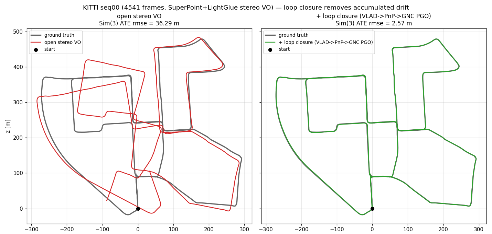

# KITTI Loop-Closure Benchmark

Metric loop closure on KITTI seq00, the canonical loopy odometry sequence. A
streaming stereo-VO frontend produces an **open** trajectory: only the first
pose is gauge-fixed, so drift accumulates unbounded along the path. Dense global
bundle adjustment cannot remove that drift — a loop-free reprojection minimum
just deforms the trajectory without any constraint tying a revisited place back
to its earlier observation. A loop closure is exactly that missing constraint.

This benchmark runs the **same** exported SuperPoint/LightGlue stereo VO twice
over identical features — once open, once with loop closure — and reports ATE
before vs after, so the only variable is the loop-closure stage.

## The loop-closure stage

`pipelines/slam/src/vo_loop_closure.rs` (`close_loops_on_vo_trajectory`) turns
the open VO products — per-frame poses, left features, and stereo depth — into a
globally consistent trajectory:

1. **Appearance** — a VLAD global descriptor per frame from a k-means vocabulary
   pooled over (subsampled) left descriptors.
2. **Proposal** — for each frame, the most similar earlier frames beyond a
   temporal gap and an accumulated-path-length gate (drift only builds with
   distance travelled, so the path-length gate is frame-rate independent).
3. **Verification** — brute-force descriptor matching between the pair, the
   older frame's keypoints lifted to world 3D via its stereo depth, then PnP.
   PnP yields a **metric** relative pose, so no separate scale source is needed.
4. **Optimization** — sequential odometry edges plus the verified metric loop
   edges, anchored at frame 0, solved with the robust GNC SE(3) pose-graph
   optimizer so a surviving spurious loop is down-weighted rather than trusted.

## Result (KITTI seq00, 4541 frames, stride 1)

SuperPoint (2048 kpts) + LightGlue stereo/temporal matching, PnP relative pose.
ATE reported under two alignments: **Sim(3)** (absorbs a single global
scale/rotation/offset, isolating trajectory shape) and **origin-only**
(gauge-fixed at frame 0 — the metric-frame number).

| trajectory     | ATE rmse Sim(3) | ATE rmse origin | ATE mean origin | ATE max origin |
| -------------- | --------------: | --------------: | --------------: | -------------: |
| open VO        |          36.29 m |          83.86 m |          65.35 m |        184.20 m |
| + loop closure |           2.57 m |           9.29 m |           8.18 m |         19.16 m |

**14.1× lower Sim(3) ATE rmse (36.29 m → 2.57 m)** from 35 verified loops
(3901 appearance candidates), GNC pose-graph cost `4.1e7 → 0.42`. The
origin-only ATE drops 9.0× (83.86 m → 9.29 m) as well — the correction is real
in the metric frame, not just a global shape fit. The loop-closed trajectory
length is 3716 m, matching the true sequence (~3724 m): the metric frontend's
scale is correct, so the metric loop edges and the odometry edges agree and the
pose graph closes cleanly.



The open VO (left, red) rotates and shifts off ground truth as drift
accumulates; loop closure (right, green) snaps the revisited places back onto
ground truth.

## Why stride matters: scale drift breaks metric loops

The same pipeline on a **stride-2** subset of seq00 (2271 frames, ~2 m between
frames) is far weaker:

| trajectory     | ATE rmse Sim(3) | ATE rmse origin |
| -------------- | --------------: | --------------: |
| open VO        |          41.98 m |         185.23 m |
| + loop closure |          23.69 m |         374.09 m |

Sim(3) ATE improves only 1.8× and the **origin-only ATE gets worse** (185 m →
374 m). The cause is visible in the trajectory length: the stride-2 open VO
integrates to **5490 m**, ~47% longer than the true 3724 m — the wider baseline
degrades temporal matching and PnP, inflating scale. The loop edges are still
metric (PnP), but they now disagree with the scale-inflated odometry edges, so
the pose graph cannot satisfy both and distorts the metric frame to compromise.
Dense, small-baseline frames (stride 1) keep the frontend's scale correct, which
is the precondition for metric loop closure to be a clean win.

## Reproduce

```sh
# 1. Fetch KITTI seq00 stereo images + GT poses (HTTP byte-range, no full zip).
scripts/fetch_kitti_seq00_images.py \
  --out-dir ~/datasets/kitti_seq00_full \
  --cameras image_0,image_1 --also-fetch-poses --stride 1 --max-frames 4541

# 2. Export features + run open vs loop-closure VO + ATE (export needs torch+lightglue).
scripts/run_kitti_loop_closure_benchmark.sh \
  --data-root ~/datasets/kitti_seq00_full \
  --gt-poses  ~/datasets/kitti_seq00_full/poses_00.txt \
  --frames 4541
```

The script builds the `stereo_vo_external_deep_files` and
`evaluate_trajectory_from_kitti_files` examples, exports SuperPoint/LightGlue
features once, runs the VO twice (open / `--loop-closure`), evaluates both, and
writes `summary.md` with the table above. Pass `--skip-export` to reuse already
exported features, or `--device cpu` if no CUDA GPU is available (much slower).
