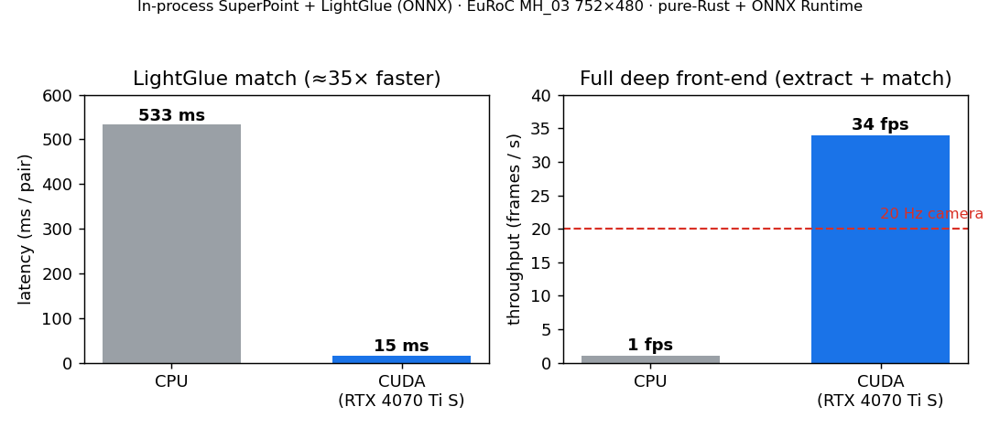

# In-process LightGlue (ONNX) — full deep front-end, CPU vs CUDA

This completes the in-process deep front-end started in
[the SuperPoint ONNX benchmark](superpoint_onnx_cuda_benchmark.md). That landed
SuperPoint **feature extraction** in-process; this lands the learned **LightGlue
matcher** in-process too, so the *entire* learned front-end — extract **and**
match — runs inside the Rust process via ONNX Runtime, with no Python and no
pre-exported feature dump.

- `LightGlueOnnxMatcher` (`crates/vision/src/features/lightglue_onnx.rs`,
  `onnx-inference` / `onnx-cuda` features) takes two SuperPoint feature sets and
  returns matches, on the same CUDA-or-CPU execution-provider plumbing as
  SuperPoint (`OnnxBackend`).

## Parity: bit-identical to the Python reference

On a real EuRoC MH_03 pair, the exported ONNX LightGlue reproduces the Python
`lightglue` matcher exactly (same SuperPoint features, pruning disabled in both):

```
python matches: 1324   onnx matches: 1324   index agreement: 1500/1500 (100.00%)
```

All 1500 per-keypoint match indices agree. The export disables LightGlue's
adaptive depth/width pruning and FlashAttention (data-dependent control flow that
does not trace to a static graph) — a speed knob, not a quality one, so the
matches are unchanged.

## Throughput — EuRoC MH_03 752×480, SuperPoint top-1500, GPU

150 consecutive frame pairs, CPU vs CUDA execution provider, *same binary*:

| stage | CPU | CUDA | speedup |
|---|---|---|---|
| LightGlue match only | 533 ms / pair (1.9 pairs/s) | **15 ms / pair (67 pairs/s)** | **≈35×** |
| **full front-end** (2× extract + 1× match) | 902 ms / pair (1.1 fps) | **29 ms / pair (34 fps)** | **≈31×** |



**The full learned deep front-end runs at 34 fps on the GPU — above the 20 Hz
EuRoC camera rate.** Matches are equivalent across providers (886 vs 885 on the
sample pair; the one-match difference is GPU reduction-order non-determinism).
On the CPU LightGlue's 9-layer transformer dominates (533 ms of the 902 ms
per-pair budget); on the GPU it drops to 15 ms and extraction (2 × 7.4 ms)
becomes the larger share.

So the in-process, pure-Rust + ONNX-Runtime deep front-end is now **complete and
real-time** — a slot between classical-corner real-time VO and offline deep
pipelines that need a Python feature-export stage.

## Export the model

```sh
# Needs PyTorch + lightglue. ~48 MB single-file ONNX (the 9-layer transformer).
scripts/export_lightglue_onnx.py --out models/lightglue.onnx --width 752 --height 480
```

The exporter reuses LightGlue's own `normalize_keypoints`, `input_proj`, rotary
positional encoding, the 9 self/cross-attention layers, the log-assignment head
and `filter_matches` verbatim; it only fixes batch size 1, disables
pruning/flash, and bakes the image size in (re-export for a different camera
resolution). I/O contract (matched by `lightglue_onnx.rs`):
`kpts0 (1,M,2) f32, desc0 (1,M,256) f32, kpts1 (1,N,2), desc1 (1,N,256)` →
`matches0 (M,) i64` (matched index in image 1 or -1), `mscores0 (M,) f32`.

## Reproduce

```sh
scripts/export_superpoint_onnx.py --out models/superpoint_1500.onnx
scripts/export_lightglue_onnx.py  --out models/lightglue.onnx
scripts/run_deep_frontend_onnx_demo.sh \
    --images-dir /tmp/MH_03_rect/image_0 --pairs 150 --backend both
```

The runner builds with the `onnx-cuda` feature and handles the two CUDA-provider
runtime wrinkles (provider shared-lib placement, cuDNN on `LD_LIBRARY_PATH`) —
see the [SuperPoint benchmark](superpoint_onnx_cuda_benchmark.md#reproduce) for
the details.
