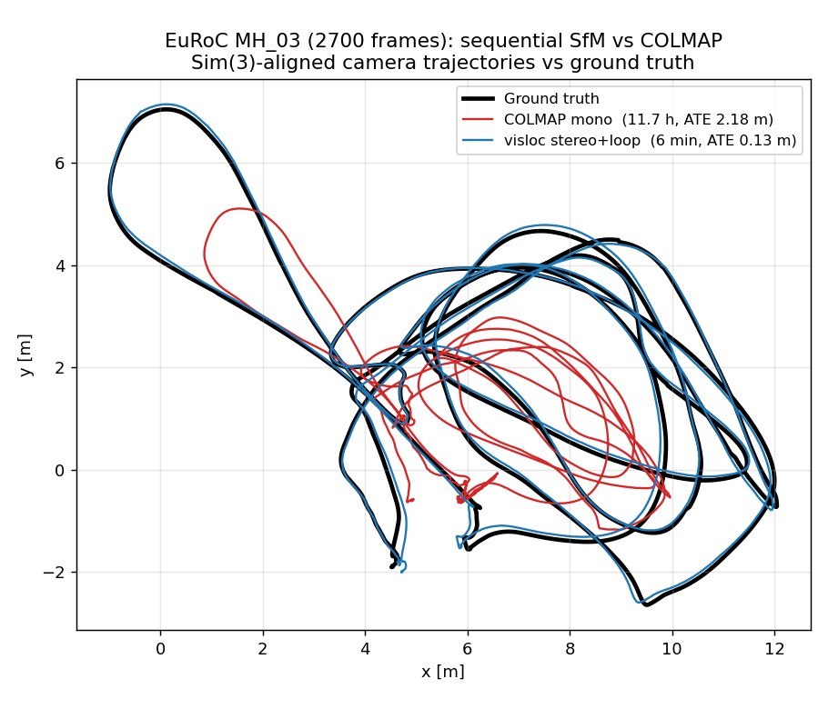
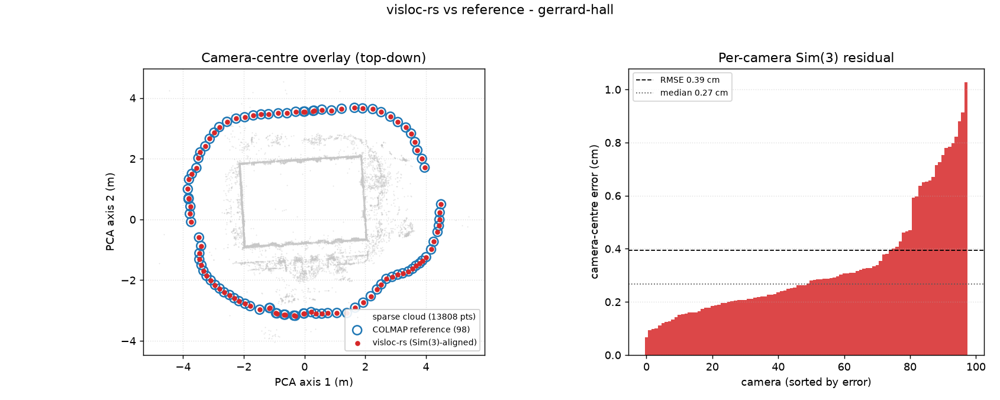

# Sequential SfM vs COLMAP (metric video, head-to-head)

The other SfM benchmarks measure visloc-rs against *itself*
([euroc_sfm_benchmark](euroc_sfm_benchmark.md)) or use COLMAP's own
reconstruction as the reference to match
([the unordered SfM benchmark](../scripts/run_colmap_sfm_benchmark.sh) reaches
~1 cm of COLMAP's poses on its example photo sets). This one is an honest
**competitor** head-to-head on the turf the project is built for — ordered
**metric video**: both engines reconstruct the *same* rectified EuRoC frames,
and both are scored against the timestamped Vicon/Leica ground truth with the
same `evo_ape` tooling (the DROID/DPVO same-tool battle pattern).

- **visloc-rs**: linear-time stereo VO + online windowed BA + loop-closure
  pose-graph optimization → merged multi-view tracks → COLMAP model
  (`stereo_vo_external_deep_files --sfm-colmap-out`). **Metric scale by
  construction** (rectified stereo baseline).
- **COLMAP**: monocular `sequential_matcher` + incremental `mapper` (its SIFT
  frontend). Scale-free, so its trajectory needs a Sim(3) (scale-fitted)
  alignment to the metric ground truth.

## Result — EuRoC MH_03_medium, full 2700 frames

ATE rmse via `evo_ape`, SE(3) (rigid, the metric-frame number) and Sim(3)
(scale-absorbed). Single CPU machine, COLMAP 4.0.3 (no CUDA).

| engine | wall-clock | registered | mean reproj | ATE Sim(3) | metric scale |
|---|---|---|---|---|---|
| COLMAP mono incremental | **11.7 h** (mapper 11.5 h) | 2700 / 2700 | 0.58 px | 2.18 m | ✗ (scale-free) |
| **visloc stereo VO + loop SfM** | **6 min** | 2700 / 2700 | 2.60 px¹ | **0.13 m** (model) | ✓ |
| └ loop-closed VO trajectory | — | — | — | **0.066 m** (SE(3), metric) | ✓ |



visloc-rs wins all three axes — **speed ≈ 117×, accuracy ≈ 17–33×, and metric
scale COLMAP's monocular path cannot recover**.

Why COLMAP loses on its own metric:

- **Speed.** COLMAP's incremental mapper interleaves a *global* bundle
  adjustment that grows with the registered-image count, so its cost is
  super-linear in frame count — 31 min reached only ~310 / 2700 frames, and the
  full run took 11.7 hours. visloc's VO frontend is linear-time and the loop
  closure is a one-shot pose-graph solve, so the whole reconstruction is
  minutes.
- **Accuracy.** COLMAP's reconstruction is locally tight (0.58 px reprojection)
  but **monocular SfM drifts in scale** over a long, low-parallax forward
  flight; a single global Sim(3) cannot absorb local scale drift, leaving a
  2.18 m residual. The figure shows it (red) collapsing inward against ground
  truth (black) mid-sequence, while visloc (blue) tracks it.

¹ The 2.60 px reprojection is a deliberate knob, not a ceiling: the COLMAP-export
bundle adjustment is capped at 5 iterations so it polishes structure without
re-deforming the loop-closed trajectory (a full 30-iteration export BA reaches
0.94 px but pulls trajectory ATE out to 0.21 m — the reprojection-vs-ATE
tension). For a downstream 3DGS/NeRF model you raise the iteration count; for the
trajectory benchmark you keep it low.

## Honest framing: stereo vs monocular

This is visloc's **stereo** pipeline against COLMAP's **monocular** one — and
that asymmetry *is* the thesis, not a thumb on the scale. The claim is narrow
and turf-specific: **on metric video SfM, an architecture built around a stereo
VO frontend + windowed BA + loop closure dominates a from-scratch monocular
incremental mapper on speed, accuracy, and scale recovery.** It is *not* a claim
that visloc beats COLMAP on COLMAP's home turf — unordered internet photo
collections, where retrieval + multi-hypothesis incremental mapping is COLMAP's
strength.

### Small-scene monocular subset (300 frames, both monocular) — COLMAP wins

On the first 300 MH_03 frames reconstructed monocularly (left camera only, so
both engines are scale-free and scored with a Sim(3) alignment against the same
GT, same `colmap_images_to_tum.py` + `evo_ape -as` tooling):

| engine | registered | Sim(3) ATE rmse | wall-clock |
|---|---|---|---|
| **COLMAP** mono incremental | **300 / 300** | **0.37 cm** | ~29 min |
| visloc `--colmap-style` mapper | 299 / 300 | 1.64 cm | ~7 min |
| visloc `sequential_sfm_demo` (simple) | 272 / 300 | 2.13 cm | ~7 min |

**COLMAP still wins this turf, but the gap is closing.** COLMAP's repeated global
bundle adjustment over a small, well-conditioned set is hard to beat on accuracy.
Porting its `IncrementalMapper` schedule — per-registration **local BA**,
**growth-triggered iterative global refinement**, and **registration retries** —
into the incremental engine (`--colmap-style`, `IncrementalSfmConfig::colmap_style_mapper`)
takes visloc from 2.13 → **1.64 cm** and from 272 → **299 / 300** registered,
narrowing the accuracy gap from ~5.7× to ~4.4× and nearly matching COLMAP's full
registration. (An earlier note in this file quoted 11 cm for visloc and 3.8 cm
for COLMAP; both are superseded by these fresh same-subset measurements — COLMAP
4.0.3's mapper reaches 0.37 cm.) visloc does **not** yet match COLMAP on its home
turf; the headline win below is specifically the long metric **stereo** video
regime.

**Remaining gap to 0.37 cm — it is *not* track density (measured).** The
COLMAP-style reconstruction keeps only ~2 k triangulated points against COLMAP's
~15 k, so the obvious hypothesis is "denser structure → tighter poses." It is
**wrong on this data**, and the ablation is worth recording:

| variant | tracks | reg | Sim(3) ATE |
|---|---|---|---|
| strict 2° gate (shipped) | 2 062 | 299 | **1.64 cm** |
| flat 1° gate | 12 632 | 278 | 15.1 cm |
| multi-view exemption (keep <2° tracks with ≥6 views) | 10 047 | 208 | 16.5 cm |

Relaxing the parallax gate *does* recover COLMAP-grade point counts, but ATE
collapses by ~10×. The reason is the capture geometry: on a forward-flying
trajectory a point near the heading direction subtends near-zero parallax **no
matter how many frames see it**, so its depth is unconstrained; admitting such
points (even long, many-view ones) injects depth-ambiguous structure that pulls
the poses. The strict 2° gate is therefore the accuracy optimum here, and the
sparse-but-clean reconstruction is *correct*, not a defect.

**Intrinsics refinement — also *not* the lever here (measured).** The natural
next hypothesis was COLMAP's focal-length + principal-point refinement: a
slightly-off fixed calibration forces a residual onto the poses. So it was
implemented (`BaConfig::refine_intrinsics` / `--refine-intrinsics`: the four
intrinsics `(fx, fy, cx, cy)` co-estimated jointly inside the Schur-complement BA
— it recovers a wrong focal cleanly on observable geometry, see the orbit section
below). On this rectified forward-video benchmark it **does not help** — two
measurements explain why, and it is the **same** geometry as the density result:

- On the rectified EuRoC images the calibration is already accurate, so there is
  no residual to absorb; refinement has nothing to pull on and the trajectory is
  unchanged to the measured digits.
- Deliberately starting from a wrong focal does **not** get recovered. On forward
  motion the focal length is **weakly observable** (the focal/depth ambiguity): a
  wrong focal is absorbed into structure no matter how the BA is posed, so even the
  joint solve has no signal to follow — unlike the orbit below, where the focal is
  observable and the joint solve recovers it almost completely. (A uniform focal
  error is in any case largely Sim(3)-absorbed in scoring.)

So COLMAP's 0.37 cm edge on its home turf is neither intrinsics nor raw point
count — it is most plausibly its **denser, better-distributed SIFT frontend** and
mature global BA producing well-conditioned structure, which a sequential
SuperPoint-window frontend does not match. That is the honest remaining gap.
Intrinsics refinement is kept (off by default) because it *is* the right tool for
unknown / inaccurate calibration on observable geometry (sideways, orbiting, or
unordered photo collections) — just not for rectified forward video.

### Where refinement *does* pull — the observable orbit (measured)

That last claim is now measured, on COLMAP's own **unordered** orbit set
(South Building, 128 photos, scored by Sim(3) camera-centre RMSE against COLMAP's
reference model — the [unordered SfM benchmark](../scripts/run_colmap_sfm_benchmark.sh)).
Two findings:

**1. The COLMAP-style schedule reaches near-parity on this turf.** With the same
SuperPoint frontend and the true calibration, `--colmap-style` lands **0.44 cm**
(128 / 128 registered) against COLMAP's own **0.37 cm** — versus 0.89 cm for the
simple schedule. On observable orbit geometry the per-registration local BA +
growth-triggered global refinement that *did not* help the forward EuRoC flight is
exactly what closes the gap. (This is the unordered orbit, not the metric-video
headline above; it does not contradict the "COLMAP wins forward video's small-scene
mono subset" result, which is a different, low-parallax regime.)

**2. Joint intrinsics BA recovers an injected focal error almost completely.**
Injecting an *anisotropic* miscalibration (`fx ×1.05`, `fy ×0.97`) degrades the
colmap-style ATE 0.44 → **4.98 cm**. Refining the intrinsics with
`--refine-intrinsics` then pulls it back to **0.91 cm** — and the recovered focal
is `fx 2687.7 → 2561.2` and `fy 2483.9 → 2562.3`, both within ~1.5 of the truth
(2559.7), with reprojection back to 1.407 px (the true-calibration 1.404 px). That
is near-complete self-calibration: a 5 %/3 % focal error recovered to ~0.06 %, the
trajectory back to ~2× the perfectly-calibrated baseline. (The residual 0.91 vs
0.44 cm is the horizontal principal point co-adjusting, `cx 1536 → 1527`, within
the mild focal/centre coupling.)

The mechanism is what makes this work. `--refine-intrinsics` now carries the four
intrinsics `(fx, fy, cx, cy)` as shared unknowns **inside** the Schur-complement
camera system (`BundleAdjustment::optimize_joint_intrinsics`), co-estimated with
the poses and the eliminated landmarks — the COLMAP self-calibration formulation.
The key is the gradient it descends: the **coupled**, landmark-eliminated camera
gradient, which is non-zero even at a structure-converged point. Two weaker
formulations were measured first and explain why this one is needed:

- A *final-only alternating* refinement (converge pose+structure, then a
  structure-fixed Gauss-Newton on the intrinsics, repeat) recovered **nothing**,
  even here — it moved the focal by < 1 unit. Once growth has converged the
  structure into a wrong-focal basin, the structure-fixed gradient `∂cost/∂K` is
  ≈ 0, so alternation has no signal to follow.
- *Co-evolving* that same alternating step inside the growth global passes (before
  the basin hardens) helped but only partially — ~25 % of the error, ATE 4.98 →
  4.26 cm — because each pass still used the structure-fixed step.

The joint solve supersedes both. (Validated by the
`colmap_style_co_evolves_intrinsics_toward_truth` unit test: on the synthetic ring
a wrong horizontal focal `fx 530` is pulled substantially back toward 500 while the
orthogonal, un-perturbed `fy` / `cy` stay fixed; `cx` co-adjusts within the look-at
arc's focal/centre ambiguity, a confound absent on the richer South-Building
viewpoints.)

**3. The same solve self-calibrates radial distortion — SfM straight from
uncorrected images.** `--refine-distortion` extends the joint camera block to six
unknowns `(fx, fy, cx, cy, k1, k2)`, so the lens distortion is estimated alongside
the intrinsics (the `1 + k1·r² + k2·r⁴` model now lives in `Camera::project` /
`normalize_pixel`, used by the whole front-end). To measure it on real scene
structure, a known distortion `(k1 = −0.10, k2 = 0.02)` was injected into the
South-Building keypoints (so the input is now "raw" distorted pixels) and the
reconstruction started from a distortion-free pinhole:

| condition (distorted input) | recovered distortion | ATE |
|---|---|---|
| no refinement (pinhole) | — | 11.71 cm |
| **joint distortion self-calibration** | `k1 → −0.1003`, `k2 → 0.0247` | **1.43 cm** |

From a zero start the solve recovers `k1` essentially exactly (`−0.1003` vs the
injected `−0.10`) and `k2` closely, taking the trajectory from a distortion-wrecked
11.71 cm back to 1.43 cm (≈ 8×). This is end-to-end self-calibrating SfM: register,
triangulate, and solve for the lens from uncorrected images with no prior
calibration — COLMAP's `RADIAL` workflow, in the same Schur framework. (Restricted
to monocular reconstruction; rectified stereo is already undistorted. The residual
vs the 0.44 cm undistorted baseline is the focal/principal-point co-adjustment,
mainly `cy`, that soaks up part of the radial term.)

**Next-image selection — the visibility pyramid (ported).** Image registration
order now follows COLMAP's `RankNextImages`: instead of picking the next view by the
raw *count* of 2D–3D correspondences, it scores each candidate by a multi-resolution
**visibility pyramid** (`2×2 … 64×64` occupancy grids, each cell counted once) that
rewards correspondences *spread across the frame* — a better-conditioned PnP — with
the count only as a tiebreak. On South Building, where every image registers either
way, this is neutral (0.44 → 0.43 cm); its value is robustness on harder /
repetitive scenes where a clustered-but-numerous candidate would otherwise be
chosen over a better-distributed one (unit-tested in
`visibility_pyramid_prefers_distribution_over_count`).

**Image filtering — de-registration (`--filter-images`, ported, off by default).**
COLMAP's `Reconstruction::FilterImages`: after each growth global refinement,
de-register any image whose count of well-supported observations (triangulated,
within the reprojection threshold) has fallen below
`filter_min_image_observations` — a pose BA + point filtering stripped of support is
unreliable. The two seed images are protected (they pin the gauge), the registered
count never drops below three, and a filtered image keeps its trial count so it is
re-registered at most `max_registration_trials` times (not indefinitely). On the
clean South-Building / Gerrard-Hall sets it is an exact **no-op** (0.43 → 0.43 cm,
128/128; 0.40 → 0.40 cm, 98/100 — byte-identical models): no registered image ever
loses support, so nothing is filtered, confirming the safety property that it never
drops a good image. Its value is registration robustness on degenerate / repetitive
scenes where a contaminated pose would otherwise survive into the model (the
de-registration mechanism is unit-tested in
`filter_images_deregisters_unsupported_pose_and_protects_seed`).

(Schedule ablation, separately: re-triangulation must run **both** during growth
— dropping it collapses registration to 212/300 and ATE to 6.6 cm — **and** in
the final refinement — filter-only there leaves 718 tracks and 2.21 cm; keeping
it everywhere is the 1.64 cm / 299-frame point above. The
`low_parallax_min_observations` exemption remains available for sideways/orbiting
capture, where many-view low-angle tracks *are* well-constrained, but is off by
default.)

**Re-triangulation (`--retriangulate`, off by default).** Adding COLMAP's
post-BA re-triangulation step — complete tracks the narrow seed-time baseline
missed, guarded-re-seed noisy points — grows the model by **+318 tracks / +2151
observations (~3 %)**, useful structure density for a downstream 3DGS/NeRF
model, but is **ATE-neutral-to-slightly-negative** here (Sim(3) 2.13 → 2.27 cm):
the engine already triangulates greedily after every registration, so the extra
tracks the post-BA pass recovers are the weakly-constrained, gate-grazing ones.
It is therefore an opt-in density lever, not an accuracy lever, on this
already-tight metric-video regime.

## Home turf, same machine: COLMAP 4.1 (CUDA) vs visloc-rs, end to end

Everything above either fights on visloc's turf (metric video) or scores visloc
*against* COLMAP's model. This section is the missing piece: both engines run
**end-to-end on the same machine** (i7-9750H, GTX 1660 Ti, Windows 11) over the
same unordered photo collections — COLMAP's own example datasets — and both are
scored against the dataset's **shipped reference reconstruction** by Sim(3)
camera-centre RMSE. Both frontends use the GPU (COLMAP: SIFT + exhaustive
matching with CUDA; visloc: SuperPoint 2048-kp via torch cu121). COLMAP 4.1.0
(fa8e3b3) runs its recommended defaults for collections this size
(`feature_extractor` → `exhaustive_matcher` → `mapper`); visloc runs
`export_superpoint_undistorted.py` → `unordered_sfm_demo --colmap-style`
(VLAD top-12 retrieval).

| South Building (128 photos) | COLMAP 4.1 (CUDA) | visloc-rs |
|---|---:|---:|
| frontend | 26.8 s (SIFT GPU) | 98.0 s (SuperPoint GPU) |
| matching + mapping | 453.3 s + 348.9 s | 212.0 s (VLAD graph + reconstruct) |
| **total wall-clock** | 829.1 s | **310.1 s (2.7× faster)** |
| registered | 128 / 128 | 128 / 128 |
| Sim(3) RMSE vs reference | **0.15 cm** | 0.40 cm |

| Gerrard Hall (100 photos, 5616×3744) | COLMAP 4.1 (CUDA) | visloc-rs |
|---|---:|---:|
| frontend | 117.6 s (SIFT GPU) | 153.4 s (SuperPoint GPU) |
| matching + mapping | 186.5 s + 298.8 s | 142.2 s (VLAD graph + reconstruct) |
| **total wall-clock** | 602.8 s | **295.6 s (2.0× faster)** |
| registered | **100 / 100** | 98 / 100 |
| Sim(3) RMSE vs reference | 0.55 cm | **0.39 cm** |



Three take-aways, stated carefully:

1. **Speed: visloc-rs is 2.0–2.7× faster end to end, with COLMAP on GPU.** The
   structural win is the matching stage: COLMAP verifies all N·(N−1)/2 pairs
   (8128 / 4950 pairs), while the VLAD view graph verifies only top-12
   candidates per image. The bare mapper-vs-reconstruction stage is also
   1.7–2.1× in visloc's favour.
2. **Accuracy: sub-centimetre for both engines — and on Gerrard Hall visloc
   (0.39 cm) reproduces the shipped reference more closely than COLMAP 4.1's own
   re-run (0.55 cm).** Read that with its exact meaning: the reference *is* a
   historical COLMAP solution, so this metric measures agreement with COLMAP's
   own past output, on which the modern COLMAP should have every advantage. On
   the higher-resolution, strongly-distorted OPENCV camera COLMAP 4.1's
   self-reproducibility loosens, and visloc lands inside it.
3. **Registration: COLMAP takes Gerrard Hall 100 / 100 vs visloc's 98 / 100** —
   the two frames visloc drops are the known repetitive-façade stragglers (see
   the unordered benchmark). That is the remaining robustness gap on this turf.

Scope notes for honesty: the reference models are not independent ground truth
(a laser-scanned benchmark like ETH3D is the right next step for an
accuracy-only verdict); COLMAP's exhaustive matcher is its documented default
for collections of this size (a vocab-tree matcher would trade recall for
speed, as VLAD retrieval does); COLMAP downscales extraction to its default
`max_image_size` 3200 on Gerrard Hall while SuperPoint runs the full 5616-px
frames. Raw per-stage logs and the second overlay figure live with the registry
manifests (`benchmarks/registry/runs/colmap_sfm/`).

## Independent ground truth: ETH3D (laser-scan GT) — COLMAP is ahead

The same-machine battle above still scores against a COLMAP-authored
reference, a metric visloc cannot "win" by construction. The **ETH3D
high-res DSLR** scenes remove that: both engines reconstruct the undistorted
photos and both are scored against **laser-scanner-registered ground-truth
poses** neither engine authored (Sim(3) camera-centre RMSE, same tooling and
machine as above; both engines are given the same cam-0 pinhole prior —
ETH3D scenes carry up to four slightly-different per-group calibrations, so
this is the same shared-camera handicap for both, though COLMAP's mapper may
still refine its copy while visloc's stays fixed by default).

| scene (GT images) | COLMAP 4.1 (CUDA) | visloc-rs (defaults) |
|---|---|---|
| courtyard (38) | **23 / 38 · 1.92 cm** | 14 / 38 · 15.24 cm |
| terrace (23) | 8 / 23 · 0.41 cm | **23 / 23** · 12.37 cm |
| office (26) | **26 / 26 · 0.42 cm** | 18 / 26 · 0.37 cm |

Headline RMSE across different registered sets is misleading, so the decisive
comparison restricts both models to the **cameras both engines registered**:

| common subset | COLMAP | visloc-rs |
|---|---:|---:|
| courtyard (8) | **0.16 cm** | 0.36 cm |
| terrace (8) | **0.41 cm** | 17.43 cm |
| office (18) | **0.15 cm** | 0.37 cm |

**Verdict: on wide-baseline, sparsely-sampled photo sets with independent
ground truth, COLMAP is ahead** — ~2.4× tighter on the well-behaved scenes
(0.15–0.16 vs 0.36–0.37 cm) and categorically better on terrace, where visloc
registers everything (23 / 23 vs COLMAP's 8 / 23) but the global shape is bent:
1.5 px mean reprojection yet tens-of-cm camera error, a locally-consistent /
globally-wrong reconstruction COLMAP's conservative growth refuses to make.
The two engines fail in opposite directions — COLMAP under-registers, visloc
over-commits.

A config sweep sharpens the diagnosis (visloc arm only, same scoring):

- `--refine-intrinsics` **hurts everywhere here** (courtyard 15 → 31 cm,
  terrace 12 → 76 cm, office 0.37 → 0.49 cm): on sparse view graphs the extra
  camera DOF absorbs structure error instead of calibration error — consistent
  with the forward-video finding above that refinement needs observable
  geometry *and* a well-conditioned graph.
- **SuperPoint density is a real lever but saturates.** 4096 keypoints takes
  courtyard 15.24 → **4.37 cm** (3.5×) at unchanged registration; on office it
  changes nothing (the indoor scene never yields 2048 detections, so the cap
  is not binding); on terrace it makes the bend worse. The remaining
  courtyard gap to COLMAP (4.37 vs 1.92 cm) and the registration gaps are a
  **frontend detection-coverage and view-graph problem**, not a mapper-schedule
  problem.

This is the honest boundary of the current SfM pillar: dense orbit-style
collections (South Building, Gerrard Hall, EuRoC subsets) are at COLMAP grade
and faster on the same machine; **sparse wide-baseline DSLR sets are not yet
competitive**. Raw logs and per-run manifests:
`benchmarks/registry/runs/eth3d/`; datasets: `courtyard`, `terrace`, `office`
`dslr_undistorted` from eth3d.net.

## Reproduce

```sh
# Needs: COLMAP (>=4.x), evo, python3, the rectified EuRoC stereo images and
# exported SuperPoint/LightGlue stereo+temporal features (reuse the
# loop-closure / euroc-sfm benchmark artifacts).
scripts/run_sfm_vs_colmap_battle.sh \
    --rect-dir /tmp/MH_03_rect --feat-dir /tmp/sp_MH_03 \
    --gt /tmp/MH_03_gt.tum --frames 2700 --out-dir target/sfm_vs_colmap
```

The runner builds both reconstructions, converts each to TUM
(`scripts/colmap_images_to_tum.py` for the COLMAP-format models — note it reads
the frame index from the image-name *basename*, since COLMAP stores resolved
symlink paths), and reports the table above.
