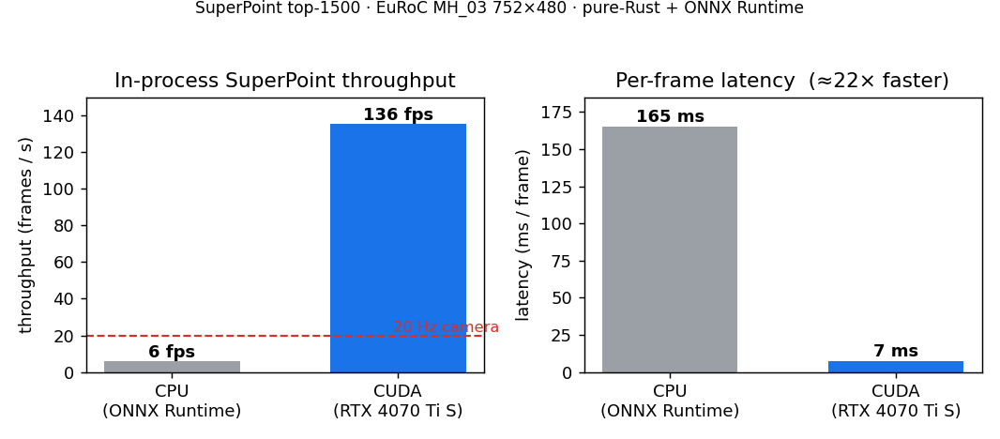

# In-process SuperPoint (ONNX) — CPU vs CUDA throughput

The deep-frontend benchmarks elsewhere in this repo (KITTI / EuRoC loop closure,
SfM-vs-COLMAP) feed on SuperPoint + LightGlue features that were **pre-exported
by a Python script** (`scripts/export_superpoint_lightglue.py`) into multi-GB
per-sequence feature dumps (a single EuRoC sequence is ~30 GB on disk). That
export step is the deployment wart: it needs a Python + PyTorch + LightGlue
install, it writes tens of GB, and it is an offline pass — not something a
real-time SLAM front-end could do.

This benchmark measures the **in-Rust** SuperPoint front-end
(`SuperPointOnnxExtractor`, the `onnx-inference` / `onnx-cuda` features) running
the network *inside the process* via ONNX Runtime, with the CUDA execution
provider. It answers one question: **can the deep feature front-end keep up with
the camera, in-process, with no Python and no feature-export step?**

## Result — EuRoC MH_03, 752×480, SuperPoint top-1500, RTX 4070 Ti SUPER

Per-frame latency / throughput of `extract_deep` over 300 real frames (warm-up
frame excluded), CPU execution provider vs CUDA execution provider, *same model,
same binary*:

| execution provider | latency | throughput | vs camera (20 Hz) |
|---|---|---|---|
| CPU (ONNX Runtime) | 165 ms / frame | **6.1 fps** | 0.3× — far below real time |
| **CUDA** | **7.4 ms / frame** | **135 fps** | **6.7× real-time headroom** |

**≈22× speedup**, and 135 fps clears the 20 Hz EuRoC camera rate by 6.7×. The CPU
and CUDA paths return effectively identical features (avg kept keypoints 1021.8
vs 1020.7 after the score gate — the sub-keypoint difference is GPU
reduction-order non-determinism, not a behavioural change), so the GPU path is a
pure latency win, not an accuracy trade.



## What this lands, and what it does not

- **Lands:** the SuperPoint *feature-extraction* front-end now runs in-process,
  in Rust, on the GPU, at real time. For the extraction stage this removes the
  Python/PyTorch dependency and the multi-GB on-disk feature dump entirely — the
  network is loaded from a single 5 MB `.onnx` file and run per frame.
- **Still external:** the learned **LightGlue matcher** is not yet an in-process
  ONNX graph; the deep-VO benchmarks still read pre-exported LightGlue matches.
  An in-process, training-free matcher already exists
  (`matching::MutualSoftmaxMatcher`, a dual-softmax LightGlue emulation), so a
  fully in-process deep front-end is possible today with that matcher; porting
  the learned LightGlue weights to ONNX for the quality tier is the next step.

So the honest claim is narrow: **the deep feature-extraction front-end is now
real-time and in-process (pure-Rust + ONNX Runtime), no Python export pass** — a
slot between classical-corner real-time VO and offline deep pipelines that need
a feature-export stage.

## Export the model

```sh
# Needs PyTorch + lightglue (the SuperPoint weights ship with the lightglue pip
# package). Writes a single self-contained ~5 MB ONNX file.
scripts/export_superpoint_onnx.py --out models/superpoint_1500.onnx \
    --max-keypoints 1500 --nms-radius 4
```

The exporter reimplements SuperPoint's keypoint head for batch size 1 with a
fixed top-k selection (so the graph has a constant keypoint count and only H/W
stay dynamic); NMS, border removal and bilinear descriptor sampling are kept
bit-for-bit from the reference `lightglue.SuperPoint`. Output contract (matched
by `crates/vision/src/features/superpoint_onnx.rs`): `image (1,1,H,W) f32` →
`keypoints (N,2) i64`, `scores (N,) f32`, `descriptors (N,256) f32`.

## Reproduce

```sh
scripts/run_superpoint_onnx_throughput.sh \
    --model models/superpoint_1500.onnx \
    --images-dir /tmp/MH_03_rect/image_0 --frames 300 --backend both
```

The runner builds the example with the `onnx-cuda` feature and handles the two
CUDA-provider runtime wrinkles automatically:

1. ONNX Runtime's provider bridge `dlopen()`s `libonnxruntime_providers_shared.so`
   and `libonnxruntime_providers_cuda.so` from the **executable's directory**;
   the runner symlinks them from ort's download cache (`~/.cache/ort.pyke.io/...`)
   next to the binary.
2. The CUDA provider needs `libcudnn.so.9` (+ cuBLAS / cuFFT) at run time; the
   runner adds the pip `nvidia-*` wheel lib dirs to `LD_LIBRARY_PATH`.

`OnnxBackend::CudaThenCpu` (the production default) registers CUDA first and
falls back to CPU if the GPU provider cannot load, so a CUDA-less deployment
still runs. The benchmark uses the strict `OnnxBackend::Cuda` so it errors rather
than silently reporting CPU numbers under the "cuda" label.
