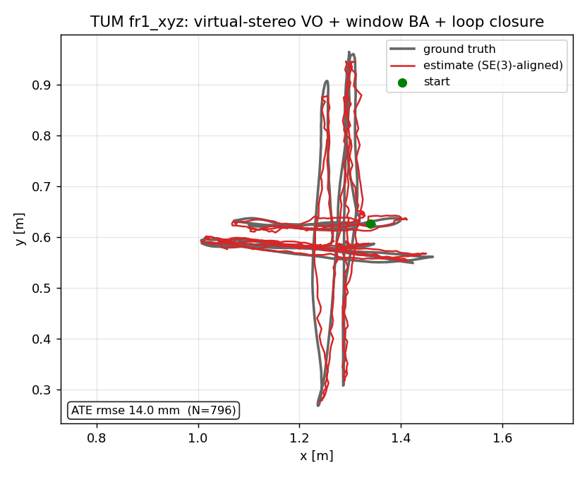

# TUM RGB-D Benchmark (indoor, handheld)

The indoor handheld counterpart to the [KITTI](kitti_loop_closure_benchmark.md)
(ground vehicle) and [EuRoC](euroc_loop_closure_benchmark.md) (aerial)
loop-closure benchmarks. [TUM RGB-D](https://cvg.cit.tum.de/data/datasets/rgbd-dataset)
is the classic indoor SLAM benchmark — a hand-held Kinect through an office, with
motion-capture ground truth — on which ORB-SLAM2, ElasticFusion, and DVO-SLAM
publish ATE.

It also exercises a different sensor than the rest of the suite. TUM RGB-D has
**no stereo pair**: each frame is a single RGB image plus a registered depth map
(16-bit PNG, `depth_m = pixel / 5000`). Rather than add a separate RGB-D
frontend, the same metric stereo VO / online-BA / loop-closure backend
(`examples/stereo_vo_external_deep_files.rs`,
`pipelines/slam/src/vo_loop_closure.rs`) is driven by **virtual stereo**.

## Virtual stereo: depth as a synthetic right image

The stereo backend only ever uses the right image to triangulate metric 3D
points; everything downstream (PnP / Kabsch relative pose, online BA, loop
closure) runs on the resulting camera-frame points. So `depth` can stand in for
the right view directly. For each depth-valid SuperPoint keypoint
`(u, v)` with depth `d`, `scripts/export_tum_rgbd_virtual_stereo.py` emits a
synthetic right keypoint at the disparity it would have at a chosen virtual
baseline `b`, carrying the same descriptor:

```
disparity = b * fx / d            u_right = u - disparity,   v_right = v
```

and a 1:1 stereo match. The Rust triangulator inverts this exactly
(`d = b * fx / disparity`), so the recovered depth — and hence the **metric
scale** — is the true TUM depth, *independent of the (arbitrary) baseline*, as
long as the same `--baseline` is passed to the binary. Temporal (frame-to-frame)
matches come from LightGlue between consecutive left frames, exactly as in the
stereo path.

The payoff: the entire stereo VO / BA / loop stack runs on RGB-D **with zero Rust
changes** — the new sensor is handled entirely in the feature exporter. Metric
scale is recovered directly from depth, with no scale drift to absorb (the SE(3)
and Sim(3) ATE numbers below agree to ~1 mm).

## Results (Freiburg1, full sequences)

SuperPoint (2048 kpts) + LightGlue, virtual-stereo depth lift, Freiburg1
intrinsics (`fx 517.3 fy 516.5 cx 318.6 cy 255.3`), baseline 0.1 m. ATE rmse via
`evo_ape` under SE(3) (rigid, the metric-frame number) and Sim(3) (scale-absorbed)
alignment, associated against the motion-capture `groundtruth.txt` by timestamp.

The full pipeline visloc ships — incremental window BA (`--online-ba`) + metric
loop closure (`--loop-closure`) + two-view loop-edge BA (`--loop-two-view-ba`) —
is the `full_tv` row.

### fr1_xyz (798 frames, translation-dominant)

| trajectory                         | ATE rmse SE(3) | ATE rmse Sim(3) | loops |
| ---------------------------------- | -------------: | --------------: | ----: |
| open VO                            |       0.0313 m |        0.0280 m |     – |
| + loop closure                     |       0.0244 m |        0.0213 m |    63 |
| + loop closure + two-view BA       |       0.0207 m |        0.0165 m |    63 |
| window BA + loop                   |       0.0205 m |        0.0200 m |    89 |
| **window BA + loop + two-view BA** |   **0.0140 m** |    **0.0129 m** |    89 |



### fr1_desk (596 frames, rotation-heavy)

| trajectory                         | ATE rmse SE(3) | ATE rmse Sim(3) | loops |
| ---------------------------------- | -------------: | --------------: | ----: |
| open VO                            |       0.1596 m |        0.1573 m |     – |
| window BA + loop                   |       0.0363 m |        0.0264 m |    52 |
| **window BA + loop + two-view BA** |   **0.0262 m** |    **0.0215 m** |    52 |

## Where a vision-only RGB-D stack stands

The best config lands at **14.0 mm (fr1_xyz)** and **26.2 mm (fr1_desk)** ATE
rmse, **~1.3–1.6× ORB-SLAM2 RGB-D** (which publishes ≈ 0.009–0.011 m on fr1_xyz
and ≈ 0.016 m on fr1_desk) — competitive for a vision-only stack that treats
depth purely as a virtual right image and reuses an outdoor-stereo-tuned VO
backend unchanged.

Two levers carry the indoor result, the same ones the
[EuRoC benchmark](euroc_loop_closure_benchmark.md) identified:

- **Loop closure is the dominant lever**, far more so than on the largely
  monotonic aerial flights. The desk scene revisits the same workspace
  repeatedly, so the open VO's accumulated drift (159.6 mm) collapses to 36.3 mm
  once 52 revisits are tied back — a **6× reduction** from loop closure alone.
- **Two-view loop BA** (`--loop-two-view-ba`) sharpens it further on both
  sequences (fr1_xyz 20.5 → 14.0 mm, fr1_desk 36.3 → 26.2 mm). Each verified
  loop edge is re-ground as a minimal two-view bundle adjustment before it enters
  the pose graph, removing the depth-anchoring bias PnP leaves in the raw edge —
  the same ~30% lever measured on EuRoC.

A note on window BA in isolation: on `fr1_xyz`, `--online-ba` *without* loop
closure slightly worsens the open VO (31.3 → 50.8 mm) because the temporal
sliding window, tuned for fast KITTI/EuRoC motion, over-constrains the slow
hand-held trajectory. Its value here is indirect: the locally-tighter map detects
more revisits (89 vs 63 loops), and once those loops plus two-view BA are applied
the combination is the best of all (14.0 mm). The frontend stage and the loop
stage are complementary, not independently additive.

## Reproduce

Download a sequence (e.g. `rgbd_dataset_freiburg1_xyz`) from the
[TUM RGB-D page](https://cvg.cit.tum.de/data/datasets/rgbd-dataset/download),
then:

```bash
scripts/run_tum_rgbd_benchmark.sh --seq-dir /path/to/rgbd_dataset_freiburg1_xyz
```

This exports virtual-stereo SuperPoint/LightGlue features
(`scripts/export_tum_rgbd_virtual_stereo.py`, requires `torch` + `lightglue` +
`pillow`), runs the three conditions above, converts each VO trajectory to TUM
(`scripts/kitti_poses_to_tum.py`), and scores with `evo_ape`
(`pip install evo`). For Freiburg2/3 pass the matching intrinsics with
`--fx/--fy/--cx/--cy`. The trajectory figure is regenerated with:

```bash
scripts/plot_tum_trajectory.py \
  --gt rgbd_dataset_freiburg1_xyz/groundtruth.txt \
  --est target/tum_rgbd_benchmark/full_tv/est.tum \
  --out docs/assets/tum_fr1_xyz_loop_closure.png \
  --title "TUM fr1_xyz: virtual-stereo VO + window BA + loop closure"
```
